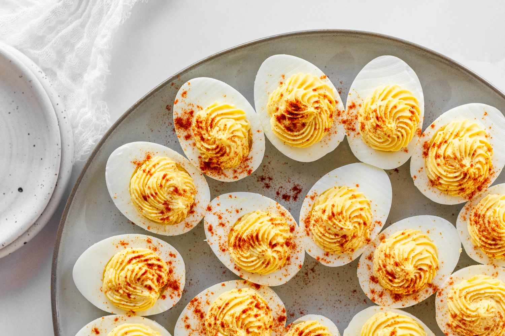

# Classic Deviled Eggs

📍 *Across the Midwest*

> No Midwestern potluck, picnic, or holiday table is complete without a platter of deviled eggs. They're the dish everyone reaches for first and the plate that's always empty. Simple, satisfying, and impossible to eat just one.

---

## At a Glance

| | |
|---|---|
| **Servings** | 24 halves |
| **Prep Time** | 20 minutes |
| **Cook Time** | 12 minutes |
| **Total Time** | 1 hour (includes chilling) |
| **Difficulty** | Easy |
| **Category** | Appetizers & Snacks |

---

## Ingredients

- 12 large eggs
- ⅓ cup mayonnaise (Hellmann's or Duke's — this is not negotiable)
- 1 tablespoon yellow mustard
- 1 tablespoon sweet pickle relish
- 1 teaspoon white vinegar
- ½ teaspoon salt
- ¼ teaspoon black pepper
- Paprika for garnish
- Fresh chives, finely snipped *(optional)*

---

## Instructions

1. **Boil eggs:** Place eggs in a single layer in a large pot. Cover with cold water by 1 inch. Bring to a rolling boil, then remove from heat, cover, and let sit exactly 12 minutes.
2. **Ice bath:** Transfer eggs immediately to a large bowl of ice water. Let cool at least 10 minutes.
3. **Peel and halve:** Peel eggs carefully under running water. Slice in half lengthwise. Pop yolks into a medium bowl.
4. **Make filling:** Mash yolks with a fork until smooth. Add mayo, mustard, relish, vinegar, salt, and pepper. Mix until creamy and uniform.
5. **Fill:** Pipe or spoon filling into egg white halves, mounding generously.
6. **Garnish** with a sprinkle of paprika and snipped chives.
7. **Chill** at least 30 minutes before serving.

---

## Tips & Variations

- **Piping trick:** Use a zip-lock bag with the corner snipped for easy, clean filling.
- **Bacon & cheddar:** Fold in crumbled bacon and a tablespoon of finely shredded cheddar.
- **Horseradish kick:** Replace mustard with 1 tablespoon prepared horseradish.
- **Sriracha drizzle:** For the adventurous Midwesterner — a thin drizzle on top.
- **Transport:** Use a deviled egg carrier. Every Midwest kitchen has one. It's practically a rite of passage.

---

## 🌾 Did You Know?

Deviled eggs have been a staple of American potluck culture since the mid-1800s, but nowhere are they more revered than in the Midwest. At church socials and family reunions, there's an unspoken competition over whose deviled eggs are the best. The dish is so deeply embedded in Midwestern culture that specialty deviled egg plates — ceramic dishes with individual oval wells — are a common wedding gift. Some families have deviled egg plates that have been handed down for three generations.

---

*📸 Photography note: Rustic farmhouse style — arranged on a vintage deviled egg plate (the kind with individual wells), garnished with paprika and chives, on a lace-trimmed cloth. Picnic table setting.*
