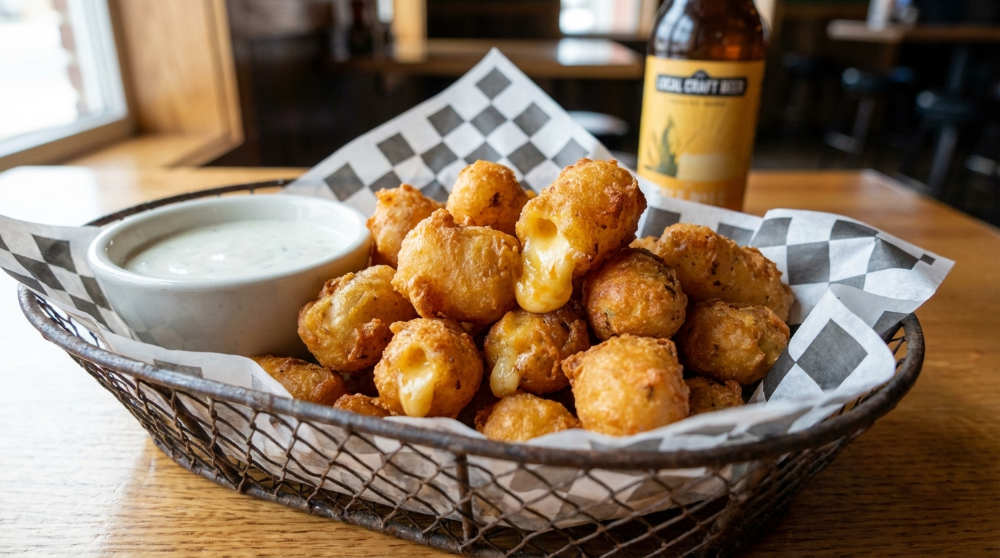

# Wisconsin Fried Cheese Curds

📍 *Wisconsin*

> If Wisconsin had a national dish, this would be it. Fresh cheese curds — the squeaky kind — battered and fried until golden outside, molten inside. Best served at a county fair, a Friday fish fry, or honestly anywhere with a deep fryer and zero regrets.

---

## At a Glance

| | |
|---|---|
| **Servings** | 6–8 (appetizer) |
| **Prep Time** | 15 minutes |
| **Cook Time** | 10 minutes |
| **Total Time** | 25 minutes |
| **Difficulty** | Medium |
| **Category** | Appetizers & Snacks |

---

## Ingredients

### Cheese Curds
- 2 lbs fresh white cheddar cheese curds (room temperature)
- Vegetable or peanut oil for frying

### Beer Batter
- 1 cup all-purpose flour
- ½ cup cornstarch
- 1 teaspoon baking powder
- 1 teaspoon garlic powder
- ½ teaspoon paprika
- ½ teaspoon salt
- ¼ teaspoon cayenne pepper
- 1 cup cold beer (a Wisconsin lager, naturally)
- 1 egg, beaten

### For Serving
- Ranch dressing
- Marinara sauce

---

## Instructions

1. **Prep curds:** Pat cheese curds dry with paper towels. If large, break into bite-sized pieces. They should be at room temperature (cold curds = cold centers).
2. **Heat oil:** Fill a deep pot or fryer with 3 inches of oil. Heat to 375°F (190°C).
3. **Make batter:** Whisk flour, cornstarch, baking powder, garlic powder, paprika, salt, and cayenne. Add beer and egg, whisk until just combined — lumps are fine. Batter should be thick enough to coat the back of a spoon.
4. **Dredge:** Toss curds in a light coating of plain flour first (helps the batter stick), then dip into beer batter, letting excess drip off.
5. **Fry in batches:** Carefully drop 6–8 curds at a time into hot oil. Fry 1½–2 minutes until deep golden brown. Don't overcrowd.
6. **Drain** on a wire rack over a sheet pan. Season with a light sprinkle of salt immediately.
7. **Serve** hot with ranch and marinara for dipping.

---

## Tips & Variations

- **The squeak test:** Fresh curds should squeak against your teeth. If they don't squeak, they're not fresh enough.
- **No beer?** Club soda works for a lighter batter.
- **Extra crispy:** Double-dip — flour, batter, back in flour, batter again.
- **Temperature is everything:** Too cool and they're greasy. Too hot and the batter burns before the cheese melts. 375°F is the sweet spot.

---

## 🌾 Did You Know?

Wisconsin produces over 3 billion pounds of cheese annually — more than any other state and more than most *countries*. Cheese curds are a byproduct of the cheesemaking process, and true Wisconsinites insist on eating them within hours of production, when they're still squeaky. The tradition of frying them in beer batter likely originated at Wisconsin county fairs in the 1990s and has since become an unofficial state food. In 2023, Wisconsin legislators even considered making the fried cheese curd the official state appetizer.

---

*📸 Photography note: Rustic farmhouse style — piled high on parchment paper in a wire basket, golden and glistening, with a ramekin of ranch. Beer glass in background. Warm pub lighting.*
