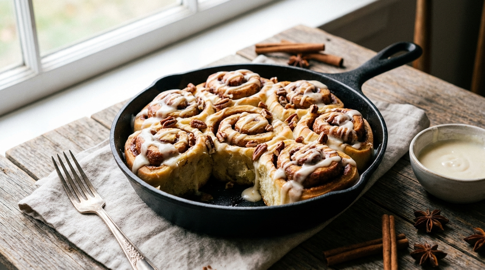

# Cinnamon Rolls with Cream Cheese Frosting

📍 *Across the Midwest — Church Basements to Farm Kitchens*

> Soft, pillowy spirals of enriched dough layered with a sinful amount of cinnamon-sugar butter, baked until golden and gooey, then drowned in a thick cream cheese frosting that melts into every crevice. The smell alone could sell a house. The taste could end a feud.

---

## At a Glance

| Detail | Info |
|--------|------|
| **Yield** | 12 large rolls |
| **Prep Time** | 30 minutes |
| **Rise Time** | 2–2½ hours (two rises) |
| **Bake Time** | 22–28 minutes |
| **Total Time** | About 3½ hours |
| **Difficulty** | Moderate |
| **Category** | Breads / Breakfast |

---

## 🫕 Midwest Nice Rating: 🫕🫕🫕🫕🫕

You could show up to a stranger's house with a pan of these and leave with a dinner invitation and a new best friend.

---

## Ingredients

### The Dough
- 1 cup whole milk, warmed to 110°F
- 2¼ teaspoons active dry yeast (1 packet)
- ½ cup granulated sugar
- ⅓ cup unsalted butter, melted and slightly cooled
- 2 large eggs, at room temperature
- 1 teaspoon pure vanilla extract
- 4 to 4½ cups all-purpose flour
- 1 teaspoon salt

### The Filling
- ⅓ cup unsalted butter, softened to spreadable
- ¾ cup packed dark brown sugar
- 2 tablespoons ground cinnamon
- Pinch of salt

### The Cream Cheese Frosting
- 4 ounces cream cheese, softened
- ¼ cup unsalted butter, softened
- 1½ cups powdered sugar, sifted
- 1 teaspoon pure vanilla extract
- Pinch of salt

---

## Instructions

1. **Bloom the yeast.** In a large bowl or the bowl of a stand mixer, combine the warm milk, yeast, and a pinch of the sugar. Let it sit for 5–8 minutes until it's foamy and smells yeasty. If nothing happens, your yeast is dead — start over with a fresh packet.

2. **Make the dough.** Add the remaining sugar, melted butter, eggs, and vanilla to the yeast mixture. Stir to combine. Add 4 cups of the flour and the salt. Mix with a dough hook on low speed (or by hand with a wooden spoon) until a shaggy dough forms. Increase to medium speed and knead for 6–8 minutes, adding the remaining ½ cup flour a tablespoon at a time if the dough is too sticky. You want a dough that's soft and slightly tacky but pulls away from the sides of the bowl.

3. **First rise.** Shape the dough into a ball, place it in a greased bowl, cover with plastic wrap or a clean towel, and let rise in a warm spot until doubled in size, about 1 to 1½ hours.

4. **Roll and fill.** Punch down the dough. On a lightly floured surface, roll it out into a rectangle roughly 16 × 12 inches. Spread the softened butter evenly over the entire surface, leaving a ¼-inch border at the far edge. Mix the brown sugar, cinnamon, and pinch of salt together, then sprinkle evenly over the butter. Press it in gently with your hands.

5. **Roll it up.** Starting from the long edge closest to you, roll the dough into a tight log. Pinch the seam closed. Using a sharp knife or unflavored dental floss (seriously — it works perfectly), cut the log into 12 equal pieces.

6. **Second rise.** Place the rolls cut-side up in a greased 9 × 13-inch baking pan. Cover and let rise for 45 minutes to 1 hour, until the rolls are puffy and touching each other.

7. **Bake.** Preheat your oven to 350°F. Bake the rolls for 22–28 minutes, until the tops are golden brown and the centers are cooked through. Don't overbake — slightly underdone is better than dry.

8. **Frost immediately.** While the rolls bake, beat together the cream cheese, butter, powdered sugar, vanilla, and salt until smooth and fluffy. The moment the rolls come out of the oven, spread the frosting generously over the hot rolls. Watch it melt into the crevices. Try not to eat the entire pan.

---

## Tips & Variations

- **Overnight Method:** After cutting and placing in the pan, cover tightly with plastic wrap and refrigerate overnight. In the morning, pull the pan out, let the rolls come to room temperature and puff up (about 45–60 minutes), then bake. Fresh cinnamon rolls without a 5 AM alarm.
- **Caramel Pecan Sticky Buns:** Before placing rolls in the pan, pour a mixture of ½ cup melted butter, ¾ cup brown sugar, and 2 tablespoons corn syrup over the bottom of the pan. Scatter with pecans. Bake as directed, then flip immediately. Midwest decadence.
- **Apple Cinnamon:** Add a layer of thinly sliced, tart apples (Granny Smith or Honeycrisp from Michigan) over the cinnamon-sugar before rolling.
- **The Secret Ingredient:** A tablespoon of heavy cream poured over the rolls just before baking makes the centers impossibly gooey.
- **Don't Skip Dark Brown Sugar:** It has more molasses than light brown sugar, which means deeper, more caramelized flavor. This matters.

---

> **🤫 Grandma's Secret:** *"Put a pan of boiling water on the bottom rack of the oven while the rolls bake. The steam keeps them soft. And never, ever use margarine in the frosting — cream cheese frosting made with margarine is just sweet grease."*

---

## Pairs Well With

A Saturday morning with nowhere to be, terrible local news playing in the background, and a mug of gas station coffee that somehow tastes perfect.

---

## 🌾 Did You Know?

> The Midwest's love affair with cinnamon rolls runs deep — so deep that in many parts of Kansas, Nebraska, and Iowa, cinnamon rolls are served *as a side dish with chili.* Not dessert. A side. The combination sounds unhinged until you try it: the sweetness of the roll cuts the heat and tomato acidity of the chili, and the soft bread soaks up the broth. School cafeterias across the region have been serving this combo since at least the 1960s, and attempts to remove it from school lunch menus have met with the kind of fierce resistance usually reserved for property tax increases. The tradition likely stems from Swedish and Scandinavian immigrants who brought *kanelbullar* (cinnamon buns) to the northern plains, where they merged with church-supper culture and midcentury convenience cooking to become the ultimate Midwest comfort carb.

---

*📸 Photography note: A 9×13 pan of cinnamon rolls, frosting still melting and dripping down the sides. One roll pulled away, stretching the gooey filling between it and the pan. Morning light through a kitchen window. A butter knife with frosting on it. Warm, golden, inviting — the photo should make you smell cinnamon.*
