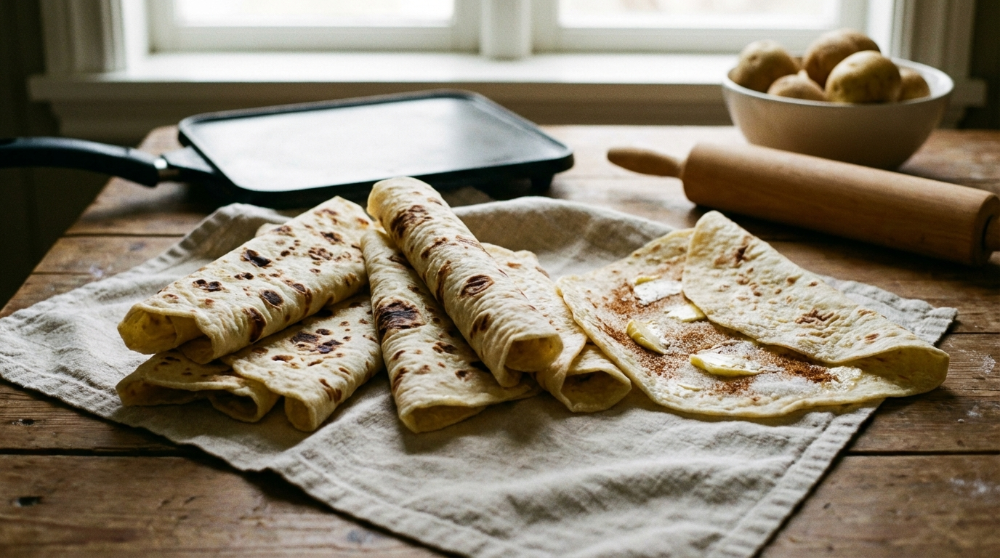

# Lefse

📍 *Minnesota & the Dakotas — Scandinavian Heritage Country*

> Paper-thin rounds of tender potato flatbread, rolled out on a cloth-covered board with a grooved rolling pin by someone who learned from someone who learned from someone who came over on a boat from Norway. Spread with butter and sugar, rolled up, and eaten with the quiet reverence of a people who don't believe in showing off — but absolutely will if you get the lefse wrong.

---

## At a Glance

| Detail | Info |
|--------|------|
| **Yield** | 16–20 rounds |
| **Prep Time** | 30 minutes (plus chilling) |
| **Chill Time** | 2–4 hours or overnight |
| **Cook Time** | 2–3 minutes per round |
| **Total Time** | About 4 hours (mostly passive) |
| **Difficulty** | Hard (requires practice and possibly therapy) |
| **Category** | Breads / Flatbreads |

---

## 🫕 Midwest Nice Rating: 🫕🫕🫕🫕🫕

If you bring homemade lefse to a potluck in Minnesota, someone *will* cry. This is not a joke.

---

## Ingredients

- 5 pounds russet potatoes, peeled and cut into chunks
- ½ cup (1 stick) unsalted butter
- ⅓ cup heavy cream
- 2 tablespoons granulated sugar
- 1 teaspoon salt
- 2½ to 3 cups all-purpose flour, plus more for rolling

### For Serving
- Softened butter
- Granulated sugar or brown sugar
- Some families add cinnamon. Other families consider this heresy. You decide.

---

## Instructions

1. **Cook the potatoes.** Boil the potatoes in salted water until very tender, about 20 minutes. Drain thoroughly — and this is critical — let them dry in the pot over low heat for a minute or two, shaking occasionally. Excess moisture is the enemy of lefse.

2. **Rice the potatoes.** Pass the hot potatoes through a potato ricer or food mill. Do not mash them with a masher or — heaven forbid — a food processor. You need perfectly smooth, lump-free potatoes, and a ricer is the only way.

3. **Add the richness.** While the potatoes are still hot, stir in the butter, heavy cream, sugar, and salt until everything is melted and incorporated. Spread the mixture on a sheet pan and let it cool, then refrigerate for at least 2 hours or overnight. Cold potatoes are essential — warm potatoes will make sticky, unworkable dough and you will want to throw things.

4. **Make the dough.** Add 2½ cups of flour to the cold potato mixture and mix gently until a soft dough forms. Add more flour a tablespoon at a time only if needed. The dough should be soft and pliable but not sticky. Less flour = more tender lefse. Resist the urge to add too much.

5. **Divide.** Portion the dough into golf ball-sized rounds (about 2 tablespoons each). Keep them covered so they don't dry out.

6. **Roll.** On a well-floured surface (many use a cloth-covered board and a cloth-covered grooved rolling pin — the traditional tools), roll each ball into a paper-thin round, about 10–12 inches in diameter. Rotate frequently and add flour as needed to prevent sticking. The thinner, the better. You should almost be able to see through it.

7. **Cook.** Heat an ungreased griddle or large flat skillet to about 400°F (if your griddle has a thermometer) or medium-high heat. Carefully transfer the lefse round to the griddle — a lefse turning stick (a long, flat wooden stick) is traditional and genuinely helpful. Cook for about 60–90 seconds per side, until brown spots appear. The lefse should bubble slightly and look dry on the surface before flipping.

8. **Stack and cover.** As each round is cooked, stack them between clean kitchen towels. This keeps them soft and pliable. Cover the whole stack with a towel.

9. **Serve.** Spread each round with soft butter, sprinkle with sugar, roll up or fold into quarters, and eat while making meaningful eye contact with your Scandinavian ancestors.

---

## Tips & Variations

- **Tools Matter:** A lefse griddle (flat, round, unrimmed), a grooved rolling pin, a pastry cloth, and a turning stick aren't strictly required, but they make the job dramatically easier. They're sold as "lefse kits" at every kitchen store in Minnesota. Nowhere else, but every store in Minnesota.
- **Potato Variety:** Russets are essential — their starchiness and low moisture content are what make lefse work. Waxy potatoes (Yukon Gold, red potatoes) will produce gluey dough.
- **Instant Potatoes?** Some families use instant potato flakes. Other families consider this grounds for disinheritance. This recipe takes no position, but it was written with real potatoes.
- **Freezing:** Lefse freezes beautifully. Stack rounds between sheets of wax paper, wrap tightly in plastic, and freeze for up to 3 months. Thaw at room temperature.
- **Sweet vs. Savory:** Butter and sugar is the classic. But lefse also works as a wrap for lutefisk (if you dare), turkey, or even peanut butter and jelly.

---

> **🤫 Grandma's Secret:** *"Rice the potatoes twice. Once isn't enough — you need them smoother than smooth. And the dough should rest in the fridge overnight, not just two hours. The patience is what separates good lefse from great lefse. Also, I can tell when you used instant potatoes. I can always tell."*

---

## Pairs Well With

A church basement in December, the lingering scent of lutefisk you're pretending not to notice, your Norwegian grandmother's silent judgment of your rolling technique, and approximately fourteen cousins arguing about whose lefse is better.

---

## 🌾 Did You Know?

> Lefse came to the Upper Midwest with the massive wave of Norwegian immigration in the late 19th century. In Norway, it was peasant food — a simple potato flatbread born from a cold climate where wheat was scarce and potatoes were plentiful. In Minnesota and the Dakotas, it became something closer to sacred. Lefse-making is a communal, generational activity: church groups hold lefse-making days in the fall, families gather around kitchen tables at Thanksgiving and Christmas, and the techniques are passed down with a reverence usually reserved for religious texts. The town of Starbuck, Minnesota, holds the record for the world's largest lefse — nine feet, eight inches in diameter, made in 1983. There are lefse competitions, lefse festivals, and at least one lefse-themed coloring book. For Minnesotans of Scandinavian descent, lefse isn't just food. It's identity, it's memory, it's the taste of home — and if you're not Scandinavian, it's still one of the most delicious flatbreads you'll ever eat.

---

*📸 Photography note: A stack of thin, lightly browned lefse rounds on a flour-dusted wooden board, one rolled up with butter glistening inside. A grooved rolling pin and turning stick nearby. Flour everywhere — on the board, on the cloth, maybe on someone's apron. Warm kitchen light. The photo should feel like a family kitchen in December.*
