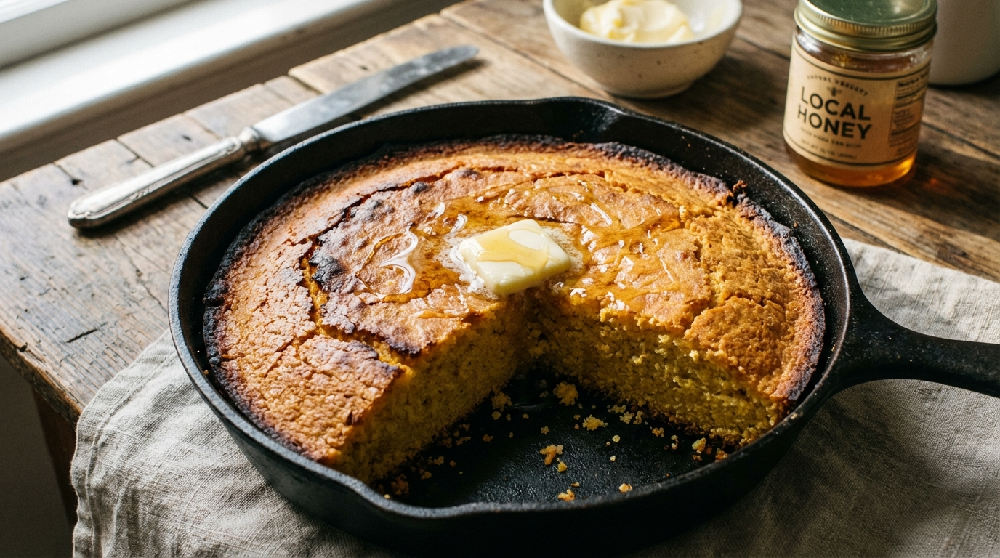

# Skillet Cornbread

📍 *Missouri, Kansas, Iowa — Where the Corn Belt Meets the Cast Iron*

> Golden, craggy, and crusty on the bottom from a screaming-hot cast iron skillet, with a tender crumb that's just barely sweet enough to remind you it's not a brick. This is cornbread the way it's supposed to be made — in a pan your great-grandmother seasoned with fifty years of bacon grease.

---

## At a Glance

| Detail | Info |
|--------|------|
| **Servings** | 8 wedges |
| **Prep Time** | 10 minutes |
| **Cook Time** | 20–25 minutes |
| **Total Time** | 35 minutes |
| **Difficulty** | Easy |
| **Category** | Breads / Sides |

---

## 🫕 Midwest Nice Rating: 🫕🫕🫕🫕

Essential alongside chili, soup, or any potluck that has a crockpot going. Loses one hotdish only because it's a supporting player, not the star.

---

## Ingredients

- 1¼ cups yellow cornmeal (stone-ground if you can get it)
- ¾ cup all-purpose flour
- 2 tablespoons granulated sugar (see note below — this is where wars start)
- 1 tablespoon baking powder
- ½ teaspoon baking soda
- ¾ teaspoon salt
- 1 cup buttermilk
- ⅓ cup whole milk
- 2 large eggs
- 4 tablespoons unsalted butter, melted, plus 2 tablespoons for the skillet

---

## Instructions

1. **Preheat and prep.** Place your 10-inch cast iron skillet in the oven and preheat to 425°F. The skillet needs to be ripping hot — this is what creates the legendary crust.

2. **Mix the dry.** In a large bowl, whisk together the cornmeal, flour, sugar, baking powder, baking soda, and salt.

3. **Mix the wet.** In a separate bowl, whisk together the buttermilk, whole milk, eggs, and 4 tablespoons of melted butter.

4. **Combine.** Pour the wet ingredients into the dry and stir until just combined. A few lumps are fine. Do not overmix — overmixed cornbread is tough cornbread, and tough cornbread is a crime.

5. **Hot skillet magic.** Carefully remove the screaming-hot skillet from the oven. Add the remaining 2 tablespoons of butter and swirl to coat the bottom and sides. The butter should sizzle and foam immediately. Pour the batter into the skillet — it should hiss and spit. This is the sound of a perfect crust forming.

6. **Bake.** Return the skillet to the oven and bake for 20–25 minutes, until the top is golden and a toothpick inserted in the center comes out clean. The edges should be deeply golden and slightly pulled away from the sides.

7. **Serve.** Let it cool in the skillet for 5 minutes. Cut into wedges and serve warm with butter, honey, or just your hands if nobody's looking.

---

## Tips & Variations

- **The Sugar Debate:** Two tablespoons of sugar puts this squarely in the Midwest camp — a little sweet, not cake-level. Southerners would say that's already too much. Northerners might want more. Adjust to your conscience. This cookbook takes no official position and hopes for peace.
- **Bacon Drippings:** Replace the butter in the skillet with 2 tablespoons of saved bacon grease. This is not optional if you have bacon grease available. It is the law.
- **Jalapeño Cheddar:** Fold in 1 cup shredded sharp cheddar and 2 diced jalapeños for a version that goes with chili like thunder goes with lightning.
- **Honey Butter:** Whip together ½ cup softened butter with 3 tablespoons honey and a pinch of salt. Serve alongside. Life-changing.
- **Corn Kernel Cornbread:** Add ¾ cup fresh or frozen corn kernels to the batter for a pop of sweetness and texture.
- **No Cast Iron?** A 9-inch round cake pan works in a pinch, but you won't get the same crust. Consider this your excuse to finally invest in a cast iron skillet.

---

> **🤫 Grandma's Secret:** *"Preheat the skillet with the butter in it for at least 10 minutes — most people don't get it hot enough. And use stone-ground cornmeal, not that fine Jiffy stuff. You want grit. Cornbread should have texture."*

---

## Pairs Well With

A bowl of chili that's been simmering since noon, the sound of a screen door slamming, and the eternal argument about whether cornbread should be sweet or savory (it should be both, and this hill is worth dying on).

---

## 🌾 Did You Know?

> Cornbread is one of the oldest American foods, predating European colonization — Native Americans were making corn-based breads for thousands of years before anyone thought to argue about sugar in the batter. The Midwest's relationship with cornbread is practical: corn grows everywhere here, and when you're surrounded by it, you eat it in every form imaginable. The cast iron skillet method likely came north with Southern and Appalachian migrants who moved to Midwestern industrial cities during the Great Migration. Kansas City, St. Louis, and Chicago all developed their own cornbread traditions, blending Southern technique with Midwestern ingredients (more butter, a touch of sugar, slightly lighter crumb). The result is a cornbread that's a peacemaker — sweet enough for the North, crusty enough for the South, and good enough to shut everybody up.

---

*📸 Photography note: A cast iron skillet of golden cornbread, one wedge already cut and pulled slightly away, steam rising from the crumb. A pat of butter melting on top. Red-checked cloth underneath. Maybe a bowl of chili in soft focus behind it. Warm, rustic, simple — the photo should feel like a Sunday afternoon.*
