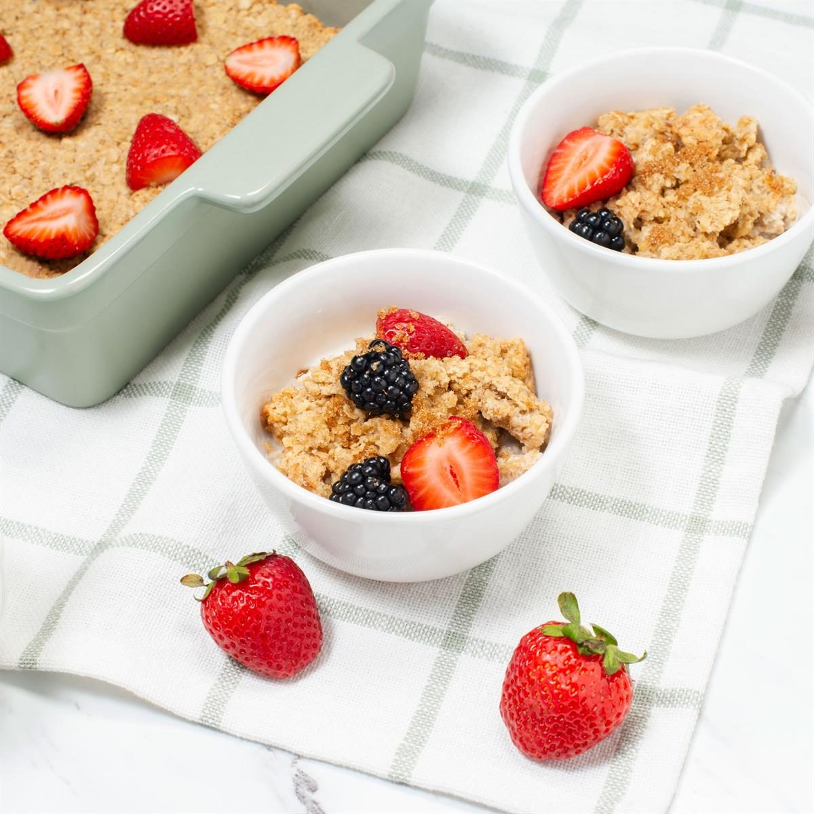

# Amish Baked Oatmeal

📍 *Ohio & Indiana Amish Country*

> A warm, custard-like breakfast casserole that's been a staple in Amish and Mennonite communities for generations. Think of it as oatmeal's more sophisticated, oven-baked cousin.

---

## At a Glance

| | |
|---|---|
| **Servings** | 8–10 |
| **Prep Time** | 10 minutes |
| **Cook Time** | 35–40 minutes |
| **Total Time** | 45–50 minutes |
| **Difficulty** | Easy |
| **Category** | Breakfast & Brunch |

---

## Ingredients

- 3 cups old-fashioned rolled oats
- 1 cup packed brown sugar
- 2 teaspoons baking powder
- 1 teaspoon cinnamon
- ½ teaspoon salt
- 1 cup whole milk
- ½ cup (1 stick) unsalted butter, melted
- 2 large eggs, beaten
- 2 teaspoons vanilla extract
- ½ cup raisins or dried cranberries *(optional)*
- Fresh berries, maple syrup, or cream for serving

---

## Instructions

1. **Preheat** oven to 350°F (175°C). Grease a 9×13-inch baking dish.
2. **Combine dry ingredients:** In a large bowl, mix oats, brown sugar, baking powder, cinnamon, and salt.
3. **Combine wet ingredients:** In a separate bowl, whisk together milk, melted butter, eggs, and vanilla.
4. **Mix:** Pour wet ingredients into dry and stir until just combined. Fold in raisins or cranberries if using.
5. **Pour** mixture into prepared baking dish and spread evenly.
6. **Bake** for 35–40 minutes until golden brown on top and set in the center.
7. **Serve** warm with fresh berries, a drizzle of maple syrup, or a splash of cold cream.

---

## Tips & Variations

- **Make-ahead:** Assemble the night before, cover, and refrigerate. Add 5 minutes to bake time.
- **Apple-cinnamon version:** Add 1 diced apple and increase cinnamon to 1½ teaspoons.
- **Nut lovers:** Stir in ½ cup chopped walnuts or pecans.
- **Leftovers:** Reheat individual portions in the microwave with a splash of milk.

---

## 🌾 Did You Know?

Baked oatmeal is a cornerstone of Amish "church lunch" — the communal meal served after Sunday worship. In many Amish communities, families take turns hosting, and baked oatmeal can be made in large batches with minimal fuss, making it the perfect dish for feeding 30+ people in a farmhouse kitchen. The recipe has barely changed in over a century.

---

*📸 Photography note: Rustic farmhouse style — served in a stoneware baking dish on a worn wooden table, with a small pitcher of cream and scattered berries. Morning window light.*
