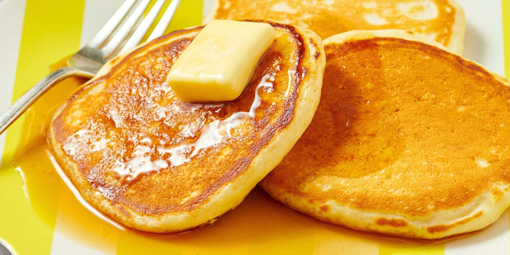

# Buttermilk Pancakes with Pure Maple Syrup

📍 *Midwest — From Every Kitchen*

> Tall, fluffy, and golden-edged — these are the pancakes that turn Saturday mornings into family traditions across the heartland, where real maple syrup flows from Michigan and Wisconsin sugar bushes.

---

## At a Glance

| Detail | Info |
|--------|------|
| **Servings** | 4 (about 12 pancakes) |
| **Prep Time** | 10 minutes |
| **Cook Time** | 20 minutes |
| **Total Time** | 30 minutes |
| **Difficulty** | Easy |
| **Category** | Breakfast |

---

## Ingredients

### Dry Ingredients
- 2 cups all-purpose flour
- 2 tablespoons granulated sugar
- 2 teaspoons baking powder
- 1 teaspoon baking soda
- ½ teaspoon fine sea salt

### Wet Ingredients
- 2 cups buttermilk, at room temperature
- 2 large eggs
- ¼ cup unsalted butter, melted and slightly cooled
- 1 teaspoon pure vanilla extract

### For Serving
- Pure maple syrup (Grade A Dark Amber recommended), warmed
- Additional butter pats
- Fresh berries or sliced bananas (optional)

---

## Instructions

1. **Mix the dry ingredients.** In a large bowl, whisk together the flour, sugar, baking powder, baking soda, and salt.

2. **Combine the wet ingredients.** In a separate bowl, whisk the buttermilk, eggs, melted butter, and vanilla until smooth.

3. **Make the batter.** Pour the wet ingredients into the dry ingredients and stir gently with a rubber spatula until *just* combined. The batter should be lumpy — overmixing is the enemy of fluffy pancakes. A few streaks of flour are perfectly fine. Let the batter rest 5 minutes while the griddle heats.

4. **Heat the griddle.** Heat a cast iron griddle or large nonstick skillet over medium heat (350°F if using an electric griddle). Lightly grease with butter or a neutral oil.

5. **Test the heat.** Flick a few drops of water onto the surface — they should dance and sizzle immediately, then evaporate within a second or two.

6. **Cook the pancakes.** Pour ⅓ cup batter per pancake onto the griddle. Cook until the surface is covered in bubbles and the edges look set and slightly dry, about 2–3 minutes. Flip once and cook until golden brown on the underside, about 1–2 minutes more.

7. **Keep warm.** Transfer finished pancakes to a wire rack set on a baking sheet in a 200°F oven while you cook the remaining batches.

8. **Serve immediately** with warm pure maple syrup, a generous pat of butter, and your favorite toppings.

---

## Tips & Variations

- **The Lumpy Batter Secret:** Resist the urge to stir until smooth. Those lumps create pockets of air that make pancakes fluffy.
- **Blueberry Pancakes:** Scatter a handful of fresh blueberries onto each pancake right after pouring the batter on the griddle. Don't fold them into the batter — they'll turn everything purple.
- **Chocolate Chip:** Add ¼ cup mini chocolate chips to the batter for a kid-favorite twist.
- **Cornmeal Crunch:** Replace ½ cup of the flour with fine cornmeal for a heartier, slightly crunchy texture — very Midwestern.
- **No buttermilk?** Stir 2 tablespoons white vinegar or lemon juice into 2 cups regular milk. Let it sit 5 minutes until slightly thickened.
- **Freeze extras:** Cool completely, then freeze in a single layer. Reheat in the toaster for weekday breakfasts.

---

## 🌾 Did You Know?

> The Midwest produces more maple syrup than you might think. Michigan, Wisconsin, and Minnesota all have thriving sugar bush operations, and the Great Lakes maple season — typically March through early April — is a cherished annual tradition. Families tap sugar maples when nighttime temperatures drop below freezing but daytime temps rise above, creating the pressure that pushes sap upward. It takes roughly 40 gallons of sap to produce just one gallon of pure maple syrup, making every golden drop a small miracle of patience and craft.

---

*📸 Photography note: Stack of three pancakes on a blue-rimmed enamelware plate, butter melting on top, maple syrup mid-pour from a small ceramic pitcher. Soft morning window light from the left. Scattered blueberries and a checkered cloth napkin. Warm, homey, inviting.*
