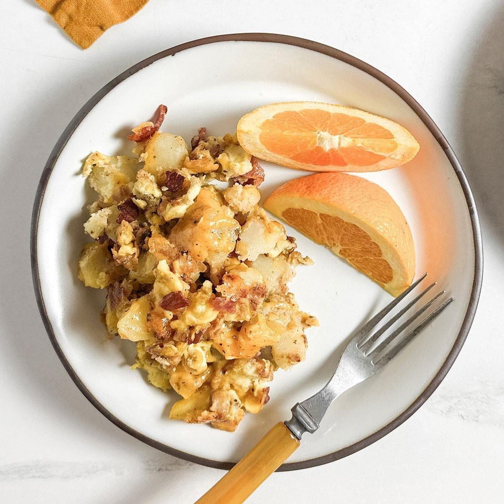

# Farmhouse Skillet Hash with Fried Eggs

📍 *Midwest — Farm Country*

> The farmhouse breakfast that fueled a century of early mornings: crispy-edged potatoes, savory pork, and sweet bell peppers all married in a single cast iron skillet, crowned with sunny fried eggs whose runny yolks become the richest sauce you'll ever make.

---

## At a Glance

| Detail | Info |
|--------|------|
| **Servings** | 4 |
| **Prep Time** | 15 minutes |
| **Cook Time** | 30 minutes |
| **Total Time** | 45 minutes |
| **Difficulty** | Easy |
| **Category** | Breakfast |

---

## Ingredients

### The Hash
- 1½ pounds Yukon Gold potatoes, cut into ½-inch dice (no need to peel)
- 8 ounces breakfast sausage (bulk) or thick-cut bacon, chopped
- 1 medium yellow onion, diced
- 1 red bell pepper, diced
- 1 green bell pepper, diced
- 3 cloves garlic, minced
- 1 tablespoon fresh thyme leaves (or 1 teaspoon dried)
- 1 teaspoon smoked paprika
- ½ teaspoon freshly ground black pepper
- Salt to taste
- 2 tablespoons unsalted butter
- 1 tablespoon vegetable oil

### The Eggs
- 4 large eggs
- 1 tablespoon unsalted butter
- Salt and freshly ground black pepper

### For Serving
- Fresh chives or green onions, sliced
- Hot sauce (optional)
- Buttered toast

---

## Instructions

1. **Par-cook the potatoes.** Place the diced potatoes in a pot of cold, salted water. Bring to a boil and cook for 5–6 minutes, until just barely fork-tender — they should still have some firmness. Drain thoroughly and spread on a clean towel to dry. (Dry potatoes = crispy potatoes.)

2. **Cook the meat.** In a large cast iron skillet (12-inch preferred), cook the sausage or bacon over medium-high heat, breaking the sausage into crumbles, until browned and the fat is rendered, about 5–6 minutes. Remove the meat with a slotted spoon, leaving the drippings in the pan.

3. **Crisp the potatoes.** Add the butter and oil to the drippings in the skillet. Once the butter is foaming, add the par-cooked potatoes in a single layer. Let them cook undisturbed for 3–4 minutes until a golden crust forms on the bottom. Toss, then let them crisp again for another 3–4 minutes. Repeat until the potatoes are golden and crispy on most sides, about 10–12 minutes total.

4. **Add the vegetables.** Push the potatoes to the edges and add the onion and bell peppers to the center of the skillet. Cook for 3–4 minutes until the peppers soften slightly. Add the garlic and cook 30 seconds until fragrant.

5. **Combine and season.** Return the cooked sausage or bacon to the skillet. Toss everything together. Sprinkle with thyme, smoked paprika, and black pepper. Season with salt to taste. Toss gently and cook another 2 minutes to let the flavors meld. Reduce heat to low to keep warm.

6. **Fry the eggs.** In a separate nonstick skillet, melt the butter over medium-low heat. Crack the eggs gently into the pan, season with salt and pepper, and cook until the whites are set but the yolks are still runny, about 3–4 minutes. (For over-easy, flip gently and cook 30 seconds more.)

7. **Serve.** Divide the hash among plates (or serve straight from the skillet — the Midwestern way). Nestle the fried eggs on top. Garnish with fresh chives. Serve with hot sauce and buttered toast.

---

## Tips & Variations

- **Cast Iron is Key:** The heat retention and surface of a well-seasoned cast iron skillet gives hash its signature crispy edges. Don't use a thin pan — you won't get the same crust.
- **Potato Swap:** Sweet potatoes work beautifully for a slightly sweeter, more colorful hash. Or mix half regular, half sweet.
- **Corned Beef Hash:** Substitute 12 ounces of chopped leftover corned beef for the sausage for a classic diner-style variation.
- **Make It Veggie:** Skip the meat entirely and add mushrooms, zucchini, and an extra pepper. The cast iron will still give you great crispy edges.
- **Leftover Friendly:** Hash is the ultimate "clean out the fridge" recipe. Last night's roasted vegetables, leftover steak, or extra ham all belong here.
- **Cheese Addition:** Sprinkle shredded cheddar or Pepper Jack over the hash during the last minute of cooking for melty goodness.

---

## 🌾 Did You Know?

> Hash — from the French *hacher*, meaning "to chop" — has been a staple of American farmhouse cooking since the colonial era, but it became a Midwestern breakfast institution in the 19th century when immigrant farmers needed a single-skillet meal that could fuel a full morning of work before the sun was fully up. The beauty of hash is its democracy: whatever meat was left over from last night's dinner, whatever vegetables were on hand from the garden, and whatever potatoes were in the root cellar all went into the same cast iron skillet. No two batches were ever the same, and that was the point. The addition of fried eggs on top became standard because, well, the chickens were always laying and a runny yolk makes everything better.

---

*📸 Photography note: A 12-inch cast iron skillet on a rustic wooden table, filled with golden crispy hash, colorful peppers visible throughout, and four sunny fried eggs nestled on top — yolks unbroken and gleaming. One yolk artfully broken with a fork, golden yolk flowing into the hash. Fresh chives scattered. Morning light streaming in from the left. Warm, hearty, rustic farmhouse mood.*
