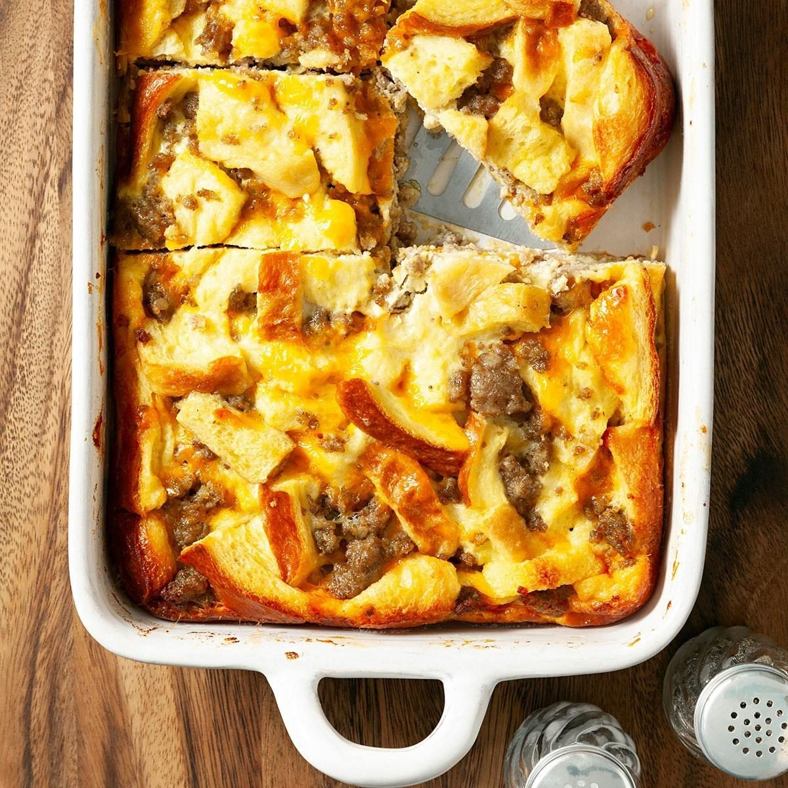

# Midwestern Breakfast Casserole (Sausage & Egg)

📍 *Across the Midwest*

> The undisputed champion of church potlucks, holiday mornings, and "I need to feed 12 people before 9 AM" situations. Every Midwestern family has a version. This is the one they all agree on.

---

## At a Glance

| | |
|---|---|
| **Servings** | 10–12 |
| **Prep Time** | 20 minutes |
| **Cook Time** | 45–50 minutes |
| **Total Time** | 5–6 hours (includes 4+ hours refrigeration) |
| **Difficulty** | Easy |
| **Category** | Breakfast & Brunch |

---

## Ingredients

- 1 lb breakfast sausage (pork, mild or spicy)
- 6 slices white bread, cubed (day-old works best)
- 2 cups shredded sharp cheddar cheese
- 8 large eggs
- 2 cups whole milk
- 1 teaspoon dry mustard powder
- 1 teaspoon salt
- ½ teaspoon black pepper
- ½ teaspoon onion powder
- Dash of Worcestershire sauce

---

## Instructions

1. **Brown the sausage:** In a large skillet over medium-high heat, cook sausage, breaking it into crumbles, until no pink remains. Drain fat.
2. **Layer the casserole:** Grease a 9×13-inch baking dish. Spread bread cubes in an even layer. Top with sausage, then cheese.
3. **Make the custard:** Whisk together eggs, milk, mustard powder, salt, pepper, onion powder, and Worcestershire sauce.
4. **Pour** custard evenly over the layered casserole. Press down gently so bread absorbs the liquid.
5. **Refrigerate** — Cover with plastic wrap and refrigerate at least 4 hours, or overnight. *(This step is essential.)*
6. **Bake:** Remove from fridge 30 minutes before baking. Preheat oven to 350°F (175°C). Bake uncovered for 45–50 minutes until puffed, golden, and set in the center.
7. **Rest** 10 minutes before cutting into squares.

---

## Tips & Variations

- **Hash brown version:** Replace bread with a layer of frozen shredded hash browns for a heartier base.
- **Veggie swap:** Substitute sausage with sautéed mushrooms, peppers, and onions.
- **Cheese blend:** Mix cheddar with Monterey Jack or pepper jack for variety.
- **The golden rule:** Overnight rest is non-negotiable. The bread needs time to soak up the custard.

---

## 🌾 Did You Know?

This casserole is sometimes called "Christmas Morning Casserole" across the Midwest because it's assembled on Christmas Eve and baked while presents are being opened. It's engineered for efficiency — one dish, minimal morning effort, maximum satisfaction. Some families have been making the same version for four or five generations, with the recipe card passed down like a deed to the family farm.

---

*📸 Photography note: Rustic farmhouse style — straight from the oven in a ceramic baking dish, steam rising, on a kitchen counter with coffee mugs and a checkered cloth. Warm morning light.*
