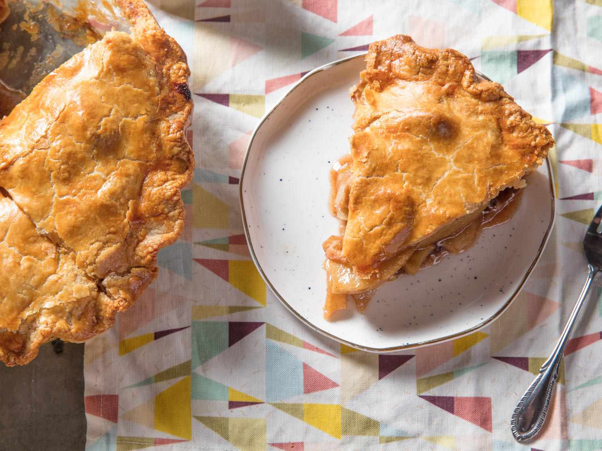

# Classic Apple Pie (with Optional Cheddar Crust)

📍 *Across the Midwest*

> The definitive American dessert, perfected in the Midwest where the apples actually grow. A flaky, all-butter crust filled with cinnamon-spiced apples, baked until golden and bubbling. And for the bold: a sharp cheddar cheese crust that sounds wrong until you try it and realize it's the best thing that ever happened to a pie.

---

## At a Glance

| | |
|---|---|
| **Servings** | 8 |
| **Prep Time** | 40 minutes + 1 hour chill |
| **Cook Time** | 50–60 minutes |
| **Total Time** | 2 hours 30 minutes - 2 hours 40 minutes (including chilling) |
| **Difficulty** | Intermediate |
| **Category** | Desserts |

---

## Ingredients

### Pie Crust (makes 2 — top and bottom)
- 2½ cups all-purpose flour
- 1 teaspoon salt
- 1 tablespoon sugar
- 1 cup (2 sticks) cold unsalted butter, cubed
- ¼–½ cup ice water
- *For cheddar crust: add ¾ cup finely shredded sharp cheddar to the flour mixture*

### Filling
- 3 lbs mixed apples (Honeycrisp, Granny Smith, and Braeburn — mix tart and sweet)
- ¾ cup granulated sugar
- 2 tablespoons all-purpose flour
- 1 tablespoon cornstarch
- 1½ teaspoons cinnamon
- ¼ teaspoon nutmeg
- ¼ teaspoon allspice
- 1 tablespoon lemon juice
- 1 teaspoon vanilla extract
- 2 tablespoons cold butter, cut into small pieces

### Egg Wash
- 1 egg beaten with 1 tablespoon water
- Coarse sugar for sprinkling

---

## Instructions

1. **Make the crust:** Whisk flour, salt, and sugar (and cheddar if using). Cut in cold butter using a pastry cutter or your fingers until mixture resembles coarse crumbs with some pea-sized butter pieces remaining. Add ice water 1 tablespoon at a time, mixing until dough just holds together. Divide in half, flatten into discs, wrap in plastic, refrigerate 1 hour.
2. **Prepare filling:** Peel, core, and slice apples ¼-inch thick. Toss with sugar, flour, cornstarch, cinnamon, nutmeg, allspice, lemon juice, and vanilla. Let sit 15 minutes.
3. **Assemble:** Roll one dough disc into a 12-inch circle. Fit into a 9-inch pie plate. Pour in apple filling, mounding slightly in the center. Dot with butter pieces.
4. **Top crust:** Roll second disc into a 12-inch circle. Place over filling. Trim, fold edges under, and crimp decoratively. Cut 4–5 slits for steam vents.
5. **Egg wash:** Brush top crust with egg wash. Sprinkle with coarse sugar.
6. **Bake:** Place pie on a baking sheet (to catch drips). Bake at 425°F for 15 minutes, then reduce to 375°F and bake 35–45 minutes more until crust is deep golden and juices are bubbling through the vents.
7. **Cool** at least 2 hours before slicing. (The filling needs time to set.)

---

## Tips & Variations

- **The apple mix matters:** All Granny Smith = too tart. All Honeycrisp = too sweet and mushy. Mix 2–3 varieties for the best texture and flavor.
- **Cheddar crust:** Sharp cheddar in the pie dough creates a savory-sweet contrast that's traditional in the upper Midwest and parts of New England. "Apple pie without cheese is like a kiss without a squeeze," goes the saying.
- **Lattice top:** For a showstopper, weave a lattice crust. More work, but stunning.
- **Overnight rest:** Apple pie is actually better the day after baking. The flavors meld and the filling fully sets.
- **À la mode:** Vanilla ice cream or a slice of sharp cheddar on top. Never both. You have to pick a side.

---

## 🌾 Did You Know?

Michigan is the third-largest apple-producing state in the US, and the Midwest's apple orchards — stretching from Michigan through Wisconsin, Minnesota, Iowa, and Illinois — produce dozens of heritage varieties perfect for pie. The tradition of serving apple pie with cheddar cheese dates back to at least the 1800s and was so embedded in the culture that in 1999, a Vermont state legislator proposed a bill requiring apple pie to be served with "a good grade of Vermont cheddar cheese, a slice of sharp cheddar cheese, or vanilla ice cream." The bill passed. Apple pie with cheese isn't weird — it's legislated.

---

*📸 Photography note: Rustic farmhouse style — golden pie on a wooden cutting board, one slice cut and slightly pulled out, on a weathered farm table. Linen napkin, vintage pie server. Basket of whole apples in the background. Warm afternoon window light.*
