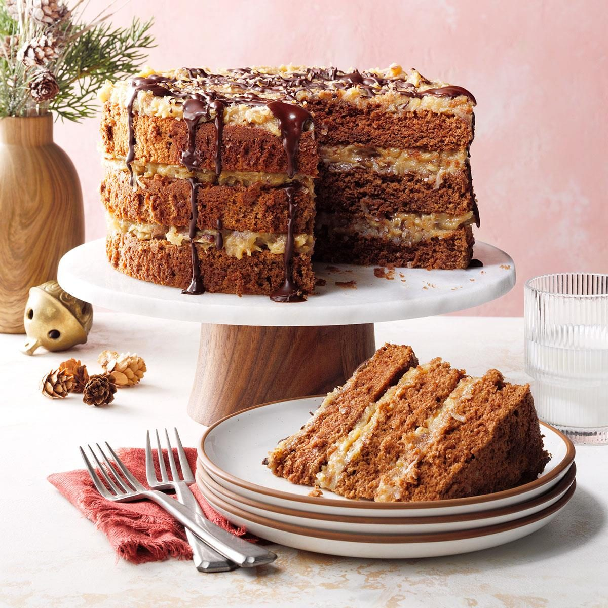

# German Chocolate Cake

📍 *Midwest — Church Suppers & Birthday Tables*

> Three layers of tender chocolate cake slathered in a decadent coconut-pecan frosting that's cooked on the stovetop until thick and caramelized — this isn't actually German at all, but it's been the Midwest's most requested birthday cake for over sixty years.

---

## At a Glance

| Detail | Info |
|--------|------|
| **Servings** | 12–16 |
| **Prep Time** | 30 minutes |
| **Cook Time** | 30 minutes (cake) + 15 minutes (frosting) |
| **Total Time** | 2 hours (including cooling) |
| **Difficulty** | Medium |
| **Category** | Desserts |

---

## Ingredients

### The Cake
- 4 ounces sweet baking chocolate (such as Baker's German's Sweet Chocolate), chopped
- ½ cup boiling water
- 2 cups all-purpose flour
- 1 teaspoon baking soda
- ½ teaspoon fine sea salt
- 1 cup (2 sticks) unsalted butter, softened
- 2 cups granulated sugar
- 4 large eggs, separated
- 1 teaspoon pure vanilla extract
- 1 cup buttermilk

### Coconut-Pecan Frosting
- 1 cup evaporated milk
- 1 cup granulated sugar
- 3 large egg yolks, lightly beaten
- ½ cup (1 stick) unsalted butter, cut into pieces
- 1 teaspoon pure vanilla extract
- 1⅓ cups sweetened flaked coconut
- 1 cup chopped pecans, toasted

---

## Instructions

### Make the Cake
1. **Prep.** Preheat oven to 350°F. Grease and flour three 9-inch round cake pans. Line the bottoms with parchment paper.

2. **Melt the chocolate.** Place the chopped chocolate in a small bowl. Pour the boiling water over it and stir until completely melted and smooth. Set aside to cool slightly.

3. **Mix dry ingredients.** In a medium bowl, whisk together the flour, baking soda, and salt.

4. **Cream butter and sugar.** In a large bowl, beat the butter and sugar with an electric mixer on medium-high speed until light and fluffy, about 4 minutes. Add the egg yolks one at a time, beating well after each. Mix in the vanilla and the melted chocolate mixture.

5. **Alternate additions.** With the mixer on low, add the flour mixture in three additions, alternating with the buttermilk in two additions, beginning and ending with flour. Mix just until combined.

6. **Whip the egg whites.** In a clean bowl with clean beaters, beat the egg whites until stiff peaks form. Gently fold the whites into the batter in two additions — this is what makes the cake tender.

7. **Bake.** Divide the batter evenly among the three prepared pans. Bake for 25–30 minutes, until a toothpick inserted in the center comes out clean. Cool in pans for 10 minutes, then turn out onto wire racks and cool completely.

### Make the Frosting
8. **Cook the frosting.** In a medium saucepan, combine the evaporated milk, sugar, beaten egg yolks, and butter. Cook over medium heat, stirring constantly, until the mixture thickens and turns golden amber, about 12–15 minutes. It should be thick enough to coat the back of a spoon.

9. **Add coconut and pecans.** Remove from heat. Stir in the vanilla, coconut, and toasted pecans. Let the frosting cool to room temperature, stirring occasionally, until it's thick and spreadable (about 45 minutes).

### Assemble
10. **Frost the cake.** Place one cake layer on a serving plate. Spread with about ⅓ of the frosting. Repeat with the second layer and more frosting. Top with the final layer and the remaining frosting. Leave the sides unfrosted (traditional) or frost the sides with chocolate buttercream for a more finished look.

---

## Tips & Variations

- **The Chocolate Matters:** Baker's German's Sweet Chocolate is the traditional choice and gives the cake its distinctive flavor. Don't substitute unsweetened chocolate — the cake will be too bitter.
- **Frosting Patience:** The stovetop frosting needs constant stirring and patience. Don't rush it — undercooked frosting will be too runny. It should be the color of caramel when done.
- **Toast the Pecans:** Always toast the pecans (350°F for 8 minutes) before adding to the frosting. It deepens their flavor dramatically.
- **Sheet Cake Version:** Pour the batter into a greased 9x13 pan, bake for 35–40 minutes, and spread the frosting on top. Easier for potlucks.
- **Make Ahead:** The unfrosted layers can be wrapped tightly and frozen for up to a month. Thaw, then frost.

---

## 🌾 Did You Know?

> Despite its name, German Chocolate Cake has nothing to do with Germany. It's named after Sam German, an American chocolatier who developed a mild, sweet baking chocolate for the Baker's Chocolate Company in 1852. The cake recipe was created more than a century later, in 1957, when a Dallas homemaker submitted her recipe using "German's chocolate" to a local newspaper. The recipe went viral (1950s-style), was picked up by General Foods (which owned Baker's Chocolate), and became a national sensation. Somewhere along the way, the possessive apostrophe was dropped, and everyone assumed the cake was German. It isn't. It's as American as the Midwest church supper where it became a perennial star.

---

*📸 Photography note: A three-layer cake on a white pedestal stand, the rich coconut-pecan frosting cascading between and over the layers. A slice removed and plated, showing the three dark chocolate layers. Pecans and coconut visible in the frosting. Warm, celebratory lighting. Clean, elegant, but homey.*
