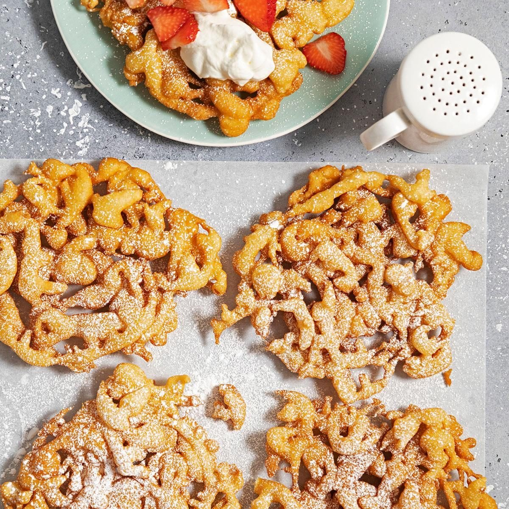

# Iowa State Fair Funnel Cake

📍 *Iowa — The State Fair*

> Ribbons of golden batter swirled into hot oil, fried until impossibly crispy, and buried under a blizzard of powdered sugar — funnel cake is the edible symbol of every Midwestern state fair, the one indulgence that makes standing in line completely worth it.

---

## At a Glance

| Detail | Info |
|--------|------|
| **Servings** | 6 funnel cakes |
| **Prep Time** | 10 minutes |
| **Cook Time** | 20 minutes |
| **Total Time** | 30 minutes |
| **Difficulty** | Easy |
| **Category** | Desserts |

---

## Ingredients

### The Batter
- 2 cups all-purpose flour
- 1 tablespoon granulated sugar
- 1 teaspoon baking powder
- ½ teaspoon baking soda
- ¼ teaspoon fine sea salt
- ¼ teaspoon ground cinnamon
- 2 large eggs
- 1½ cups whole milk
- ½ teaspoon pure vanilla extract
- Vegetable or canola oil for frying (about 2 inches in a deep skillet)

### For Topping
- Powdered sugar (generous — this is not optional)
- Whipped cream (optional)
- Strawberry or chocolate sauce (optional)
- Fresh berries (optional)

---

## Instructions

1. **Make the batter.** In a large bowl, whisk together the flour, sugar, baking powder, baking soda, salt, and cinnamon. In a separate bowl, beat the eggs, milk, and vanilla. Pour the wet ingredients into the dry and whisk until smooth — the batter should be pourable but not thin (similar to pancake batter).

2. **Heat the oil.** Pour oil to a depth of about 2 inches in a large, deep skillet or Dutch oven. Heat to 375°F. Use a thermometer — temperature control is crucial for crispy funnel cake.

3. **Pour the batter.** Transfer batter to a funnel, squeeze bottle, or large zip-top bag with a corner snipped (about ½-inch opening). Holding the funnel over the oil, pour the batter in a steady stream, moving in circles and crisscrossing patterns to create a lacy, interconnected web about 6–7 inches across.

4. **Fry.** Cook for 1–2 minutes per side until golden brown. Use tongs or a spider strainer to carefully flip once. The funnel cake should be deeply golden and crispy.

5. **Drain.** Remove from the oil and drain on a wire rack set over a sheet pan (or paper towels in a pinch).

6. **Sugar it immediately.** While still hot, dust liberally — no, obscenely — with powdered sugar. The heat should melt the first layer, so add more.

7. **Serve immediately.** Funnel cake is best eaten within minutes of frying, standing up, with powdered sugar on your shirt. Add whipped cream, chocolate sauce, or fresh berries if desired.

---

## Tips & Variations

- **The Squeeze Bottle Method:** A plastic squeeze bottle (like a ketchup bottle) gives you the most control over the batter flow. This is the secret of the fast food booth operators.
- **Churro Funnel Cake:** Dust with cinnamon sugar instead of powdered sugar.
- **Apple Pie Version:** Top with warm cinnamon-spiced apple slices and whipped cream.
- **Chocolate Drizzle:** Zigzag warm Nutella or chocolate sauce across the top.
- **Keep Oil Temperature Steady:** If the oil is too cool, the funnel cake absorbs oil and gets greasy. Too hot, and it browns before cooking through. 375°F is the sweet spot.

---

## 🌾 Did You Know?

> The Iowa State Fair — held every August in Des Moines — is one of the oldest and largest agricultural fairs in the country, and food is its beating heart. The Fair is famous for putting virtually everything "on a stick," but funnel cake reigns as the queen of the midway. The treat's origins trace back to Pennsylvania Dutch (German) immigrants who brought *Drechter Kuche* (funnel cake) to America in the 1700s. It spread through German-settled regions of the Midwest and became a carnival staple by the mid-20th century. The Iowa State Fair alone serves tens of thousands of funnel cakes each year, and the sight of someone walking through the midway with a paper plate of powdered-sugar-dusted funnel cake is as iconic as the fair's famous Butter Cow sculpture.

---

*📸 Photography note: A crispy golden funnel cake on a white paper plate, absolutely covered in powdered sugar, with a few strawberries on top. Background suggests a state fair midway — colorful lights, Ferris wheel blur. Bright, festive, fun. Maybe a hand reaching to tear off a piece.*
