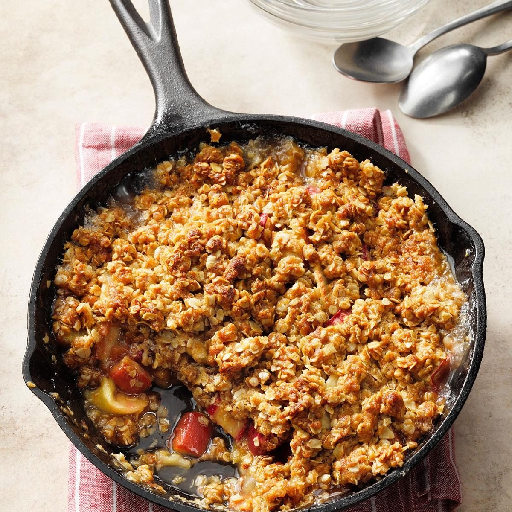

# Rhubarb Crisp with Oat Topping

📍 *Minnesota, Iowa, Wisconsin — Anywhere the Rhubarb Patch Survived Another Winter*

> Tart, ruby-red rhubarb baked under a thick blanket of buttery, brown-sugary oat crumble until the fruit is bubbling and jammy and the topping is shatteringly crisp at the edges, chewy in the middle. Served warm with a scoop of vanilla ice cream that melts into a pool of sweet cream rivers between the craggy peaks of oat topping. This is what the rhubarb was growing for.

---

## At a Glance

| Detail | Info |
|--------|------|
| **Servings** | 8 |
| **Prep Time** | 15 minutes |
| **Bake Time** | 40–45 minutes |
| **Total Time** | 1 hour |
| **Difficulty** | Easy |
| **Category** | Desserts |

---

## 🫕 Midwest Nice Rating: 🫕🫕🫕🫕🫕

This is the dessert that ends potluck arguments. Bring a rhubarb crisp in June and you'll be remembered until October.

---

## Ingredients

### The Rhubarb Filling
- 6 cups fresh rhubarb, cut into ½-inch pieces (about 2 pounds)
- ¾ cup granulated sugar
- 2 tablespoons all-purpose flour
- 1 tablespoon cornstarch
- 1 teaspoon vanilla extract
- Zest of 1 orange (optional but lovely)

### The Oat Topping
- 1 cup old-fashioned rolled oats
- ¾ cup all-purpose flour
- ¾ cup packed brown sugar
- ½ teaspoon ground cinnamon
- ¼ teaspoon ground nutmeg
- ¼ teaspoon salt
- ½ cup (1 stick) cold unsalted butter, cut into small cubes

### For Serving
- Vanilla ice cream (not optional, no matter what the recipe says)

---

## Instructions

1. **Preheat.** Set your oven to 375°F. Butter a 9 × 9-inch baking dish (or an 8 × 11 for a thinner, crispier version).

2. **Make the filling.** In a large bowl, toss the rhubarb pieces with the sugar, flour, cornstarch, vanilla, and orange zest. Let it sit for 10 minutes while you make the topping — the sugar will start pulling juice from the rhubarb, which is exactly what you want.

3. **Make the topping.** In a separate bowl, combine the oats, flour, brown sugar, cinnamon, nutmeg, and salt. Add the cold butter cubes and work them in with your fingers (or a pastry blender) until the mixture resembles coarse, clumpy crumbles — some pea-sized butter pieces remaining is good. They'll melt in the oven and create pockets of buttery crunch.

4. **Assemble.** Pour the rhubarb filling into the prepared baking dish, spreading evenly. Scatter the oat topping over the rhubarb in thick, uneven clumps. Don't press it down — you want air and texture, not a flat lid.

5. **Bake.** Bake for 40–45 minutes, until the topping is golden brown and crispy and the rhubarb filling is visibly bubbling around the edges. If the topping is browning too quickly, tent loosely with foil for the last 10 minutes.

6. **Rest and serve.** Let the crisp cool for at least 10 minutes (the filling will be volcanic). Serve warm with a generous scoop of vanilla ice cream. Watch the ice cream melt into the hot fruit. Experience joy.

---

## Tips & Variations

- **Strawberry-Rhubarb:** Replace 2 cups of rhubarb with 2 cups of sliced strawberries. This is the classic crowd-pleaser combination — the strawberries add sweetness and color. A little less sugar in the filling (reduce to ½ cup) since the berries bring their own.
- **Frozen Rhubarb:** Works perfectly. Don't thaw it — toss the frozen pieces directly with the sugar and flour. It'll release more juice, so add an extra tablespoon of cornstarch.
- **Rhubarb Source:** If you don't have a rhubarb patch, you probably know someone who does. Midwesterners with rhubarb are desperate to give it away by July. Accept the rhubarb. Make the crisp. Return a portion of the crisp. This is the social contract.
- **Pecan Topping:** Add ½ cup chopped pecans to the oat topping for extra crunch.
- **Crisp vs. Crumble vs. Cobbler:** A crisp has oats in the topping. A crumble doesn't. A cobbler has a biscuit-like dough. A buckle has cake batter. A grunt is cooked on the stovetop. A slump is baked. A betty has bread crumbs. Nobody remembers the rules. Just call it a crisp and move on.

---

> **🤫 Grandma's Secret:** *"Freeze the butter and grate it on a box grater instead of cutting it into cubes. It mixes into the dry ingredients more evenly and melts into flatter, crunchier layers. Also, a splash of fresh orange juice in the filling — not enough to taste citrusy, just enough to brighten the rhubarb."*

---

## Pairs Well With

A porch swing, the long light of a June evening, a scoop of ice cream that was on sale at Hy-Vee, and the annual threat to rip out the rhubarb patch that absolutely no one will ever follow through on.

---

## 🌾 Did You Know?

> Rhubarb is technically a vegetable, but in 1947 a U.S. customs court in Buffalo, New York, classified it as a fruit because it's used primarily as a fruit in the United States. This was a tax decision (fruits had lower tariffs), and it's the kind of pragmatic compromise the Midwest respects. Rhubarb thrives in cold climates with harsh winters — it actually needs a freeze period to grow properly — which is why the Upper Midwest is rhubarb country. Nearly every farmstead had a rhubarb patch, usually planted by a grandmother and inherited like furniture. The plant is perennial and nearly indestructible; patches have survived decades of neglect, harsh winters, and being driven over by tractors. Rhubarb was once called the "pie plant" because its primary culinary purpose was filling pies and crisps with its bracingly tart, jammy fruit. In the Midwest, rhubarb season (May through July) is treated with the same reverence as sweet corn season — a narrow window of perfection that you do not waste.

---

*📸 Photography note: A baking dish of rhubarb crisp, the oat topping golden and craggy, pink-red rhubarb filling bubbling up at the edges. One portion scooped out, served in a bowl with a scoop of melting vanilla ice cream. A garden setting — maybe a rhubarb plant in the background. Late afternoon light. The photo should feel like summer in Minnesota.*
