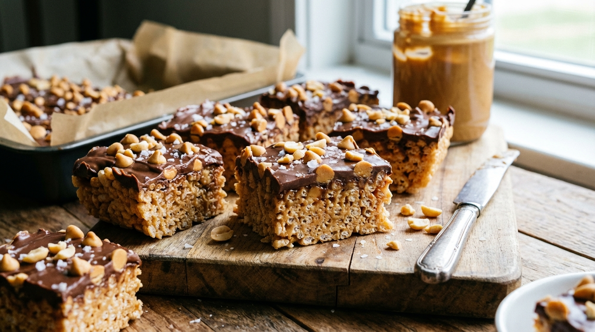

# Scotcheroos

📍 *Iowa & Minnesota — State Fair Country*

> Chewy, peanut-buttery Rice Krispie bars topped with a thick, glossy layer of melted butterscotch and chocolate chips that sets into a satisfying snap. Imagine a Rice Krispie Treat went to finishing school and came back dangerous. One pan yields enough to feed a church basement, a school bake sale, or your own secret midnight cravings for a week.

---

## At a Glance

| Detail | Info |
|--------|------|
| **Yield** | 24 bars |
| **Prep Time** | 15 minutes |
| **Set Time** | 30 minutes |
| **Total Time** | 45 minutes |
| **Difficulty** | Easy |
| **Category** | Desserts / No-Bake |

---

## 🫕 Midwest Nice Rating: 🫕🫕🫕🫕🫕

These vanish at every potluck, bake sale, and "I just need to bring *something*" situation. They're the MVP of the dessert table.

---

## Ingredients

### The Base
- 1 cup granulated sugar
- 1 cup light corn syrup
- 1 cup creamy peanut butter
- 6 cups Rice Krispies cereal

### The Topping
- 1 cup butterscotch chips
- 1 cup semi-sweet chocolate chips

---

## Instructions

1. **Prep the pan.** Lightly grease a 9 × 13-inch baking pan with butter or cooking spray. Line with parchment paper for easy removal if you're feeling fancy.

2. **Cook the sugar mixture.** In a large saucepan over medium heat, combine the sugar and corn syrup. Stir constantly until the mixture comes to a rolling boil and the sugar is fully dissolved. Remove from heat immediately — do not overcook or it will harden.

3. **Add the peanut butter.** Stir the peanut butter into the hot sugar mixture until completely smooth and combined.

4. **Add the cereal.** Pour in the Rice Krispies and fold gently with a rubber spatula until every piece is coated. Work quickly — the mixture starts to set as it cools.

5. **Press into the pan.** Transfer the mixture to the prepared pan and press it into an even layer. Use the back of a greased spatula or a piece of wax paper to press firmly — you want it compact enough to hold together but not so dense it loses its crunch.

6. **Make the topping.** In a microwave-safe bowl, combine the butterscotch chips and chocolate chips. Microwave in 30-second intervals, stirring between each, until completely smooth and melted (about 90 seconds total). Alternatively, melt in a double boiler over simmering water.

7. **Top and set.** Pour the melted butterscotch-chocolate mixture over the cereal base and spread into an even layer with an offset spatula. Let it set at room temperature for about 30 minutes, or refrigerate for 15 minutes if you're impatient.

8. **Cut and serve.** Once the topping is set (firm to the touch but still slightly yielding), cut into bars. Smaller bars are sensible. Larger bars are correct.

---

## Tips & Variations

- **Don't Overheat the Topping:** If you overheat the chocolate-butterscotch mixture, it can seize up and turn grainy. Low and slow. Stir constantly. The moment it's smooth, stop heating.
- **Peanut Butter Quality:** Standard Jif or Skippy works perfectly here — the stabilizers help the bars hold together. Natural peanut butter (the oil-separating kind) will make the base crumbly and oily. Save your fancy peanut butter for toast.
- **Butterscotch is the Star:** The butterscotch chips are what make these scotcheroos, not just chocolate-peanut-butter bars. Don't skip them. Don't substitute caramel. The butterscotch provides a warm, almost toffee-like flavor that ties the whole thing together.
- **Storage:** Keep in an airtight container at room temperature for up to 5 days. They also freeze well — cut into bars, freeze on a sheet pan, then stack with wax paper between layers. Pull out as needed. Future you will be grateful.
- **Extra Fancy:** Drizzle additional melted chocolate or butterscotch on top after the first layer sets. Sprinkle with flaky sea salt. You've now made something that could sell at a bakery.

---

> **🤫 Grandma's Secret:** *"Add a tiny pinch of salt to the peanut butter mixture — it's the difference between 'good' and 'I need the recipe.' And cut them with a plastic knife. Sounds crazy, but the chocolate topping won't crack and crumble the way it does with a metal knife."*

---

## Pairs Well With

A Ziploc bag in your car's glove compartment, a 4-H meeting, the Iowa State Fair at 2 PM when you need fuel for the butter cow, and a glass of ice-cold milk consumed standing at the kitchen counter at 11 PM.

---

## 🌾 Did You Know?

> Scotcheroos first appeared on the back of a Kellogg's Rice Krispies cereal box in the 1960s, and their rise to Midwest fame was swift and permanent. The recipe is so popular in Iowa that it's essentially the unofficial state dessert — they appear at every church potluck, school function, and office birthday celebration. The Iowa State Fair, which draws over a million visitors annually, has scotcheroo vendors scattered throughout the grounds. The recipe's genius is in its simplicity: no baking required, minimal ingredients, virtually impossible to mess up, and the result looks far more impressive than the effort involved. They sit at the perfect intersection of homemade and effortless, which is the sweet spot of Midwestern baking. The name "scotcheroo" — which sounds like it was invented by a 1960s ad copywriter (because it was) — has become so embedded in regional vocabulary that Midwesterners are often surprised to learn that people in other parts of the country have never heard of them.

---

*📸 Photography note: Scotcheroos cut into bars on a parchment-lined cutting board, the glossy chocolate-butterscotch topping catching the light, one bar turned on its side to show the crispy peanut butter base. Maybe a glass of milk nearby. Bright, cheerful lighting — bake sale energy. The photo should make you want to eat three of these.*
