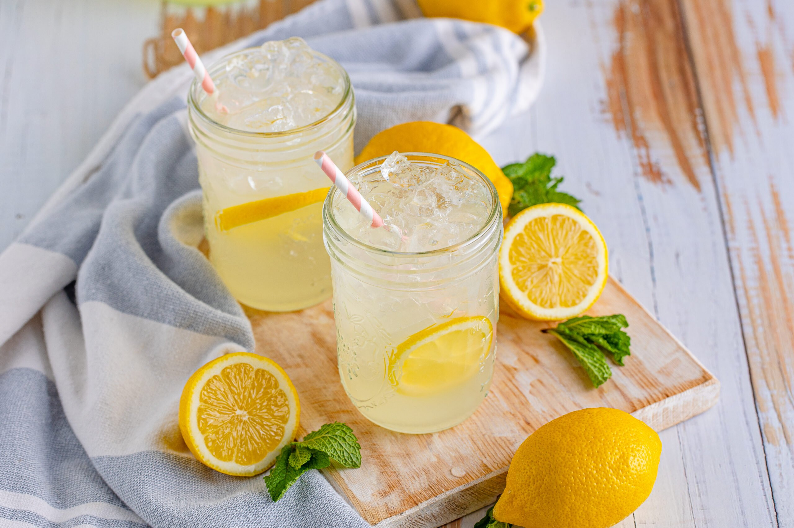

# Homemade Lemonade

📍 *Midwest — The Summer Porch Refresher*

> There's lemonade, and then there's *real* lemonade. Freshly squeezed lemons, just enough sweetness, and ice-cold refreshment that makes summer heat bearable. This is the drink of county fairs, backyard barbecues, and lazy afternoons on the porch swing.

---

## At a Glance

| Detail | Info |
|--------|------|
| **Servings** | 8 |
| **Prep Time** | 15 minutes |
| **Cook Time** | 5 minutes (for simple syrup) |
| **Total Time** | 20 minutes + chilling |
| **Difficulty** | Easy |
| **Category** | Drinks |

---

## 🫕 Midwest Nice Rating: 🫕🫕🫕🫕

Summer porch essential. Bring a pitcher to the neighborhood block party and watch it disappear in minutes.

---

## Ingredients

### The Simple Syrup
- 1 cup granulated sugar
- 1 cup water

### The Lemonade
- 1½ cups freshly squeezed lemon juice (about 8–10 large lemons)
- 5 cups cold water
- Ice cubes

### For Serving
- Lemon slices
- Fresh mint sprigs
- Additional ice

---

## Instructions

1. **Make the simple syrup.** Combine sugar and 1 cup water in a small saucepan. Heat over medium heat, stirring, until sugar completely dissolves. Do not boil. Remove from heat and let cool for 10 minutes.

2. **Juice the lemons.** Roll lemons firmly on the counter with your palm to soften them — this releases more juice. Cut in half and squeeze, straining out seeds and pulp. You need 1½ cups of juice.

3. **Combine.** In a large pitcher, combine the simple syrup, fresh lemon juice, and 5 cups cold water. Stir well to mix.

4. **Taste and adjust.** This is the crucial step. Taste your lemonade. Too tart? Add more simple syrup (make extra if needed). Too sweet? Add more lemon juice or water. Everyone's sweet-tart balance is different.

5. **Chill.** Refrigerate for at least 1 hour until very cold. Lemonade tastes best ice-cold.

6. **Serve.** Fill glasses with ice. Pour lemonade over the ice. Garnish with a lemon slice and a sprig of fresh mint.

---

## Tips & Variations

- **Fresh Is Best:** Bottled lemon juice cannot compare to freshly squeezed. It's worth the extra effort.
- **Meyer Lemonade:** Use Meyer lemons for a sweeter, more floral lemonade with less tartness.
- **Sparkling Lemonade:** Replace half the water with club soda or sparkling water. Add just before serving.
- **Strawberry Lemonade:** Blend 1 cup fresh strawberries with ½ cup water, strain, and add to the lemonade.
- **Lavender Lemonade:** Add 2 tablespoons dried culinary lavender to the simple syrup while it's warm. Steep for 10 minutes, then strain.
- **Raspberry Lemonade:** Muddle 1 cup fresh raspberries in the bottom of the pitcher before adding lemonade.
- **Arnold Palmer:** Mix half lemonade, half sweet tea for the classic golf course refresher.
- **Frozen Lemonade:** Blend lemonade with ice for a slushy summer treat.
- **Lemon Ice Cubes:** Freeze lemonade in ice cube trays so your drink doesn't get diluted.

---

> **🤫 Grandma's Secret:** *"Freeze lemon wheels in ice cube trays with a little water — they look beautiful in the pitcher and keep the lemonade cold without watering it down. And make extra simple syrup to keep in the fridge. It lasts for weeks and makes it easy to whip up a fresh batch anytime the grandkids come over."*

---

## 🌾 Did You Know?

> Lemonade has been a summer staple in America since the 1800s, but the Midwest made it an institution. County fairs across Iowa, Illinois, and Indiana became famous for their fresh-squeezed lemonade stands, often using giant wooden presses to juice lemons right in front of customers. The combination of summer heat, hard farm work, and the need for affordable refreshment made lemonade the default drink of the Heartland. Lemonade stands run by children became a rite of passage — teaching entrepreneurship, customer service, and the value of a dollar, one 25-cent cup at a time. Today, the sight of a hand-painted "Lemonade" sign on a card table still evokes pure Americana.

---

*📸 Photography note: Tall glass pitcher filled with bright yellow lemonade, condensation on the outside, lemon slices floating inside. Two tall glasses with ice and lemonade beside it, mint sprig garnishes. Bright summer day lighting. White wooden porch railing and Adirondack chair visible in background.*
