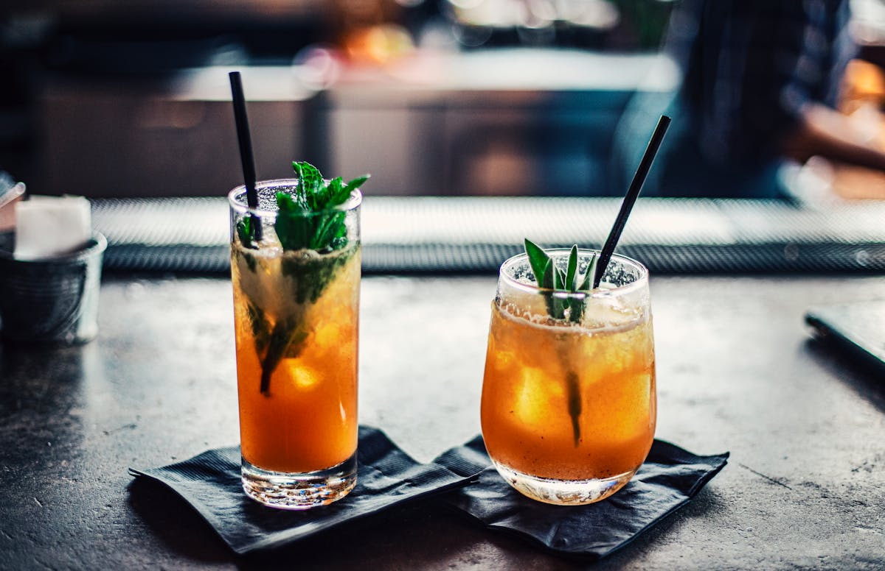

# Homemade Root Beer

📍 *Across the Midwest — County Fairs, Farm Kitchens, and Ambitious Backyards*

> Dark, foamy, sassafras-sweet root beer made from scratch with extract, sugar, yeast, and a little patience — fizzy and sharp, with a depth of flavor that makes the commercial stuff taste like it's apologizing. Brewing root beer at home is the Midwestern science experiment that actually tastes good, and the fermenting bottles on the counter make your kitchen feel like a frontier general store.

---

## At a Glance

| Detail | Info |
|--------|------|
| **Yield** | About 1 gallon (eight 16-oz bottles) |
| **Prep Time** | 15 minutes |
| **Ferment Time** | 12–48 hours |
| **Chill Time** | Overnight |
| **Total Time** | 2 days |
| **Difficulty** | Easy (but requires attention) |
| **Category** | Drinks |

---

## 🫕 Midwest Nice Rating: 🫕🫕🫕🫕

Bring homemade root beer to a cookout and you'll be the most interesting person there. Kids and adults both lose their minds over this.

---

## Ingredients

- 1 gallon warm water (not hot — about 100°F)
- 1½ cups granulated sugar
- 2 tablespoons root beer extract (Zatarain's or McCormick's — available at most grocery stores)
- ¼ teaspoon active dry yeast

### Optional (For Depth)
- 1 teaspoon vanilla extract
- ½ teaspoon wintergreen extract

### You'll Also Need
- 8 clean plastic 16-oz bottles with screw-top caps (plastic is essential — see safety note)
- A funnel
- A large pot or food-safe bucket for mixing

---

## Instructions

1. **Mix the sugar.** In a large pot or food-safe bucket, dissolve the sugar in about 2 cups of warm (not hot!) water, stirring until completely dissolved.

2. **Add the extract.** Stir in the root beer extract (and vanilla/wintergreen if using). Add the remaining water and stir to combine. The mixture should be at room temperature — about 75–100°F. If it's too hot, it will kill the yeast. If it's too cold, the yeast won't activate.

3. **Add the yeast.** Sprinkle the yeast over the surface of the root beer mixture and stir gently. The yeast is what will create the carbonation — it eats the sugar and produces CO2 (and a tiny, negligible amount of alcohol).

4. **Bottle it.** Using a funnel, pour the mixture into clean plastic bottles, leaving about 2 inches of headspace at the top. Cap tightly.

5. **Ferment.** Place the bottles in a warm spot (70–80°F) for 12–48 hours. **Check them every 12 hours** by squeezing a bottle. When the bottles are rock-hard and can't be squeezed at all, they're carbonated and ready. This is usually 24–48 hours depending on temperature.

6. **Refrigerate immediately.** Once carbonated, move the bottles to the refrigerator immediately. The cold stops the fermentation. **Do not leave carbonated bottles at room temperature** — pressure will continue to build and bottles can burst.

7. **Serve cold.** Open carefully (they'll be fizzy). Pour into a frosty mug. Add a scoop of vanilla ice cream for a root beer float. Feel like a pioneer.

---

## Tips & Variations

- **⚠️ SAFETY: Use Plastic Bottles Only.** Glass bottles can explode from the CO2 pressure. This is not a metaphor. Plastic bottles are safer because you can monitor pressure by squeezing them, and they're much less dangerous if they do over-pressurize. Do not use glass unless you have specific brewing experience and pressure-rated bottles.
- **Alcohol Content:** Technically, the yeast fermentation produces a tiny amount of alcohol — well under 0.5%, which is less than a ripe banana. For all practical purposes, this is non-alcoholic. The fermentation is just for carbonation.
- **Dry Ice Method (Instant, No Yeast):** For completely non-alcoholic root beer with no waiting, make the sugar-water-extract mixture and add small pieces of food-grade dry ice until fizzy. Handle dry ice with gloves and wait for it to completely sublimate before drinking. This method is great for parties.
- **Root Beer Floats:** Pour root beer slowly over a scoop of good vanilla ice cream in a tall glass. The foam will rise aggressively — pour slowly and keep going. The ratio is ¾ root beer to ¼ ice cream. Use a straw and a long spoon.
- **Sassafras Tea Base:** For a from-scratch version (no extract), simmer sassafras root bark, sarsaparilla root, licorice root, wintergreen, and anise in water for 30 minutes, strain, and use this as your base instead of extract plus water. This is the old-timey method and produces a more complex flavor.

---

> **🤫 Grandma's Secret:** *"A tablespoon of molasses in the mix gives the root beer a deeper, more old-fashioned flavor — darker and richer, like the kind you used to get at the soda fountain. And always serve it in a frosted mug. Put mugs in the freezer an hour before serving."*

---

## Pairs Well With

A Fourth of July barbecue, a scoop of Blue Bunny vanilla ice cream, your first sip of something you made yourself, and the brief, intoxicating delusion that you might start a root beer business.

---

## 🌾 Did You Know?

> Root beer is one of America's oldest beverages, with roots (literally) going back to colonial times when indigenous peoples brewed teas from sassafras root bark for medicinal purposes. European settlers adapted these into "small beers" — low-alcohol fermented beverages flavored with roots, bark, and herbs. Charles Hires, a Philadelphia pharmacist, popularized a commercial version at the 1876 Centennial Exposition, marketing it as "root tea" (later "root beer") — a temperance-friendly alternative to alcohol. The Midwest became root beer country in the early 20th century, with regional brands like A&W (founded in Lodi, California, but which exploded across the Midwest), Barq's, and IBC becoming fixtures at drive-ins, diners, and county fairs. Homemade root beer was a common farm kitchen project — practically every community cookbook from the 1920s through the 1970s includes a recipe. The tradition faded with cheap commercial soda, but it's experiencing a revival among home brewers and DIY enthusiasts who want that deeper, sharper, more complex root beer flavor that mass production can't quite capture.

---

*📸 Photography note: A frosty glass mug of dark, foamy root beer, foam spilling slightly over the rim. Maybe a root beer float version alongside — ice cream bobbing in the dark soda. A checkered tablecloth, a warm summer day suggested by the lighting. A few plastic bottles of homemade root beer in the background. Nostalgic, county-fair energy.*
