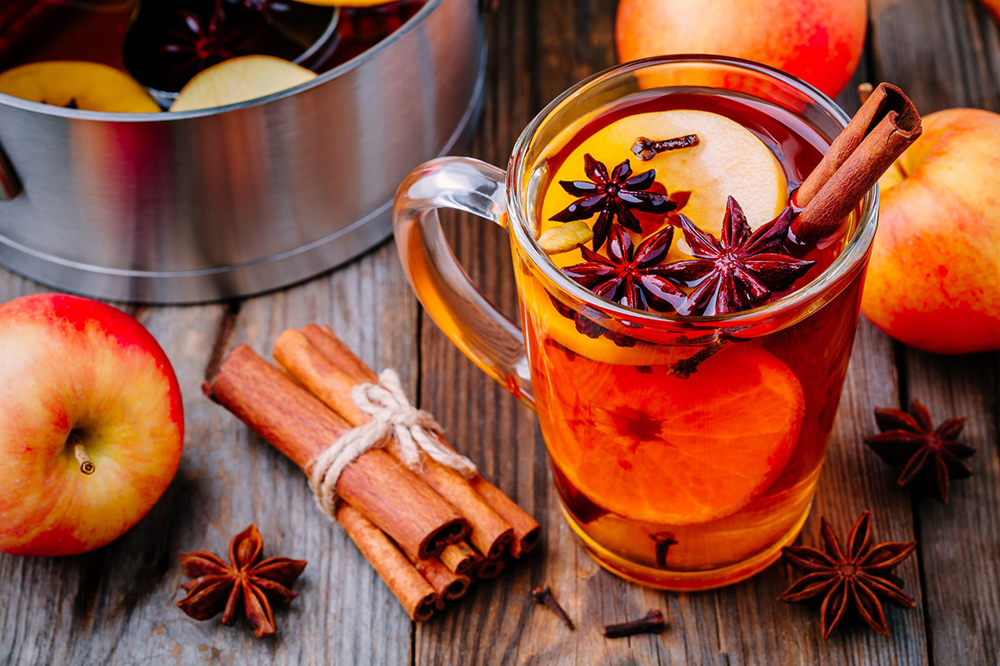

# Hot Apple Cider

📍 *Midwest — The Autumn Warmer*

> The smell of fall in a mug. Fresh apple cider simmered with cinnamon sticks, whole cloves, star anise, and orange peel until your entire house smells like an orchard in October. This is the drink that greets you after hayrides, bonfire nights, and crisp football Saturdays.

---

## At a Glance

| Detail | Info |
|--------|------|
| **Servings** | 8 |
| **Prep Time** | 5 minutes |
| **Cook Time** | 30 minutes |
| **Total Time** | 35 minutes |
| **Difficulty** | Easy |
| **Category** | Drinks |

---

## 🫕 Midwest Nice Rating: 🫕🫕🫕🫕🫕

Autumn in a mug. Make a slow cooker full for a gathering and people will never want to leave.

---

## Ingredients

### The Cider
- 2 quarts (8 cups) fresh apple cider (not apple juice)
- ½ cup pure maple syrup (or brown sugar to taste)
- 4 cinnamon sticks
- 1 teaspoon whole cloves
- 1 teaspoon whole allspice berries
- 3 star anise pods
- 1 whole nutmeg, cracked in half
- 1 orange, sliced into rounds
- 1 small apple, sliced (optional)
- 1-inch piece fresh ginger, sliced (optional)

### For Serving
- Extra cinnamon sticks
- Orange peel twists
- Whipped cream (optional)
- Caramel drizzle (optional)
- Splash of bourbon or spiced rum (optional, for adults)

---

## Instructions

1. **Combine everything.** Pour apple cider into a large pot or Dutch oven. Add maple syrup, cinnamon sticks, cloves, allspice, star anise, nutmeg, orange slices, and apple slices and ginger if using.

2. **Heat gently.** Bring to a gentle simmer over medium heat. Do not boil — boiling can make the cider taste bitter and will evaporate the delicate apple flavors.

3. **Simmer and infuse.** Reduce heat to low and let the cider simmer gently for 25–30 minutes, allowing the spices to fully infuse. The longer it simmers, the more aromatic it becomes.

4. **Taste and adjust.** Taste the cider and add more maple syrup if you prefer it sweeter. The sweetness level depends on how sweet your cider was to begin with.

5. **Strain and serve.** Using a fine-mesh strainer or slotted spoon, remove the whole spices and fruit slices. Ladle hot cider into mugs.

6. **Garnish.** Add a fresh cinnamon stick and an orange peel twist to each mug. For an adults-only version, add a splash of bourbon or spiced rum.

---

## Tips & Variations

- **Cider vs. Juice:** Apple cider is unfiltered and has a cloudy appearance with more complex, fresh apple flavor. Apple juice will work but tastes thinner. Seek out fresh cider from orchards or farmers' markets for the best results.
- **Slow Cooker Method:** Combine all ingredients in a slow cooker and cook on low for 3–4 hours. Keep on warm for serving at parties.
- **Spice Bag:** Place whole spices in a cheesecloth bundle or large tea infuser for easy removal.
- **Cranberry Apple:** Add 1 cup cranberry juice for a tart, festive version.
- **Caramel Apple:** Stir in 3 tablespoons caramel sauce and top each mug with whipped cream and a caramel drizzle.
- **Ginger Kick:** Add more fresh ginger for a spicier, warming version.
- **Keep Warm:** Transfer to a thermal carafe or keep on the lowest heat setting for serving throughout an event.

---

> **🤫 Grandma's Secret:** *"Save your spice bundle after making a batch — it can be reused 2-3 times if you keep it in the fridge. And if you're having people over, start the cider in the slow cooker in the morning on low. By evening, your whole house smells like fall and the cider is perfect. Leftover cider makes the best oatmeal — just use it instead of water."*

---

## 🌾 Did You Know?

> Apple cider has been an American tradition since colonial times, when apples were more commonly drunk than eaten. The Midwest's apple-growing regions — Michigan, Wisconsin, and Minnesota — became cider-making capitals, with families visiting orchards each fall for fresh cider and donuts. The tradition of mulling cider with spices came from European wassail traditions and was adopted by German and Scandinavian immigrants who settled the region. Hot apple cider became the signature drink of harvest festivals, Halloween parties, and Thanksgiving gatherings. Today, many Midwestern orchards still press their own cider, and the first sip of hot spiced cider signals that autumn has truly arrived.

---

*📸 Photography note: Clear glass mug filled with golden amber hot apple cider, cinnamon stick resting inside, orange slice floating on top. Steam rising visibly. Whole spices (star anise, cinnamon sticks) scattered on wooden surface. Fall leaves and small pumpkins in background. Warm, cozy autumn lighting.*
