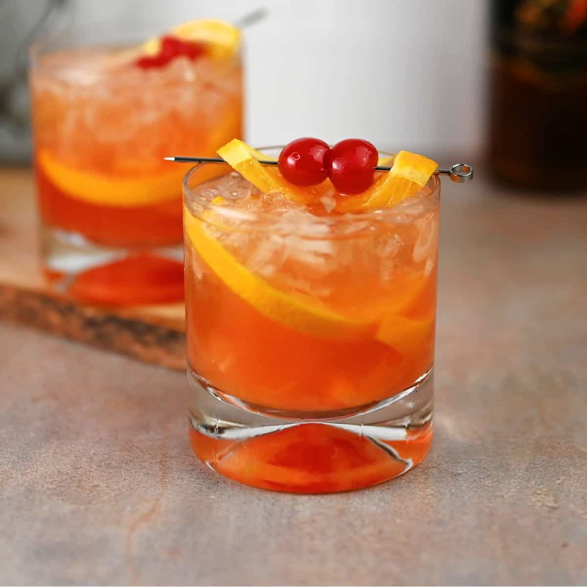

# Wisconsin Brandy Old Fashioned

📍 *Wisconsin — Every Supper Club, Bar, and Family Gathering in the State*

> Brandy muddled with a sugar cube, bitters, and a maraschino cherry, topped with a splash of soda (sweet, sour, or press — you must choose), and garnished with enough fruit to qualify as a produce section. This is not the whiskey Old Fashioned the rest of America drinks. This is the Wisconsin Old Fashioned, and in Wisconsin, if you order an Old Fashioned without specifying whiskey, you're getting brandy. Nobody asks. Everybody knows.

---

## At a Glance

| Detail | Info |
|--------|------|
| **Servings** | 1 cocktail |
| **Prep Time** | 5 minutes |
| **Total Time** | 5 minutes |
| **Difficulty** | Easy |
| **Category** | Drinks / Cocktails |

---

## 🫕 Midwest Nice Rating: 🫕🫕🫕🫕🫕

This is the state drink of Wisconsin in everything but official designation. It's at every fish fry, every supper club, every wedding, and every Tuesday.

---

## Ingredients

- 1 sugar cube (or ½ teaspoon granulated sugar)
- 2–3 dashes Angostura bitters
- 1 maraschino cherry (plus more for garnish)
- 1 orange slice
- Splash of water or soda water
- 2 ounces brandy (Korbel is the Wisconsin standard)
- Ice
- Your choice of topper:
  - **Sweet:** Sprite or 7-Up
  - **Sour:** Squirt or Fresca (or sour mix)
  - **Press:** Half Sprite, half soda water

### Garnish (The Wisconsin Way)
- Additional maraschino cherries
- Additional orange slices
- A cocktail pick loaded with fruit
- Optional: a skewered mushroom (yes, really — in some bars)

---

## Instructions

1. **Muddle.** Place the sugar cube in the bottom of an Old Fashioned glass. Add the bitters and a splash of water. Drop in the cherry and orange slice. Muddle firmly — you want to dissolve the sugar and express the oils from the orange, but you're not making a smoothie. The fruit should be bruised, not obliterated.

2. **Add ice.** Fill the glass with ice cubes. Some bars use a single large cube; most Wisconsin bars use regular cubes. Both are fine.

3. **Add the brandy.** Pour 2 ounces of brandy over the ice. In Wisconsin, this is almost always Korbel. Not because it's the best brandy in the world, but because it's *the* brandy. The relationship between Wisconsin and Korbel is deep, loyal, and immune to marketing.

4. **Top it off.** Add your chosen topper — sweet, sour, or press. The bartender will ask "sweet, sour, or press?" and you must answer without hesitating. This is a loyalty test.

5. **Garnish aggressively.** Add more cherries, another orange slice, and whatever fruit the bar has available. A Wisconsin Old Fashioned should have enough garnish that you could call it a fruit salad with a straight face.

6. **Serve.** Stir gently. Sip slowly. Order a second one with dinner. This is the Wisconsin way.

---

## Tips & Variations

- **Sweet vs. Sour vs. Press:** "Sweet" (Sprite/7-Up) is the most popular order and gives a sweeter, more approachable drink. "Sour" (Squirt, sour mix, or grapefruit soda) gives a more tart, sophisticated edge. "Press" (half lemon-lime soda, half soda water) is the bartender's choice — balanced and less sweet. There is no wrong answer, but there are strong opinions.
- **The Brandy:** Korbel is the traditional Wisconsin choice — it's a California brandy that's smooth, slightly sweet, and mixes perfectly. Wisconsin consumes more Korbel brandy than any other state by a wide margin. Some bars use Christian Brothers. High-end cocktail bars might use a nicer brandy. Your supper club uses Korbel, and your supper club is right.
- **The Bitters:** Angostura is standard. Some bars use a proprietary bitters blend. If you want to get fancy, try a few dashes of orange bitters alongside the Angostura.
- **Whiskey Old Fashioned:** If you want bourbon or rye, you need to specify. In Wisconsin, "Old Fashioned" = brandy. In the rest of America, "Old Fashioned" = whiskey. Neither side is wrong. Both sides are confused by the other.
- **The Mushroom Garnish:** Some bars in central and northern Wisconsin garnish their Old Fashioneds with a pickled mushroom. This is real. It's regional even within Wisconsin. If your bartender offers one, accept it. You're in the presence of tradition.

---

> **🤫 Grandma's Secret:** *"Use Luxardo cherries instead of the neon-red maraschinos. They cost more but they're actual cherries, and the syrup from the jar can replace the sugar cube. Also, the real secret? Order it press. Sweet is fine, but press is what people who actually know their way around a brandy Old Fashioned drink."*

---

## Pairs Well With

A Wisconsin Friday fish fry (mandatory), a supper club with wood paneling and a salad bar, the third quarter of a Packers game, and a designated driver — because these go down dangerously easy and the second one arrives before you remember ordering it.

---

## 🌾 Did You Know?

> Wisconsin's relationship with brandy is unique in America and deeply rooted in history. German immigrants — who settled Wisconsin in massive numbers in the mid-1800s — had a tradition of drinking fruit brandies and schnaps. When they arrived in Wisconsin, they adapted their drinking habits to available American spirits, and Korbel brandy (a California grape brandy) became the standard. By the mid-20th century, the Brandy Old Fashioned had become the signature cocktail of Wisconsin's supper club culture — those uniquely Wisconsin dining establishments where dinner comes with a relish tray, a choice of potato, and a cocktail to start. Wisconsin drinks more brandy per capita than any other state — it's not even close. The state accounts for over 30% of Korbel's total U.S. sales. In 2020, when supply chains were disrupted and Korbel became briefly hard to find, Wisconsin experienced something close to a crisis. Bars rationed brandy. Supper clubs improvised. The experience was, for many Wisconsinites, more traumatic than the actual pandemic. The brandy Old Fashioned isn't just Wisconsin's favorite drink. It's Wisconsin's love language.

---

*📸 Photography note: A brandy Old Fashioned in a proper Old Fashioned glass — amber liquid over ice, orange slices, cherries, a cocktail pick loaded with fruit. Condensation on the glass. A supper club setting in the background — maybe dim wood paneling, a candle, a relish tray. Warm, amber-toned lighting. The photo should feel like Friday night at 6:30 PM.*
