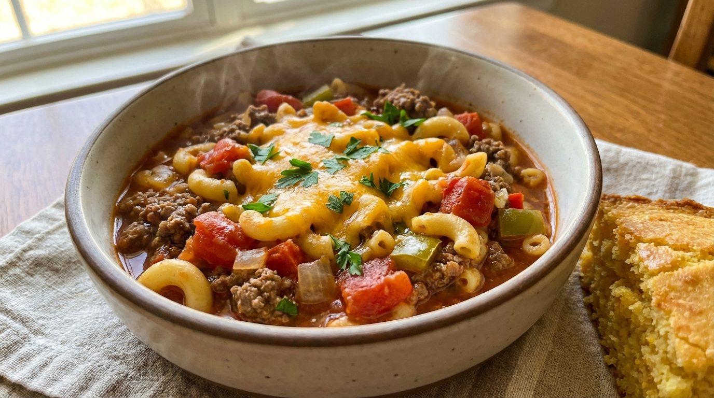

# American Goulash

📍 *Everywhere in the Midwest — Every Mom's Weeknight Rotation Since 1955*

> Elbow macaroni, ground beef, tomatoes, and a shake of whatever spices are in the cabinet, all simmered together in one pot until it becomes something warm, filling, and impossibly comforting. Hungarians would not recognize this. Your kids won't care. This is the dish that fed a generation of latchkey kids and still shows up on church supper menus with zero irony.

---

## At a Glance

| Detail | Info |
|--------|------|
| **Servings** | 6–8 |
| **Prep Time** | 10 minutes |
| **Cook Time** | 30 minutes |
| **Total Time** | 40 minutes |
| **Difficulty** | Easy |
| **Category** | Mains / One-Pot |

---

## 🫕 Midwest Nice Rating: 🫕🫕🫕🫕🫕

Peak potluck energy. If you show up to a church basement with a crockpot of goulash, you *are* the party. This is the most Midwestern dish that doesn't have tater tots in it.

---

## Ingredients

- 1½ pounds ground beef (80/20)
- 1 large yellow onion, diced
- 3 cloves garlic, minced
- 1 can (28 ounces) crushed tomatoes
- 1 can (15 ounces) tomato sauce
- 2 cups beef broth
- 2 tablespoons tomato paste
- 1 tablespoon Worcestershire sauce
- 2 teaspoons paprika (sweet Hungarian, if you want to at least nod at the name)
- 1 teaspoon dried oregano
- 1 teaspoon dried basil
- ½ teaspoon garlic powder
- Salt and freshly ground black pepper to taste
- 2 cups elbow macaroni, uncooked
- Shredded cheddar cheese, for serving

---

## Instructions

1. **Brown the beef.** In a large Dutch oven or deep skillet over medium-high heat, cook the ground beef, breaking it into crumbles, until browned and no pink remains, about 6–8 minutes. If there's a lot of grease, drain some off (leave a tablespoon for flavor — this isn't health food).

2. **Sauté the aromatics.** Add the diced onion to the beef and cook until softened, about 4 minutes. Add the garlic and cook for 30 seconds, until fragrant.

3. **Build the sauce.** Add the crushed tomatoes, tomato sauce, beef broth, tomato paste, Worcestershire sauce, paprika, oregano, basil, garlic powder, salt, and pepper. Stir everything together and bring to a simmer.

4. **Cook the pasta in the sauce.** Add the uncooked elbow macaroni directly to the pot. Stir well. Cover partially and simmer for 15–18 minutes, stirring every few minutes to prevent the pasta from sticking to the bottom. The pasta will cook in the sauce, absorbing all that tomato-beefy goodness. Add a splash of broth or water if it gets too thick before the pasta is tender.

5. **Check seasoning.** Taste and adjust salt, pepper, and paprika. American goulash should taste warmly spiced, tomatoey, and beefy — not bland. Don't be shy with the paprika.

6. **Serve.** Ladle into bowls and top with a generous handful of shredded cheddar cheese. Serve with buttered bread or saltine crackers. There is no wrong way to eat this.

---

## Tips & Variations

- **The Name:** Let's be clear — this has almost nothing in common with Hungarian goulash (gulyás), which is a paprika-spiced beef and vegetable soup/stew with no pasta. American goulash is its own thing, and it earned its own identity through decades of feeding Midwestern families. Respect both traditions.
- **One-Pot, No Excuses:** The beauty of cooking the pasta directly in the sauce is that it absorbs all the flavor and the starch thickens the sauce. Do NOT boil the pasta separately and add it. You'll lose what makes this dish great.
- **Slow Cooker Version:** Brown the beef and onion, then transfer everything (including the uncooked pasta) to a slow cooker. Cook on low for 4–5 hours or high for 2–3. Add the pasta in the last 30 minutes if you don't want it too soft.
- **Cheesy Goulash:** Stir in 1 cup of shredded cheddar or Velveeta during the last 5 minutes of cooking. It becomes something dangerously close to hamburger helper, but better because you made it yourself.
- **Green Pepper Controversy:** Some families add diced green bell pepper. Other families consider this a betrayal. This recipe respects your right to choose.
- **Upgrade It:** Swap ground beef for Italian sausage. Add mushrooms. Throw in a bay leaf. Use fire-roasted tomatoes. But know that the classic, unfussy version is the one that people actually want.

---

> **🤫 Grandma's Secret:** *"A tablespoon of sugar in the sauce. I know. But it cuts the acidity of the tomatoes and makes the whole pot taste rounder. Nobody ever guesses, and everybody always asks for the recipe."*

---

## Pairs Well With

A school night when nobody planned dinner, a loaf of white bread that exists only to sop up sauce, and the knowledge that this exact same meal is being cooked in approximately 14,000 other Midwestern homes tonight.

---

## 🌾 Did You Know?

> American goulash — also called "slumgullion," "johnny marzetti" (in Ohio), or simply "that ground beef and macaroni thing" — is one of the Midwest's most beloved weeknight dinners, and it has almost nothing to do with Hungary. The name was borrowed (loosely) from Hungarian immigrants whose paprika-rich stews inspired American home cooks to create a simplified, pantry-friendly version. The dish became ubiquitous in the 1940s and 50s, when canned tomatoes, ground beef, and dried pasta were cheap, available, and easy to combine in a single pot. It appeared in community cookbooks, school cafeterias, and church suppers across the region. In Ohio, the similar "Johnny Marzetti" was named after a restaurant owner's brother-in-law and became a cafeteria staple in Columbus public schools. Whatever you call it, it's the taste of being ten years old and knowing dinner was going to be fine.

---

*📸 Photography note: A big Dutch oven or deep bowl of American goulash — elbow macaroni visible in the rich red sauce, melted cheddar cheese on top, maybe some steam rising. A wooden spoon resting on the rim. A piece of buttered bread on the side. Kitchen table, checked tablecloth, weeknight energy. Cozy, unfussy, the visual equivalent of a warm hug.*
