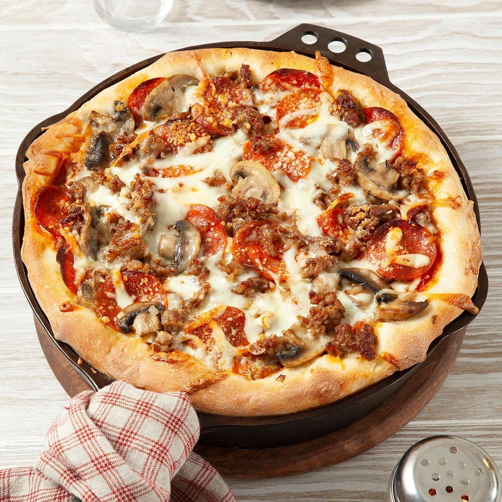

# Chicago Deep Dish Pizza

📍 *Chicago, Illinois*

> Is it a pizza or a cheese-and-tomato pie? Chicagoans don't care what you call it, as long as you acknowledge it's magnificent. A buttery, flaky crust built up the sides of a deep pan, loaded with mozzarella, toppings, and a thick layer of crushed tomato sauce on top. Yes, on top. That's the point.

---

## At a Glance

| | |
|---|---|
| **Servings** | 6–8 |
| **Prep Time** | 30 minutes + 2 hours rise |
| **Cook Time** | 30–35 minutes |
| **Difficulty** | Intermediate |
| **Category** | Mains |

---

## Ingredients

### Crust
- 3¼ cups all-purpose flour
- ½ cup yellow cornmeal
- 1¼ teaspoons salt
- 1 tablespoon sugar
- 2¼ teaspoons instant yeast (1 packet)
- 1¼ cups warm water (110°F)
- ½ cup (1 stick) unsalted butter, melted
- 3 tablespoons olive oil

### Filling
- 1½ lbs low-moisture whole-milk mozzarella, sliced ¼-inch thick (not shredded)
- 1 lb Italian sausage, casings removed, browned and drained
- ½ cup grated Parmesan

### Sauce
- 1 can (28 oz) whole San Marzano tomatoes, crushed by hand
- 2 cloves garlic, minced
- 1 tablespoon olive oil
- 1 teaspoon dried oregano
- 1 teaspoon dried basil
- ½ teaspoon salt
- ¼ teaspoon red pepper flakes
- 1 teaspoon sugar

---

## Instructions

1. **Make the dough:** Combine flour, cornmeal, salt, and sugar. Add yeast to warm water, let bloom 5 minutes. Pour into flour mixture with melted butter and olive oil. Mix until a soft, slightly sticky dough forms. Knead 5 minutes. Place in an oiled bowl, cover, and let rise 1½–2 hours until doubled.
2. **Make the sauce:** Heat olive oil in a saucepan. Sauté garlic 30 seconds. Add crushed tomatoes, oregano, basil, salt, pepper flakes, and sugar. Simmer 20–30 minutes until thickened. Let cool.
3. **Prep the pan:** Generously butter a 12-inch deep-dish pizza pan or 10-inch cast iron skillet. Press dough into the pan, building it up the sides at least 1½ inches.
4. **Layer (this order matters):**
   - Mozzarella slices directly on the dough (this protects the crust from getting soggy)
   - Browned sausage
   - Sauce spread over the top
   - Parmesan sprinkled over sauce
5. **Bake** at 425°F (220°C) for 30–35 minutes until crust is deep golden and sauce is bubbling.
6. **Rest** 10 minutes in the pan before slicing. (Seriously. Let it set or it'll be a beautiful disaster.)

---

## Tips & Variations

- **The cheese goes UNDER the sauce.** This is non-negotiable in Chicago. The thick sauce layer on top is what makes it deep dish.
- **Cornmeal is key:** It gives the crust that distinctive sandy, crunchy texture.
- **Cast iron magic:** A well-seasoned cast iron skillet makes exceptional deep dish — the butter crisps the crust edges beautifully.
- **Sausage technique:** Press raw Italian sausage into a thin patty and lay it over the cheese for an authentic pizzeria-style layer.
- **Patience:** This pizza needs 10 minutes to rest or it *will* fall apart when you cut it.

---

## 🌾 Did You Know?

The origin of Chicago deep dish is hotly debated. Most credit Ike Sewell and Ric Riccardo, who opened Pizzeria Uno in 1943. But some historians argue it was actually Uno's original pizza chef, Rudy Malnati, whose family would go on to found the legendary Lou Malnati's Pizzeria. Regardless of who invented it, deep dish became Chicago's culinary calling card. When New York comedian Jon Stewart famously called it "an above-ground marinara swimming pool for rats," Chicago's response was essentially: "We know. It's delicious. Have another slice."

---

*📸 Photography note: Modern editorial style — overhead shot of the whole pizza in its cast iron pan, one slice pulled away showing the cheese stretch, on a dark marble surface. Dramatic side lighting.*
