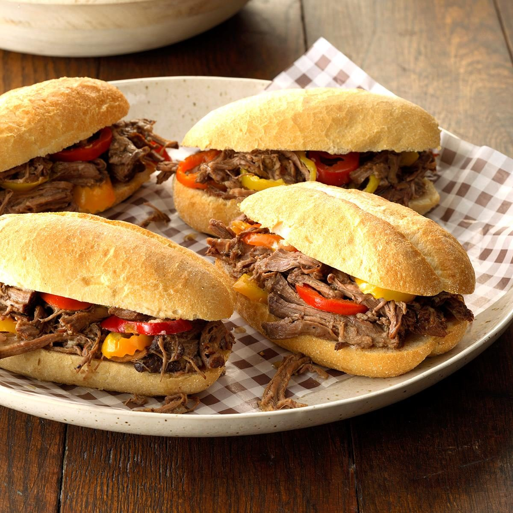

# Chicago Italian Beef

📍 *Chicago, Illinois*

> Thin-sliced, slow-simmered beef piled into a crusty Italian roll, drenched in savory jus, and crowned with hot giardiniera — this is Chicago's great blue-collar masterpiece, the sandwich that demands you lean forward over the counter and let the juices run down your forearms.

---

## At a Glance

| Detail | Info |
|--------|------|
| **Servings** | 8–10 sandwiches |
| **Prep Time** | 20 minutes |
| **Cook Time** | 3½–4 hours |
| **Total Time** | 4 hours 20 minutes |
| **Difficulty** | Medium |
| **Category** | Mains |

---

## Ingredients

### The Beef
- 1 boneless beef chuck roast (4–5 pounds)
- 4 cups beef broth
- 2 cups water
- 1 tablespoon dried oregano
- 1 tablespoon dried basil
- 1 teaspoon red pepper flakes
- 1 teaspoon garlic powder
- 1 teaspoon onion powder
- 1 teaspoon freshly ground black pepper
- 1 teaspoon fine sea salt
- 1 teaspoon dried thyme
- 5 cloves garlic, smashed
- 1 bay leaf
- 1 tablespoon Italian seasoning

### For Serving
- 8–10 crusty Italian rolls (look for long, sturdy rolls with a firm crust — French bread works in a pinch)
- Hot giardiniera (Chicago-style, chunky)
- Sweet peppers (roasted Italian sweet peppers in oil)
- Additional jus for dipping

---

## Instructions

1. **Season the roast.** Combine oregano, basil, red pepper flakes, garlic powder, onion powder, black pepper, salt, thyme, and Italian seasoning in a small bowl. Rub the spice mixture all over the beef chuck roast, pressing it into the meat.

2. **Sear the beef.** Heat a large Dutch oven over medium-high heat with a thin film of oil. Sear the roast on all sides until deeply browned, about 3–4 minutes per side. This builds flavor in the jus.

3. **Build the braising liquid.** Add the smashed garlic and bay leaf to the pot. Pour in the beef broth and water. The liquid should come about ⅔ up the sides of the roast. Bring to a boil.

4. **Braise low and slow.** Cover the Dutch oven and transfer to a 300°F oven. Braise for 3½ to 4 hours, until the beef is very tender and pulls apart easily with a fork.

5. **Slice the beef.** Remove the roast to a cutting board and let it rest 10 minutes. Slice against the grain as thinly as you possibly can — this is crucial. A sharp carving knife or electric knife helps. The slices should be almost translucent.

6. **Make the jus.** Strain the braising liquid through a fine-mesh sieve into a clean saucepan. Skim excess fat from the surface. Taste and adjust seasoning. Keep the jus at a low simmer.

7. **Dunk the beef.** Return the sliced beef to the warm jus and let it soak for at least 5 minutes. The beef should absorb the seasoned broth.

8. **Build the sandwich.** Split an Italian roll (don't fully separate the halves). Using tongs, pile the beef high — be generous. Spoon a little extra jus over the meat.

9. **Choose your toppings:**
   - **Dry:** No extra jus
   - **Wet:** Jus ladled over the sandwich
   - **Dipped:** The whole sandwich dunked in jus (the true Chicago way)
   
   Top with hot giardiniera, sweet peppers, or both ("combo").

10. **Serve immediately** with extra jus on the side for dipping. Napkins — many napkins — are not optional.

---

## Tips & Variations

- **Giardiniera is non-negotiable.** The spicy, vinegary crunch of Chicago-style giardiniera is what makes this sandwich sing. Look for it at Italian delis or make your own.
- **Slow Cooker Method:** Season and sear the beef, then transfer to a slow cooker with the broth and seasonings. Cook on low for 8–10 hours.
- **The Right Bread:** A true Italian beef roll has a firm crust that can hold up to being dipped in jus without completely disintegrating, but a soft interior that absorbs the liquid. Turano and Gonnella are the classic Chicago bakeries.
- **Combo Sandwich:** Many Chicago beef stands offer a "combo" — Italian beef plus an Italian sausage link on the same roll. It's excessive and perfect.
- **Don't Skip the Dip:** Ordering it "dipped" means the entire assembled sandwich is briefly submerged in jus. It's messy, magnificent, and mandatory for the full experience.

---

## 🌾 Did You Know?

> Italian beef traces back to the 1930s Italian immigrant community on Chicago's South Side. During the Depression, thinly slicing beef and stretching it with seasoned broth was a way to feed more people at weddings and community gatherings — a practice called "peanut weddings" where the hosts served inexpensive food to accommodate hundreds of guests. Al's #1 Italian Beef (opened 1938) and Mr. Beef on Orleans both claim origin-story status. Today, Italian beef is as essential to Chicago's identity as deep dish pizza, and locals will argue about their preferred stand with equal passion. The 2022 TV show *The Bear* brought national attention to the sandwich, but Chicagoans have known the truth all along.

---

*📸 Photography note: A juicy Italian beef sandwich on butcher paper, sliced open to show the piled-high thin beef glistening with jus. A ramekin of hot giardiniera sits alongside, its oil glistening. Colorful sweet peppers visible. Shot at a slight angle on a worn deli counter. Warm, slightly gritty urban lighting.*
