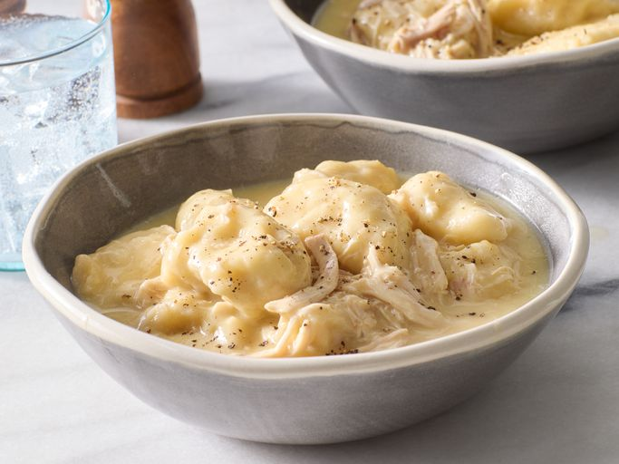

# Chicken and Dumplings

📍 *Ohio / Indiana (Farmhouse Tradition)*

> This isn't soup. This isn't stew. It's somewhere in between, thick and cloudy with schmaltz and starch, studded with chunks of tender chicken and topped with dumplings that are either pillowy clouds or dense sinkers depending on whose grandmother is making them. In Ohio farmhouses and Indiana kitchens, this is what you make when someone is sick, sad, or it's Wednesday. No one argues about the weather when there's chicken and dumplings on the table.

---

## At a Glance

| Detail | Info |
|---|---|
| **Servings** | 6-8 (or 4 if they've been outside all day) |
| **Prep Time** | 20 minutes |
| **Cook Time** | 50 minutes |
| **Total Time** | 70 minutes |
| **Difficulty** | Medium |
| **Category** | Mains |

---

## Ingredients

**For the Chicken:**
- 1 whole chicken (3-4 lbs), cut into pieces (or 2 lbs bone-in thighs and breasts)
- 8 cups (1.9L) cold water
- 1 large yellow onion, quartered
- 2 large carrots, roughly chopped
- 2 celery stalks with leaves, roughly chopped
- 2 bay leaves
- 1 tsp whole black peppercorns
- Salt to taste

**For the Dumplings:**
- 2 cups (250g) all-purpose flour
- 1 tbsp baking powder
- 1 tsp salt
- 3 tbsp (45g) cold butter, cubed
- 1 cup (240ml) whole milk
- 2 tbsp fresh parsley, chopped (optional, for flecks of green)

**To Finish:**
- 3 tbsp (45g) butter
- ⅓ cup (40g) all-purpose flour (for thickening)
- 1 cup (240ml) heavy cream or half-and-half
- Salt and pepper to taste
- Fresh parsley for garnish

---

## Instructions

1. **Make the Chicken Broth:** Place the chicken pieces in a large Dutch oven or stockpot. Add the water, onion, carrots, celery, bay leaves, and peppercorns. Bring to a boil over high heat, then reduce to a simmer. Skim off any foam that rises. Simmer partially covered for 35-40 minutes, until the chicken is cooked through and nearly falling off the bone.

2. **Pull the Chicken:** Remove chicken pieces and set aside to cool slightly. Strain the broth through a fine-mesh sieve, discarding the vegetables and aromatics. You should have about 6-7 cups of broth. Return the broth to the pot. When the chicken is cool enough to handle, shred the meat, discarding skin and bones. Set aside.

3. **Thicken the Broth:** Melt 3 tbsp butter in the broth pot over medium heat. Whisk in ⅓ cup flour and cook, stirring constantly, for 2-3 minutes until the mixture turns golden and smells toasted (this is a roux). Slowly whisk in the strained broth, stirring constantly to avoid lumps. Bring to a simmer. The broth will thicken as it heats. Stir in the heavy cream. Season generously with salt and pepper.

4. **Make the Dumplings:** In a medium bowl, whisk together the flour, baking powder, and salt. Cut in the cold butter using a pastry cutter or your fingers until the mixture looks like coarse crumbs. Add the milk and parsley (if using) and stir with a fork just until a shaggy dough forms. Do not overmix or your dumplings will be tough. The dough should be sticky and rough.

5. **Cook the Dumplings:** Bring the thickened broth to a gentle boil. Drop heaping spoonfuls of dumpling dough onto the surface of the simmering broth, spacing them slightly apart. You should get about 10-12 dumplings. Cover the pot with a tight-fitting lid. **Do not lift the lid.** Reduce heat to medium-low and cook for 15 minutes. The dumplings will puff and steam.

6. **Add Chicken & Serve:** After 15 minutes, gently stir the shredded chicken back into the pot, nestling it around the dumplings. Let it heat through for 2-3 minutes. Taste and adjust seasoning. Ladle into deep bowls, making sure everyone gets dumplings. Garnish with parsley if you're feeling fancy.

---

## Tips & Variations

- **Dumpling Texture:** For fluffy, biscuit-like dumplings, follow the recipe exactly and don't overmix. For denser, chewier "sinkers" (the old-school style), use less baking powder (1 tsp instead of 1 tbsp) and knead the dough a bit.
- **Shortcut Version:** Use a rotisserie chicken and store-bought chicken broth. You'll lose some soul, but you'll save an hour.
- **Vegetable Add-Ins:** Frozen peas or corn can be stirred in with the chicken at the end. Some folks add diced potatoes to the broth before thickening.
- **The Lid Rule:** Lifting the lid while the dumplings cook releases the steam and results in sad, dense dumplings. Resist the urge.

---

## 🌾 Did You Know?

> Chicken and dumplings is one of those dishes that arrived in the Midwest with settlers from the South and Appalachia, where it was a way to stretch a single chicken into a meal for a large family. In Ohio and Indiana, farm wives would simmer a tough old laying hen for hours until it was tender, then drop in dumplings made from pantry staples — flour, baking powder, and milk or buttermilk.
> 
> The dish became a Sunday staple and a sick-day cure-all. Church ladies brought it to new mothers. Neighbors delivered it in Mason jars after funerals. It's utilitarian comfort food — not fancy, not Instagrammable, but undeniably effective at making you feel like someone cares.
> 
> There are two warring dumpling camps in the Midwest: **fluffy** (made with baking powder, light and cake-like) and **flat** (rolled thin and cut into strips, more noodle than cloud). Ohio tends toward fluffy. Southern Indiana leans flat. Both are correct. Both will be defended at potlucks.

---

*📸 Photography note: Farmhouse realism. A deep white ceramic bowl filled with chicken and dumplings, thick broth clinging to torn pieces of chicken and fluffy dumplings. A silver spoon rests in the bowl. Shot on a worn wooden table with a faded floral tablecloth, natural window light from the side, slightly cool tones. A Mason jar of water and a crumpled linen napkin in the background. Steam optional but encouraged.*

---

## ⭐ Midwest Nice Rating

5/5 🫕🫕🫕🫕🫕  
(Will bring this to your house if you're sick, leave it on the porch with reheating instructions, and text you later to make sure you ate it.)

---

## 🥂 Pairs Well With

A January blizzard, a dog sleeping by the woodstove, the quiet of a farmhouse kitchen after everyone else has gone to bed, and the knowledge that tomorrow's leftovers will taste even better.

---

## 👵 Grandma's Secret: Chicken and Dumplings

> "Grandma Agnes swore the secret was using an old hen — a laying chicken past its prime — and simmering it for two full hours until the broth was golden and thick. 'Young chickens don't have enough flavor,' she'd insist, 'and store-bought broth tastes like dishwater.' She also added a fistful of fresh parsley stems (not the leaves) to the broth while it cooked, claiming it made the whole pot taste 'greener.' No one argued."
