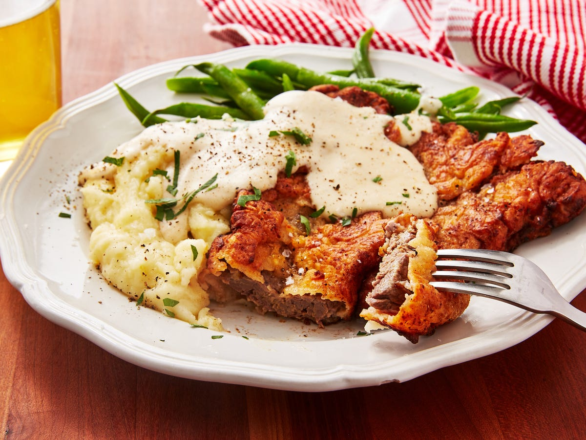

# Chicken Fried Steak

📍 *Kansas*

> A Southern-inspired comfort food that found a firm foothold in the heartland, featuring a tenderized steak coated in seasoned flour, pan-fried to a golden crisp, and smothered in creamy white gravy.

---

## At a Glance

| Detail | Info |
|---|---|
| **Servings** | 4 |
| **Prep Time** | 20 minutes |
| **Cook Time** | 20-25 minutes |
| **Total Time** | 40-45 minutes |
| **Difficulty** | Medium |
| **Category** | Mains |

---

## Ingredients

- 4 (4-6 oz / 113-170g each) beef cube steaks (or top round, tenderized)
- 1.5 cups all-purpose flour, divided
- 1 tsp salt, plus more for seasoning
- 1 tsp black pepper, plus more for seasoning
- ½ tsp garlic powder
- ½ tsp onion powder
- ¼ tsp cayenne pepper (optional, for a subtle kick)
- 2 large eggs
- ½ cup milk (whole or 2%)
- 4-6 cups vegetable oil or shortening, for frying

**For the Cream Gravy:**
- ¼ cup pan drippings from frying (or use butter/oil)
- ¼ cup all-purpose flour
- 2 cups milk (whole or 2%), warmed
- Salt and black pepper to taste
- Pinch of cayenne pepper (optional)

---

## Instructions

1. **Prepare Steak:** Pat the cube steaks dry with paper towels. Season both sides generously with salt and black pepper. If using top round, pound it to about ¼-inch thickness.
2. **Set Up Breading Station:** Set up three shallow dishes. In the first dish, whisk together 1 cup of flour, 1 tsp salt, 1 tsp black pepper, garlic powder, onion powder, and cayenne pepper (if using). In the second dish, whisk together the eggs and ½ cup milk. In the third dish, place the remaining ½ cup of flour.
3. **Dredge Steaks:** Dredge each steak first in the seasoned flour, shaking off excess. Then dip it into the egg wash, ensuring it's fully coated. Finally, return it to the seasoned flour for a second coating, pressing gently to adhere the breading. Place breaded steaks on a wire rack while you prepare the others.
4. **Heat Oil:** In a large, heavy-bottomed skillet (preferably cast iron), add vegetable oil or shortening to a depth of about 1 inch. Heat over medium-high heat until it reaches 350°F (175°C).
5. **Fry Steaks:** Carefully place 1-2 breaded steaks into the hot oil (do not overcrowd the pan). Fry for 3-5 minutes per side, or until deeply golden brown and crispy. The internal temperature should reach 145°F (63°C).
6. **Drain:** Using tongs, remove the fried steaks and place them on a clean wire rack set over paper towels to drain excess oil. Keep warm in a low oven (200°F / 95°C) while you make the gravy.
7. **Make Cream Gravy:** Carefully pour off all but ¼ cup of the pan drippings from the skillet. Return the skillet to medium heat. Whisk in ¼ cup flour and cook for 1-2 minutes, stirring constantly, until a light golden roux forms. Slowly whisk in the warmed milk, stirring constantly to prevent lumps. Bring the gravy to a simmer, whisking until it thickens. Season with salt, pepper, and a pinch of cayenne pepper (if using) to taste.
8. **Serve:** Serve the hot, crispy chicken fried steaks immediately, smothered generously with the warm cream gravy. Excellent with mashed potatoes and green beans.

---

## Tips & Variations

- For extra tender steak, pound the cube steaks even thinner before breading.
- Use bacon fat instead of vegetable oil for frying for an extra layer of savory flavor.
- For spicier gravy, add a dash of hot sauce or more cayenne pepper.
- Serve with a side of creamy mashed potatoes and steamed green beans or corn for a classic Southern-Midwestern meal.

---

## 🌾 Did You Know?

> Chicken Fried Steak, despite its name, contains no chicken. The "chicken fried" refers to the cooking method, which mimics the technique used for frying chicken. While often associated with Southern cuisine, this hearty dish is a beloved staple across the Plains states, including Kansas, where it provides comforting, filling fare for hardworking ranchers and families. It's a testament to resourceful cooking, taking an inexpensive cut of beef and transforming it into a tender, flavorful meal.

---

*📸 Photography note: Rustic farmhouse style. A golden-brown, crispy chicken fried steak, generously smothered in white cream gravy, served on a classic white diner plate. A side of fluffy mashed potatoes and vibrant green beans complete the plate. Set on a distressed wooden table with soft, warm overhead lighting. A fork should be poised to cut into the steak.*

---

## ⭐ Midwest Nice Rating

4/5 🫕🫕🫕🫕
(Will serve this hearty meal to anyone who shows up unannounced, especially after a long day of farm work.)

---

## 🥂 Pairs Well With

A long day of honest work, a classic country music playlist, and a tall glass of iced tea on the porch.

---

## 👵 Grandma's Secret: Chicken Fried Steak

> "Grandma Loretta swore by soaking her cube steaks in buttermilk for at least an hour (or even overnight!) before breading. 'It makes 'em so tender,' she'd declare, 'you'll think you're eating prime rib, bless your heart!'"
