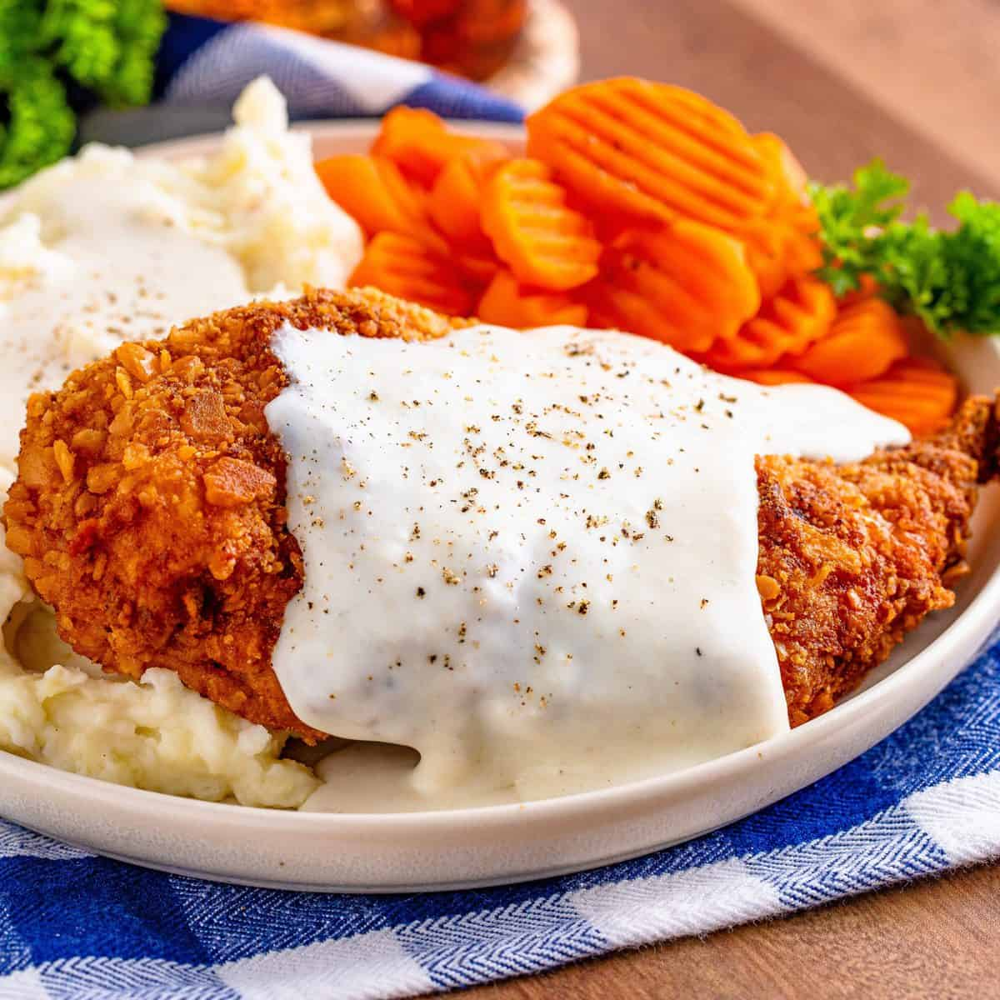

# Country Fried Chicken

📍 *Indiana, US*

> A beloved Midwestern staple, Country Fried Chicken features tender chicken pieces coated in a seasoned, crispy crust, pan-fried to golden perfection and often served with a generous helping of creamy gravy.

---

## At a Glance

| Detail | Info |
|--------|------|
| **Servings** | 4-6 |
| **Prep Time** | 20 minutes (plus 30 min - 2 hours marinating) |
| **Cook Time** | 25-30 minutes |
| **Total Time** | 45-50 minutes (plus marinating) |
| **Difficulty** | Medium |
| **Category** | Mains |

---

## Ingredients

- 2-3 lbs (900g-1.3kg) bone-in, skin-on chicken pieces (drumsticks, thighs, breasts, wings)
- 2 cups (480ml) buttermilk
- 1 tsp hot sauce (optional, for flavor, not heat)
- 2 cups all-purpose flour
- 2 tbsp cornstarch (for extra crispiness)
- 1 tbsp salt
- 1 tbsp black pepper
- 1 tsp garlic powder
- 1 tsp onion powder
- 1 tsp smoked paprika
- ½ tsp cayenne pepper (optional, for a kick)
- 4-6 cups vegetable oil or shortening, for frying

---

## Instructions

1. **Marinate Chicken:** In a large bowl, combine buttermilk and hot sauce (if using). Add chicken pieces, ensuring they are fully submerged. Cover and refrigerate for at least 30 minutes, or up to 2 hours, to tenderize and add flavor.
2. **Prepare Breading:** In a shallow dish or a large zip-top bag, whisk together flour, cornstarch, salt, black pepper, garlic powder, onion powder, smoked paprika, and cayenne pepper (if using).
3. **Bread Chicken:** Remove chicken pieces from the buttermilk, allowing excess to drip off. Do not rinse. Dredge each piece thoroughly in the seasoned flour mixture, pressing to ensure a thick, even coating. Place breaded chicken on a wire rack set over a baking sheet.
4. **Heat Oil:** In a large, heavy-bottomed skillet (preferably cast iron) or Dutch oven, add vegetable oil or shortening to a depth of about 1.5-2 inches. Heat over medium-high heat until it reaches 350°F (175°C). Use a deep-fry thermometer to monitor the temperature.
5. **Fry Chicken:** Carefully place chicken pieces into the hot oil, skin-side down first (do not overcrowd the pan; fry in batches). Fry for 6-8 minutes per side, turning with tongs, until golden brown.
6. **Cook Through:** Reduce heat to medium-low, cover the skillet, and continue to cook for an additional 10-15 minutes, flipping once or twice, until the chicken is cooked through and the internal temperature reaches 165°F (74°C) at the thickest part.
7. **Drain & Serve:** Remove fried chicken from the skillet and place on a clean wire rack set over paper towels to drain excess oil. Let rest for a few minutes. Serve hot, often with country gravy.

---

## Tips & Variations

- For extra crispy chicken, you can do a double-dredge: after the first flour coating, dip back into a shallow bowl of buttermilk, then dredge in flour again.
- Use a mix of dark and white meat chicken pieces to cater to different preferences.
- If the chicken is browning too quickly, lower the heat slightly. If it's not browning, increase the heat. Maintaining a consistent oil temperature is key.
- Serve with a side of creamy mashed potatoes, green beans, or coleslaw for a classic Midwestern meal.

---

## 🌾 Did You Know?

> Country Fried Chicken, while having roots across the American South, found its way into the heart of the Midwest, becoming a cherished dish particularly in states like Indiana. It's a staple at Sunday dinners, family reunions, and community events, symbolizing the region's love for hearty, honest, and comforting home-cooked meals. The simple yet satisfying combination of crispy coating and juicy chicken embodies the generous and unpretentious spirit of Midwestern cuisine.

---

*📸 Photography note: Rustic farmhouse style. A platter piled high with golden-brown, crispy country fried chicken pieces, glistening and hot. A small bowl of creamy white country gravy is nearby. Set on a well-worn wooden table, perhaps with a classic checkered tablecloth, bathed in soft, inviting natural light. Focus on the appealing crispiness of the chicken.*

---

## ⭐ Midwest Nice Rating

4/5 🫕🫕🫕🫕 (Will make a big batch for guests and subtly encourage you to take home leftovers for lunch tomorrow.)

---

## 🥂 Pairs Well With

Pairs well with: A Sunday family dinner after church, a warm summer evening on the porch, and the happy sounds of conversation and clinking glasses.

---

## 👵 Grandma's Secret: Country Fried Chicken

> "Grandma Irene always added a secret spoonful of **sugar** (just a teaspoon!) to her flour dredge. 'It helps the chicken get that perfect golden crust,' she'd whisper, 'and makes it extra crispy, a little trick no one ever guesses!'"
