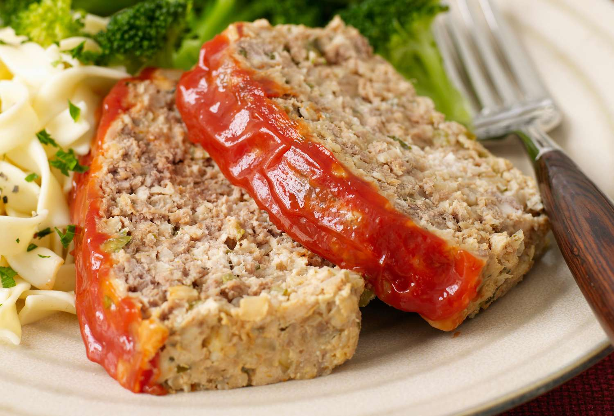

# Country Meatloaf

📍 *Midwest US (Depression-Era Legacy)*

> Meatloaf is what happens when you need to feed six people with one pound of ground beef and whatever's in the pantry. It's the culinary descendant of economic anxiety, stretched with breadcrumbs, eggs, and vegetables, then shellacked with a ketchup glaze and baked until it smells like Sunday dinner. In the Midwest, it never went out of style because it was never about style. It was about making something out of not much, and making it taste like home.

---

## At a Glance

| Detail | Info |
|---|---|
| **Servings** | 6-8 (or 4 if they've been working outside) |
| **Prep Time** | 20 minutes |
| **Cook Time** | 70 minutes |
| **Total Time** | 90 minutes |
| **Difficulty** | Easy |
| **Category** | Mains |

---

## Ingredients

**For the Loaf:**
- 2 lbs (900g) ground beef (80/20 — don't use lean, you need the fat)
- 1 cup plain breadcrumbs or crushed saltines (about 30 crackers)
- ½ cup whole milk
- 1 large yellow onion, finely diced
- ½ green bell pepper, finely diced (optional, but traditional)
- 2 large eggs, beaten
- 3 cloves garlic, minced
- 2 tbsp Worcestershire sauce
- 1 tsp salt
- 1 tsp black pepper
- ½ tsp dried thyme
- ¼ tsp dried sage or poultry seasoning

**For the Glaze:**
- ¾ cup ketchup (Heinz preferred, but store-brand works)
- 3 tbsp brown sugar, packed
- 2 tbsp yellow mustard
- 1 tbsp apple cider vinegar
- ½ tsp smoked paprika (optional, for depth)

---

## Instructions

1. **Preheat & Prep:** Preheat oven to 350°F (175°C). Line a rimmed baking sheet with parchment paper or lightly grease a 9x5-inch loaf pan. (Free-form on a sheet is traditional and gives you more glaze coverage; a loaf pan is tidier.)

2. **Soak the Breadcrumbs:** In a small bowl, pour the milk over the breadcrumbs and let sit for 5 minutes until the crumbs absorb the liquid and turn into a paste. This is your binder.

3. **Mix the Meatloaf:** In a large bowl, combine the ground beef, soaked breadcrumbs, onion, bell pepper, eggs, garlic, Worcestershire, salt, pepper, thyme, and sage. Use your hands to mix gently but thoroughly until everything is evenly distributed. Don't overwork it or the loaf will be dense and rubbery.

4. **Shape the Loaf:** Turn the mixture out onto the prepared baking sheet and form it into a loaf shape, about 9 inches long and 5 inches wide. Pat the top smooth. If using a loaf pan, press the mixture in evenly and smooth the top.

5. **Make the Glaze:** In a small bowl, whisk together the ketchup, brown sugar, mustard, vinegar, and smoked paprika until smooth.

6. **First Bake:** Bake the meatloaf for 45 minutes.

7. **Glaze & Finish:** Remove from the oven and brush or spoon half the glaze over the top and sides. Return to the oven and bake for another 20-25 minutes, until the internal temperature reaches 160°F (71°C) and the glaze is sticky and caramelized. Brush with the remaining glaze during the last 10 minutes if you want extra shine.

8. **Rest & Slice:** Let the meatloaf rest for 10 minutes before slicing. This keeps it from falling apart and lets the juices settle. Serve in thick slices.

---

## Tips & Variations

- **Crushed Crackers:** Saltines or Ritz crackers work just as well as breadcrumbs and add a subtle buttery flavor. This is the Depression-era method.
- **The Loaf Pan Debate:** A loaf pan keeps it compact and tidy, but a free-form loaf on a baking sheet lets the fat drip away and gives you more glaze surface area. Choose your ancestor's method.
- **Vegetable Add-Ins:** Grated carrot, zucchini, or even a raw potato (Grandma Rose's trick) can be mixed in for moisture and stealth nutrition.
- **Leftovers:** Cold meatloaf sandwiches on white bread with yellow mustard are peak Midwestern lunch. Don't argue with tradition.

---

## 🌾 Did You Know?

> Meatloaf as we know it became an American staple during the Great Depression, when cooks needed to stretch expensive ground meat as far as possible. Breadcrumbs, oatmeal, crackers — anything that added bulk without adding cost. The Midwest embraced it because it was economical, forgiving, and used ingredients already in the pantry.
> 
> The ketchup glaze is a post-WWII innovation, when bottled ketchup became cheap and ubiquitous. Before that, meatloaf was often topped with tomato paste or nothing at all. The sweet-tangy glaze became iconic in the 1950s and '60s, appearing in church cookbooks, community fundraisers, and Sunday dinner tables across the heartland.
> 
> Meatloaf never went upscale. It stayed humble. You won't find it on trendy restaurant menus. It lives in casserole dishes, church basement potlucks, and weeknight family dinners. It's not fancy. It doesn't need to be.

---

*📸 Photography note: No frills. A thick slice of meatloaf on a plain white plate with a scoop of mashed potatoes and a pile of green beans. The glaze should be glossy and slightly sticky. Shot on a Formica table or faded tablecloth, with overhead incandescent lighting that casts a warm, slightly yellow glow. A scratched fork and a glass of milk in the background. This should look like 1975.*

---

## ⭐ Midwest Nice Rating

5/5 🫕🫕🫕🫕🫕  
(Will bring this to your house if you just moved in, had a baby, or experienced a death in the family. It's the universal Midwest gesture of care.)

---

## 🥂 Pairs Well With

A Sunday evening in late autumn, the smell of woodsmoke drifting through the neighborhood, a table set with mismatched plates, and the knowledge that there will be leftovers for tomorrow's lunch.

---

## 👵 Grandma's Secret: Country Meatloaf

> "Grandma Rose grated half a raw potato into the meat mixture and swore it was the secret to her meatloaf never being dry. 'It keeps everything moist and tender,' she'd say, 'and no one can ever figure out what I did different.' She also used crushed Ritz crackers instead of breadcrumbs because they were cheaper by the sleeve."
