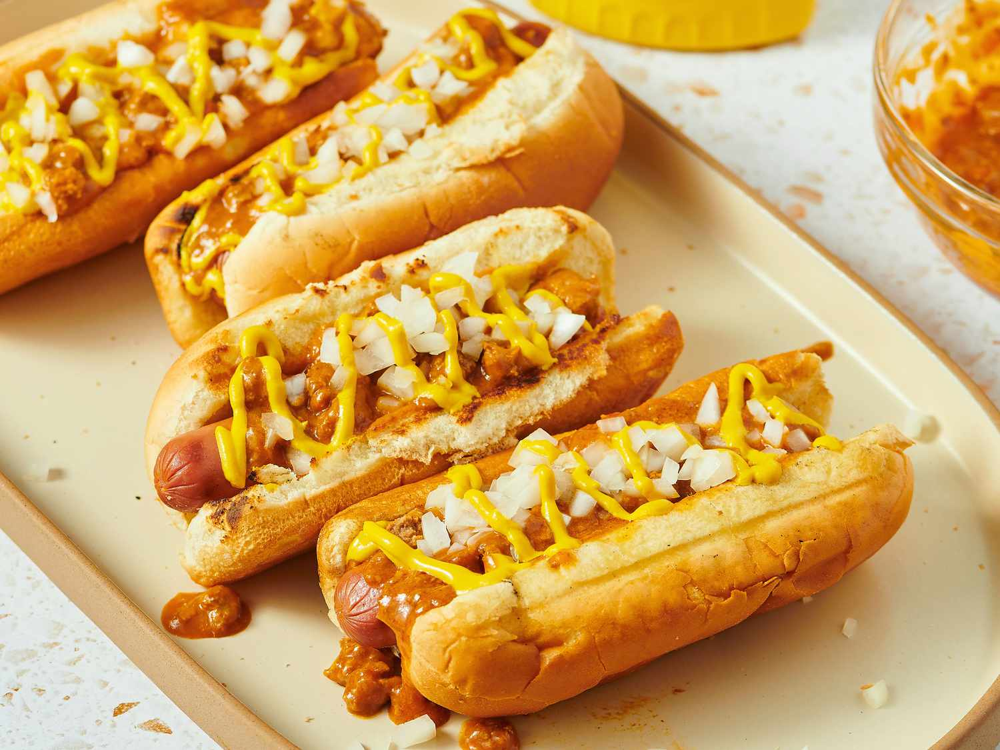

# Detroit-Style Coney Dogs

📍 *Detroit, Michigan — Lafayette vs. American, the Eternal Rivalry*

> A natural-casing hot dog buried under a beanless, finely ground beef chili sauce, topped with diced white onion and a stripe of yellow mustard, served in a steamed bun that's already half-disintegrating from the sauce. This is not a neat food. This is a Detroit food. And the only question that matters: Lafayette or American?

---

## At a Glance

| Detail | Info |
|--------|------|
| **Servings** | 8 coney dogs |
| **Prep Time** | 15 minutes |
| **Cook Time** | 1 hour (for the sauce) |
| **Total Time** | 1 hour 15 minutes |
| **Difficulty** | Moderate |
| **Category** | Mains |

---

## 🫕 Midwest Nice Rating: 🫕🫕🫕

More of a 2 AM institution than a potluck staple. But bring a crockpot of coney sauce to a tailgate and people will remember your name forever.

---

## Ingredients

### The Coney Sauce
- 1 pound ground beef (80/20 — you want some fat)
- 1 cup water
- 2 tablespoons tomato paste
- 2 tablespoons yellow mustard
- 1 tablespoon chili powder
- 1½ teaspoons ground cumin
- 1 teaspoon paprika
- 1 teaspoon garlic powder
- 1 teaspoon onion powder
- ½ teaspoon salt (adjust to taste)
- ¼ teaspoon freshly ground black pepper
- ¼ teaspoon cayenne pepper (optional — for a little kick)

### The Dogs
- 8 natural-casing beef hot dogs (Dearborn Brand or Koegel's are the Michigan standard)
- 8 steamed hot dog buns

### Toppings
- Yellow mustard
- 1 medium white onion, finely diced

---

## Instructions

1. **Make the coney sauce.** In a medium saucepan, combine the ground beef and water. Using a potato masher or the back of a wooden spoon, break the beef into very fine, almost paste-like pieces. This is not taco meat — you want the texture to be almost smooth, with no discernible chunks. Some cooks even pulse the raw meat in a food processor first.

2. **Simmer.** Bring the beef and water mixture to a simmer over medium heat, continuing to break up the meat as it cooks. Once simmering, add the tomato paste, mustard, chili powder, cumin, paprika, garlic powder, onion powder, salt, pepper, and cayenne if using. Stir to combine.

3. **Cook low and slow.** Reduce heat to low and simmer, uncovered, for 45 minutes to 1 hour, stirring occasionally. The sauce should reduce and thicken to a consistency that's spoonable but not soupy — it should hold on a hot dog without running off immediately. If it gets too thick, add a splash of water. If it's too thin, keep cooking.

4. **Cook the dogs.** While the sauce simmers, boil or griddle your hot dogs until heated through and snappy, about 5 minutes.

5. **Steam the buns.** Briefly steam the buns until soft and warm. A steamer basket over boiling water, or wrapping in a damp towel and microwaving for 10 seconds, both work.

6. **Assemble.** Place a hot dog in each bun. Ladle a generous amount of coney sauce over the top. Add a stripe of yellow mustard. Finish with a heavy sprinkling of diced white onion. The sauce should be threatening to escape the bun at all times.

7. **Eat.** Over the paper, leaning forward, with napkins nearby. This is a two-hander. Accept your fate.

---

## Tips & Variations

- **The Texture Secret:** The coney sauce MUST be finely ground — almost a paste. This is what separates Detroit coney sauce from regular chili. If your meat is too chunky after cooking, hit it with an immersion blender for a few pulses.
- **Lafayette vs. American:** These two legendary coney islands sit literally next to each other in downtown Detroit. Lafayette is cash-only, no-frills, fluorescent-lit chaos. American has been renovated and accepts credit cards. Both have been there since 1917. The rivalry is real, the debates are intense, and the correct answer is Lafayette. (American fans: see us outside.)
- **Flint-Style Coney:** If you go north to Flint, Michigan, the coney sauce is drier, grainier, and made with beef heart. It's a completely different animal (literally). Flint coneys use a different hot dog too (Koegel's). Both cities claim the superior coney. Both cities are willing to fight about it.
- **No Beans, Ever:** There are no beans in coney sauce. This is not negotiable. If your chili has beans, it's chili. If it's on a hot dog with mustard and onion and no beans, it's a coney. The taxonomy is clear.
- **Coney Island Connection:** Despite the name, Detroit's coney islands were founded by Greek and Macedonian immigrants who may or may not have passed through Coney Island, New York. The connection is more mythological than historical, but it stuck.

---

> **🤫 Grandma's Secret:** *"Simmer the sauce with a beef bouillon cube for deeper flavor. And the onions should be diced so fine they're almost minced — you want onion in every bite, not big chunks you have to bite through."*

---

## Pairs Well With

An order of chili cheese fries from the same counter, a can of Vernors ginger ale, the last Lions game of the season (pain optional), and the unshakeable belief that whatever coney island *you* go to is the correct one.

---

## 🌾 Did You Know?

> Detroit's coney island tradition dates to the early 1900s, when Greek immigrants — many from the same villages in northern Greece and Macedonia — opened small diners serving American-style hot dogs with their own distinctive chili sauce. The word "coney" comes from Coney Island in New York, but the Detroit coney dog bears almost no resemblance to anything you'd find on the East Coast. It's purely a Detroit invention, perfected by Greek-American cooks who adapted Mediterranean spice knowledge to American fast food. At its peak, Detroit had hundreds of coney islands; today there are still dozens. The Lafayette vs. American rivalry is so famous that it's been covered by the *New York Times*, *ESPN*, and *No Reservations.* Anthony Bourdain chose Lafayette. Kid Rock goes to American. Detroit doesn't agree on much, but everyone agrees that a proper coney at 2 AM after a night out is one of life's great experiences.

---

*📸 Photography note: Two coney dogs on a paper-lined counter, drowning in the fine-textured chili sauce, yellow mustard stripe, diced onion heaped on top. A worn Formica counter beneath. Maybe a napkin dispenser and a can of Vernors in the shot. The lighting should be slightly harsh — diner fluorescent. This isn't fancy. This is Detroit, and that's the point.*
