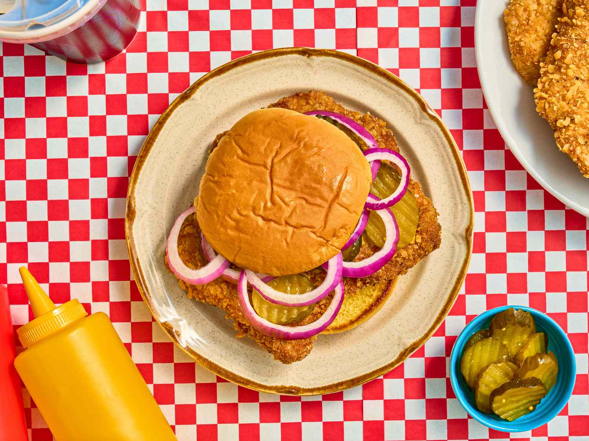

# Indiana Breaded Pork Tenderloin Sandwich

📍 *Indiana*

> A pork tenderloin pounded impossibly thin, breaded, and fried until it extends 4 inches past the bun in every direction. The meat-to-bun ratio is absurd. That's the point. In Indiana, the tenderloin is always bigger than the bread, and the bread is just there for moral support.

---

## At a Glance

| | |
|---|---|
| **Servings** | 4 |
| **Prep Time** | 30 minutes |
| **Cook Time** | 10 minutes |
| **Difficulty** | Medium |
| **Category** | Mains |

---

## Ingredients

### Pork
- 4 boneless pork loin chops (about 4 oz each, ½-inch thick)
- Vegetable oil for frying (about 1 inch deep in a cast iron skillet)

### Breading Station
- 1 cup all-purpose flour
- 1 teaspoon salt
- ½ teaspoon black pepper
- ½ teaspoon garlic powder
- ½ teaspoon paprika
- 2 eggs, beaten
- 2 tablespoons milk
- 1½ cups fine dry breadcrumbs or crushed saltine crackers

### To Serve
- 4 soft hamburger buns (regular-sized — the comical overhang is traditional)
- Mustard (yellow, the classic choice)
- Dill pickle slices
- Sliced onion
- Lettuce and tomato *(optional but common)*
- Mayonnaise *(if you're that type)*

---

## Instructions

1. **Pound the pork:** Place each chop between plastic wrap. Using a meat mallet, pound aggressively to ¼-inch thickness. They should be roughly 8–10 inches across. (Yes, really. Bigger than your head.)
2. **Set up breading station:** Bowl 1: flour mixed with salt, pepper, garlic powder, paprika. Bowl 2: eggs whisked with milk. Bowl 3: breadcrumbs.
3. **Bread the pork:** Dredge each tenderloin in flour (shake off excess), dip in egg wash, then press firmly into breadcrumbs on both sides.
4. **Fry:** Heat 1 inch of oil in a large cast iron skillet to 350°F (175°C). Fry tenderloins one at a time, 3–4 minutes per side, until deep golden brown and internal temp reaches 145°F.
5. **Drain** on a wire rack. Season with a pinch of salt while hot.
6. **Assemble:** Place tenderloin on bottom bun (it will hang over dramatically). Add mustard, pickles, onion, and any other toppings. Balance the top bun somewhere in the middle.

---

## Tips & Variations

- **Crackers vs. breadcrumbs:** The great Indiana debate. Saltine crackers give a more delicate, shatteringly crispy crust. Breadcrumbs give a thicker, crunchier coating. Both are correct.
- **The pounding matters:** Don't be gentle. The tenderloin should be uniformly thin. Uneven thickness = uneven cooking.
- **Cast iron is king:** The heat retention of cast iron gives the best, most even fry.
- **Double-dip:** For extra crust, go flour → egg → crumbs → egg → crumbs.
- **Nick's Kitchen:** The legendary tenderloin at Nick's Kitchen in Huntington, Indiana (est. 1908) is considered the gold standard. If you're ever in town, pay your respects.

---

## 🌾 Did You Know?

Indiana takes its pork tenderloin sandwich with dead seriousness. The Hoosier tenderloin trail is a real thing — a curated list of restaurants across the state competing for the title of best tenderloin. The sandwich likely evolved from German Schnitzel traditions brought by immigrants in the 1800s. The absurd size isn't an accident; it's a point of pride. A tenderloin that fits inside the bun is considered an embarrassment. Some restaurants serve tenderloins that are literally a foot in diameter, on a standard 4-inch bun. It's magnificent, impractical, and peak Indiana.

---

*📸 Photography note: Modern editorial style — shot from slightly above, tenderloin dramatically overhanging the bun on all sides, on a simple white plate. Pickles and mustard visible. Clean background to emphasize the ridiculous proportions.*
