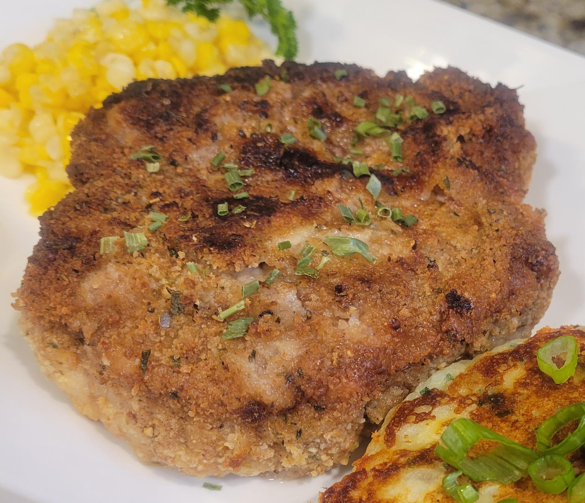

# Iowa Breaded Pork Chop

📍 *Iowa, US*

> A beloved Midwestern classic, the Iowa Breaded Pork Chop features a thick, tender pork chop coated in a seasoned breading and pan-fried to a golden, crispy perfection, often a centerpiece of family meals.

---

## At a Glance

| Detail | Info |
|--------|------|
| **Servings** | 4 |
| **Prep Time** | 20 minutes |
| **Cook Time** | 15-20 minutes |
| **Total Time** | 35-40 minutes |
| **Difficulty** | Medium |
| **Category** | Mains |

---

## Ingredients

- 4 (1-inch thick / 2.5 cm) boneless pork chops (Iowa Chops preferred)
- 1 cup all-purpose flour
- 1 tsp salt
- 1 tsp black pepper
- ½ tsp garlic powder
- ½ tsp onion powder
- 2 large eggs, lightly beaten
- ¼ cup (60ml) milk
- 1.5 cups plain breadcrumbs (Panko for extra crispiness)
- ½ cup vegetable oil or shortening, for frying
- Optional: Fresh parsley, chopped, for garnish
- Optional for serving: Lemon wedges, mashed potatoes, green beans

---

## Instructions

1. **Prepare Pork Chops:** Pat pork chops dry with paper towels. Season both sides with a pinch of salt and pepper.
2. **Set Up Breading Station:** Set up three shallow dishes. In the first dish, whisk together flour, 1 tsp salt, 1 tsp black pepper, garlic powder, and onion powder. In the second dish, whisk together eggs and milk. In the third dish, place the breadcrumbs.
3. **Bread Pork Chops:** Dredge each pork chop first in the seasoned flour, shaking off excess. Then dip it into the egg mixture, ensuring it's fully coated. Finally, coat thoroughly in the breadcrumbs, pressing gently to adhere. Place breaded chops on a wire rack while you prepare the others.
4. **Heat Oil:** In a large, heavy-bottomed skillet (preferably cast iron), add vegetable oil or shortening to a depth of about ½ inch. Heat over medium-high heat until it reaches 350°F (175°C).
5. **Fry Pork Chops:** Carefully place 1-2 breaded pork chops into the hot oil (do not overcrowd the pan). Fry for 4-6 minutes per side, or until deeply golden brown and cooked through (internal temperature reaches 145°F / 63°C). Adjust heat as needed to prevent burning.
6. **Drain & Serve:** Using tongs, remove the fried pork chops and place them on a clean wire rack set over paper towels to drain excess oil. Let rest for a few minutes before serving. Garnish with fresh parsley if desired. Serve immediately with lemon wedges and your favorite sides.

---

## Tips & Variations

- For extra tender chops, pound them slightly thinner before breading.
- Add a pinch of cayenne pepper or smoked paprika to the flour mixture for a subtle kick.
- Use a mix of Panko and regular breadcrumbs for a varied texture.
- Serve with a side of creamy mashed potatoes and a fresh green salad for a complete meal.
- Ensure the oil temperature is consistent; too low, and the chops will be greasy; too high, and they will burn before cooking through.

---

## 🌾 Did You Know?

> The "Iowa Chop" is not just any pork chop; it's a specific, thick-cut, bone-in loin chop that became a source of pride for Iowa's pork industry. Known for its tenderness and flavor, this breaded and fried version is a quintessential Midwestern comfort food. It celebrates Iowa's rich agricultural heritage as a leading pork producer, reflecting the region's love for hearty, unpretentious, and satisfying meat-and-potatoes meals that are a staple at family dinners and community gatherings.

---

*📸 Photography note: Rustic farmhouse style. A golden-brown, crispy Iowa Breaded Pork Chop, sliced to reveal its juicy interior, served on a classic white diner plate. A side of fluffy mashed potatoes and vibrant green beans complete the plate. Set on a distressed wooden table with soft, warm overhead lighting. A fork should be poised to cut into the chop. The image should convey warmth and home-cooked goodness.*

---

## ⭐ Midwest Nice Rating

4/5 🫕🫕🫕🫕 (Will happily make a batch for unexpected guests, and probably send them home with leftovers.)

---

## 🥂 Pairs Well With

Pairs well with: A quiet Sunday family dinner, a lively potluck, and sharing stories around a well-loved kitchen table after a long day.

---

## 👵 Grandma's Secret: Iowa Breaded Pork Chop

> "Grandma Johnson always mixed a tiny bit of crushed Ritz crackers into her breadcrumbs. 'It gives 'em an extra buttery, crispy crunch,' she'd wink, 'and nobody ever guesses my secret for that perfect golden crust!'"
