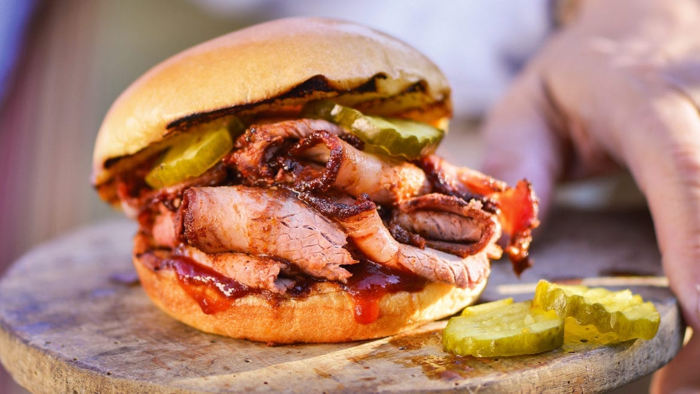

# Kansas City BBQ Brisket & Burnt Ends

📍 *Kansas City, Missouri*

> Kansas City doesn't just do barbecue — it *is* barbecue. Slow-smoked brisket with a thick, sweet, tomato-and-molasses-based sauce, and the legendary burnt ends: the charred, caramelized cubes from the point of the brisket that pit masters used to give away for free. Now they're the most expensive thing on the menu. Welcome to KC.

---

## At a Glance

| | |
|---|---|
| **Servings** | 12–15 |
| **Prep Time** | 30 minutes + overnight rub |
| **Cook Time** | 12–14 hours (brisket) + 2 hours (burnt ends) |
| **Difficulty** | Advanced |
| **Category** | Mains |

---

## Ingredients

### Brisket
- 1 whole packer brisket (12–15 lbs), fat cap trimmed to ¼ inch
- Yellow mustard (as a binder)

### KC Dry Rub
- ¼ cup paprika
- 3 tablespoons coarse black pepper
- 3 tablespoons brown sugar
- 2 tablespoons kosher salt
- 1 tablespoon garlic powder
- 1 tablespoon onion powder
- 1 teaspoon cayenne pepper
- 1 teaspoon cumin

### KC-Style Sauce
- 1 cup ketchup
- ½ cup apple cider vinegar
- ¼ cup molasses
- ¼ cup brown sugar
- 2 tablespoons Worcestershire sauce
- 1 tablespoon yellow mustard
- 1 teaspoon garlic powder
- 1 teaspoon onion powder
- ½ teaspoon black pepper
- ½ teaspoon liquid smoke *(if not using a smoker)*

### For Smoking
- Oak or hickory wood chunks
- Apple juice in a spray bottle

---

## Instructions

### The Brisket
1. **Prep (night before):** Slather brisket lightly with yellow mustard. Apply dry rub generously on all sides. Wrap in plastic and refrigerate overnight.
2. **Set up smoker** at 225°F (107°C) using oak or hickory. Place a water pan inside for moisture.
3. **Smoke:** Place brisket fat-side up on the smoker. Spritz with apple juice every 90 minutes after the first 3 hours.
4. **The stall:** Around 150–165°F internal temp, the brisket will stall (temp stops rising). This is normal. Wait it out, or wrap in butcher paper to push through *(the "Texas crutch")*.
5. **Target temp:** Cook until internal temperature reaches 200–205°F in the thickest part of the flat. The probe should slide in like butter.
6. **Rest:** Wrap in butcher paper, then towels, and place in a cooler (no ice) for at least 1 hour, up to 4 hours. This is essential.

### The Burnt Ends
7. **Separate the point** from the flat after resting. The point is the thicker, fattier section.
8. **Cube** the point into 1½-inch pieces.
9. **Sauce and smoke:** Toss cubes with KC sauce. Place in an aluminum pan, return to smoker at 275°F for 1½–2 hours until edges are caramelized and sticky.
10. **Serve** burnt ends as an appetizer, on sandwiches, or piled on white bread with pickles.

### The Sauce
11. Combine all sauce ingredients in a saucepan. Simmer over medium-low heat for 20 minutes, stirring occasionally, until thickened.

---

## Tips & Variations

- **No smoker?** Use the low-and-slow oven method: 225°F with a pan of water on the lower rack. Add liquid smoke to the rub.
- **The flat vs. the point:** The flat is the lean, sliceable part. The point is fattier and becomes the burnt ends.
- **Butcher paper > foil:** Foil makes the bark soggy. Unwaxed butcher paper lets it breathe.
- **Slice against the grain.** The grain direction changes between the flat and point — find it before you cut.
- **KC sauce is THICK and SWEET.** That's what distinguishes it from Texas (peppery), Carolina (vinegar), and Memphis (dry rub) styles.

---

## 🌾 Did You Know?

Kansas City's BBQ legacy traces back to Henry Perry, an African American pit master who began selling smoked meats wrapped in newspaper from an outdoor stand in the early 1900s. His protégé, Charlie Bryant, and later Charlie's brother Arthur Bryant, built the famous Arthur Bryant's restaurant, which Calvin Trillin called "the single best restaurant in the world" in 1972. Burnt ends were originally considered scraps — pit masters at Arthur Bryant's would put them on the counter for customers to snack on for free while waiting. By the 2000s, burnt ends had become the most prized item on the menu. Today, KC has over 100 BBQ restaurants and hosts the American Royal World Series of Barbecue, the largest BBQ competition on Earth.

---

*📸 Photography note: Modern editorial style — sliced brisket fanned on butcher paper, burnt ends in a small cast iron skillet alongside, pickles and white bread. Smoke wisps if possible. Dark, moody lighting.*
