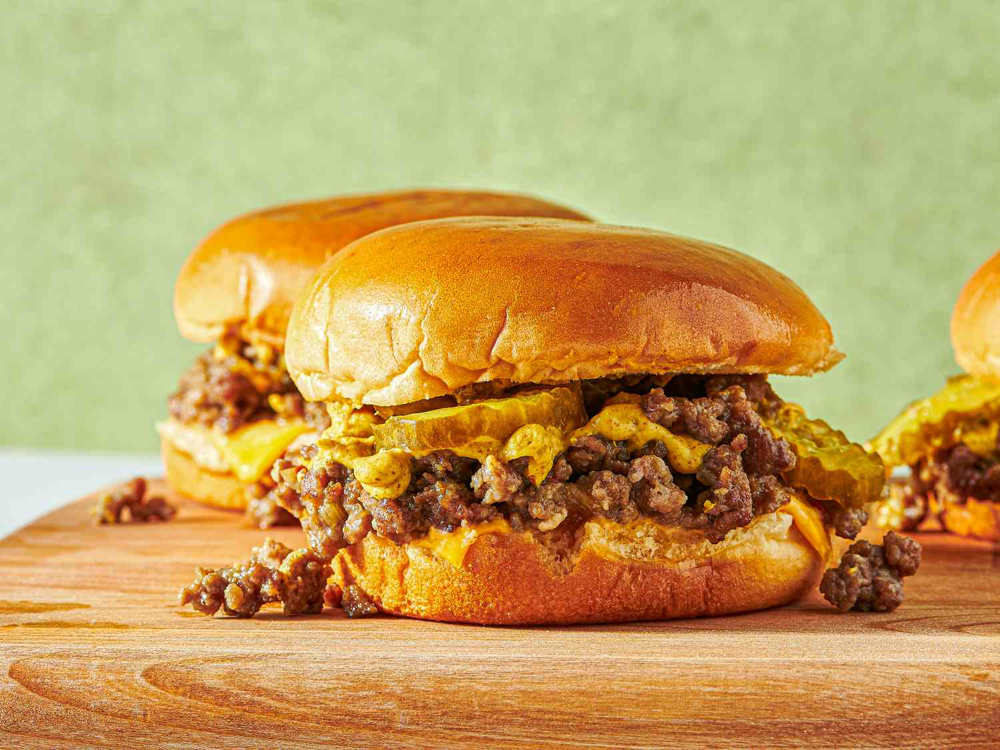

# Loose Meat Sandwich (Maid-Rite / Tavern Burger)

📍 *Iowa / Nebraska*

> Not quite a burger. Not quite a sloppy joe. The Loose Meat Sandwich exists in its own Midwestern category — a pile of seasoned, finely crumbled beef heaped onto a bun with no sauce, no apology, and absolutely no patience for your expectations. Iowa claims it. Nebraska loves it. And everyone who tries it wonders why the rest of the country bothers with hamburger patties.

---

## At a Glance

| Detail | Info |
|---|---|
| **Servings** | 4-6 sandwiches |
| **Prep Time** | 10 minutes |
| **Cook Time** | 25 minutes |
| **Total Time** | 35 minutes |
| **Difficulty** | Easy |
| **Category** | Mains |

---

## Ingredients

- 1.5 lbs (680g) lean ground beef (85/15 — not too lean or it'll be dry)
- 1 medium yellow onion, minced fine as confetti
- 1 cup (240ml) beef broth
- 2 tbsp Worcestershire sauce
- 1 tsp yellow mustard (the cheap stuff, not Dijon)
- ½ tsp garlic powder
- ½ tsp onion powder
- ½ tsp black pepper
- Tiny pinch of nutmeg (trust us)
- Salt to taste
- 4-6 soft white hamburger buns
- For serving: dill pickle slices, yellow mustard, ketchup, chopped raw onion

---

## Instructions

1. **Brown the Beef:** Heat a large skillet over medium-high. Add the beef and onion. Break up the meat aggressively with a wooden spoon or potato masher — you want fine crumbles, not chunks. Cook until no pink remains, about 7-8 minutes.

2. **Drain:** Pour off the excess fat. This isn't grease you simmer in; this is grease you abandon.

3. **Add Liquids & Simmer:** Return skillet to heat. Add beef broth, Worcestershire, mustard, garlic powder, onion powder, pepper, and that suspicious pinch of nutmeg. Stir well. Bring to a gentle simmer.

4. **Cook Low & Slow:** Reduce heat to low. Let it bubble quietly for 15-20 minutes, stirring occasionally, until most of the liquid has cooked off but the meat is still moist and tender. It should look loose, not dry. Taste and add salt as needed.

5. **Serve:** Toast the buns if you're fancy (most taverns don't bother). Pile the loose meat generously onto each bun. Serve with pickles, mustard, ketchup, and raw onion on the side. Let people build their own.

---

## Tips & Variations

- **The Liquid Matters:** Beef broth is best. Water works in a pinch. Never use canned beef consommé unless you want it to taste like a salt lick.
- **Texture is Everything:** The meat should be fine, almost paste-like when cooked, but still moist. If it's dry, you drained too much fat or cooked it too long.
- **Tavern-Style Toppings:** Midwestern taverns serve these with pickles and onions on the side, never on the sandwich. Mustard and ketchup are applied by the customer, not the cook. This is democracy in sandwich form.
- **Make it a Meal:** Serve with crinkle-cut fries, potato chips, or (if you're in Minnesota) tater tots.

---

## 🌾 Did You Know?

> The Loose Meat Sandwich was born in 1926 at Maid-Rite in Muscatine, Iowa, when a butcher named Fred Angell allegedly stumbled onto the recipe. The original story involves a secret ingredient (still unknown), a garage, and an instant hit with local workers who wanted a hot lunch without utensils. By the 1930s, Maid-Rite had spread across the Midwest like a cafeteria rumor.
> 
> Unlike a Sloppy Joe (which is basically ketchup with meat ambitions), a Maid-Rite contains **no tomato sauce** in the meat mixture. The seasoning is subtle. The beef is the star. It's served "loose" — literally spooned onto the bun — and you're expected to eat it fast before it falls apart. The sandwich appeared on *Roseanne* in the 1990s when the Conner family opened the "Lanford Lunch Box," introducing a generation of TV viewers to Iowa's strangest export.
> 
> In Nebraska, it's often called a "Tavern Burger" or just "Tavern," served in small-town bars alongside cheap beer and free popcorn. Same sandwich, different name, same glorious mess.

---

*📸 Photography note: Diner realism. An open-faced loose meat sandwich on a plain white ceramic plate, meat piled high and visibly crumbly, with the bottom bun soaking up juices. Dill pickle chips and a small glass ramekin of yellow mustard on the side. Background: red-checkered tablecloth or Formica counter, slightly worn. Lighting warm and overhead, like a small-town cafe at lunch hour. No garnish. No frills.*

---

## ⭐ Midwest Nice Rating

4/5 🫕🫕🫕🫕  
(Will serve at any casual gathering, football tailgate, or church basement lunch, and will definitely offer seconds without judgment.)

---

## 🥂 Pairs Well With

A summer road trip through the Iowa cornfields, a Nebraska dive bar jukebox playing Johnny Cash, Friday night high school football, and the sound of cicadas buzzing outside the open windows of a small-town diner.

---

## 👵 Grandma's Secret: Loose Meat Sandwich

> "Grandma Jean swore by a tiny pinch of nutmeg in the beef mixture — not enough to taste it, just enough to 'round out the flavor,' she'd say, tapping the side of her nose like it was classified information. She also insisted on using the cheap yellow mustard in the cooking, never the fancy stuff. 'Maid-Rite didn't have Dijon in 1926, and neither do we.'"
