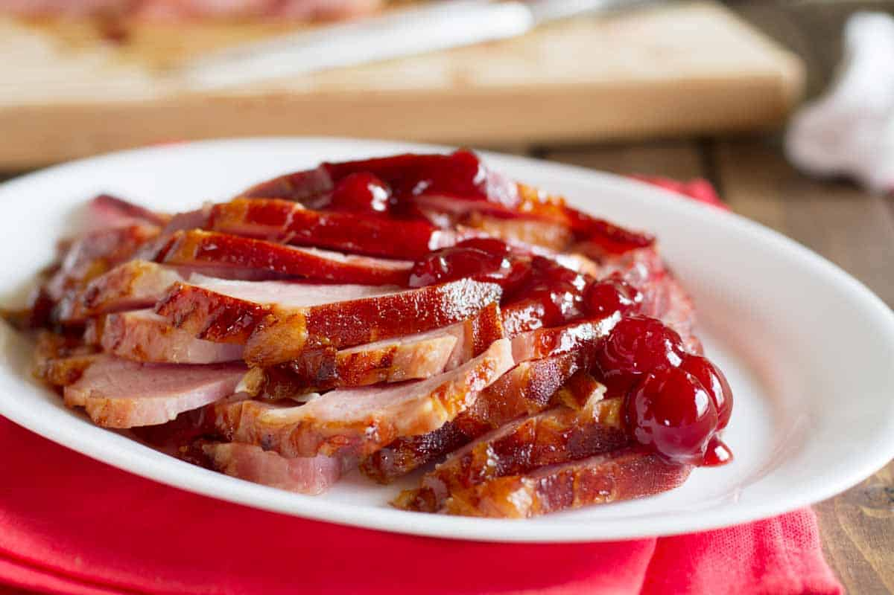

# Michigan Cherry-Glazed Ham

📍 *Michigan, US*

> A show-stopping centerpiece for any Midwestern gathering, this tender ham is bathed in a luscious, sweet-tart cherry glaze, celebrating Michigan's famed cherry orchards.

---

## At a Glance

| Detail | Info |
|--------|------|
| **Servings** | 10-12 |
| **Prep Time** | 15 minutes |
| **Cook Time** | 1.5 - 2 hours (for a pre-cooked ham) |
| **Total Time** | 1.75 - 2.25 hours |
| **Difficulty** | Easy |
| **Category** | Mains |

---

## Ingredients

- 1 (7-9 lb / 3.1-4 kg) pre-cooked spiral-sliced ham
- 1 (12 oz / 340g) jar cherry preserves or jam
- ½ cup (120ml) honey
- ¼ cup (60ml) fresh orange juice (or cherry juice)
- 1 tbsp (15ml) apple cider vinegar
- 1 tsp Dijon mustard
- ½ tsp ground ginger
- ¼ tsp ground cloves
- Pinch of salt and black pepper

---

## Instructions

1. **Preheat Oven & Prepare Ham:** Preheat your oven to 325°F (160°C). Place the ham in a large roasting pan, fat-side up. If your ham didn't come with glaze instructions, you can add about ½ inch of water to the bottom of the pan to help keep it moist.
2. **Make Cherry Glaze:** In a medium saucepan, combine the cherry preserves, honey, orange juice, apple cider vinegar, Dijon mustard, ground ginger, ground cloves, salt, and black pepper. Bring the mixture to a gentle simmer over medium heat, stirring occasionally, until the preserves have melted and the glaze is smooth (about 5-7 minutes).
3. **First Glaze Application:** Bake the ham for 1 to 1.5 hours, or according to package directions, until it is warmed through (internal temperature of 140°F / 60°C). During the last 30 minutes of baking, begin applying the glaze.
4. **Continue Glazing:** Increase oven temperature to 375°F (190°C). Brush about one-third of the cherry glaze generously over the ham. Return to the oven and bake for 10-15 minutes.
5. **Final Glazing:** Repeat the glazing process two more times, brushing the ham with additional glaze every 10-15 minutes, until all the glaze is used and the ham is beautifully caramelized and glossy.
6. **Rest & Serve:** Remove the ham from the oven and tent loosely with foil. Let it rest for 10-15 minutes before carving and serving. This allows the juices to redistribute and ensures a moist ham.

---

## Tips & Variations

- For a spicier kick, add a pinch of red pepper flakes to the glaze mixture.
- Use dark cherry preserves for a richer, more intense cherry flavor.
- Garnish the finished ham with fresh rosemary sprigs or orange slices for a beautiful presentation.
- Save the ham bone to make a delicious split pea soup or bean soup later.

---

## 🌾 Did You Know?

> Michigan is renowned as the "Cherry Capital of the World," particularly for its tart cherries grown around Traverse City. This abundance of cherries has inspired countless regional dishes, including this festive cherry-glazed ham. It's a perfect example of how Midwestern cuisine celebrates local agricultural bounty, transforming seasonal ingredients into comforting and memorable meals that are often the centerpiece of holiday tables and special occasions.

---

*📸 Photography note: Modern editorial style. A whole, glistening Michigan Cherry-Glazed Ham, beautifully caramelized with a deep reddish-brown sheen, on a large serving platter. It should be partially carved, revealing moist, tender slices. A small bowl of extra glaze and some fresh cherries or rosemary sprigs nearby. Clean, bright lighting with a shallow depth of field to emphasize the ham. The setting should feel elegant yet inviting.*

---

## ⭐ Midwest Nice Rating

5/5 🫕🫕🫕🫕🫕 (Will bring this as the main dish to any holiday potluck, and discreetly offer to carve it for everyone.)

---

## 🥂 Pairs Well With

Pairs well with: A festive holiday gathering, a special Sunday dinner, and the warm feeling of family and friends celebrating together.

---

## 👵 Grandma's Secret: Michigan Cherry-Glazed Ham

> "Grandma Carol always added a tiny splash of **bourbon** (about a tablespoon!) to her cherry glaze. 'It deepens the flavor and gives it a little extra kick,' she'd whisper, 'but don't tell anyone, it's our little secret for the best ham in the county!'"
