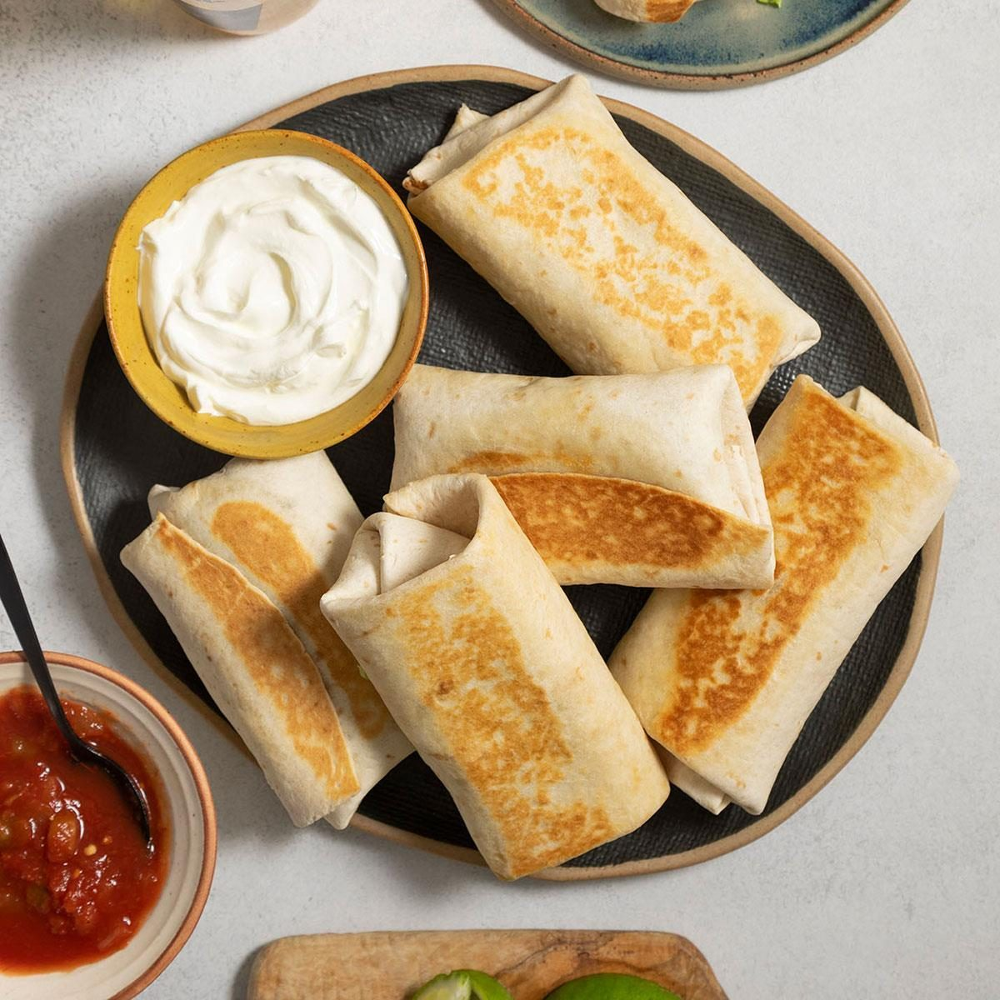

# Nebraska Runza (Beef & Cabbage Sandwich)

📍 *Nebraska*

> A pillowy yeast-dough pocket stuffed with seasoned ground beef, cabbage, and onions. Part sandwich, part hand pie, entirely Nebraskan. It's what happens when German-Russian immigrants meet the Great Plains and decide to make the perfect portable meal.

---

## At a Glance

| | |
|---|---|
| **Servings** | 12 runzas |
| **Prep Time** | 45 minutes + 1 hour rise |
| **Cook Time** | 20 minutes |
| **Difficulty** | Intermediate |
| **Category** | Mains |

---

## Ingredients

### Dough
- 1 cup warm milk (110°F)
- ¼ cup warm water
- 2¼ teaspoons instant yeast (1 packet)
- ¼ cup sugar
- ⅓ cup vegetable oil
- 1 teaspoon salt
- 1 egg, beaten
- 3½–4 cups all-purpose flour

### Filling
- 1½ lbs ground beef
- 1 medium onion, finely diced
- 4 cups green cabbage, finely chopped
- 2 cloves garlic, minced
- 1 teaspoon salt
- ½ teaspoon black pepper
- ½ teaspoon garlic powder

### Topping
- 2 tablespoons butter, melted

---

## Instructions

1. **Make the dough:** Combine warm milk, water, yeast, and sugar. Let sit 5 minutes until foamy. Add oil, salt, and egg. Gradually mix in flour until a soft dough forms. Knead 5–7 minutes until smooth and elastic. Place in an oiled bowl, cover, rise 1 hour until doubled.
2. **Make the filling:** Brown ground beef in a large skillet over medium-high, breaking into small crumbles. Add onion, cook 3 minutes. Add cabbage, garlic, salt, pepper, and garlic powder. Cook 8–10 minutes, stirring often, until cabbage is soft and liquid has evaporated. Let cool to room temperature.
3. **Assemble:** Punch down dough and divide into 12 equal pieces. Roll each into a 6-inch circle. Place ~⅓ cup filling in the center. Fold dough over filling and pinch edges firmly to seal. Place seam-side down on a parchment-lined baking sheet, 2 inches apart.
4. **Rest** 15 minutes while oven preheats to 375°F (190°C).
5. **Bake** 18–20 minutes until golden brown.
6. **Brush** tops with melted butter immediately out of the oven.

---

## Tips & Variations

- **Sealing is critical:** If the edges aren't pinched tight, filling leaks. Wet your fingertip with water to help the dough stick.
- **Cheese runza:** Add a strip of American or pepper jack cheese with the filling before sealing.
- **Pizza runza:** Use pizza sauce, mozzarella, and pepperoni as filling.
- **Freezer-friendly:** Bake, cool completely, wrap individually, freeze up to 3 months. Reheat in a 350°F oven for 15 minutes.
- **The Runza restaurant test:** If you've had one at a Runza drive-through in Nebraska, you know the benchmark. This recipe gets you there.

---

## 🌾 Did You Know?

The Runza has roots in the *Bierock* (also spelled *Bieroc*), a stuffed bread brought to the Great Plains by Volga German immigrants — ethnic Germans who had settled in Russia before emigrating to the American Midwest in the late 1800s. The Runza Restaurant chain, founded in Lincoln, Nebraska in 1949, turned this immigrant staple into a regional fast-food icon. Today there are over 90 Runza locations across Nebraska, and the chain is so beloved that Runza sandwiches are served at University of Nebraska football games at Memorial Stadium. On game days, they sell over 10,000 Runzas.

---

*📸 Photography note: Rustic farmhouse style — two runzas on a cutting board, one cut in half showing the filling, with a bowl of yellow mustard. Rustic kitchen backdrop, red-checkered napkin.*
