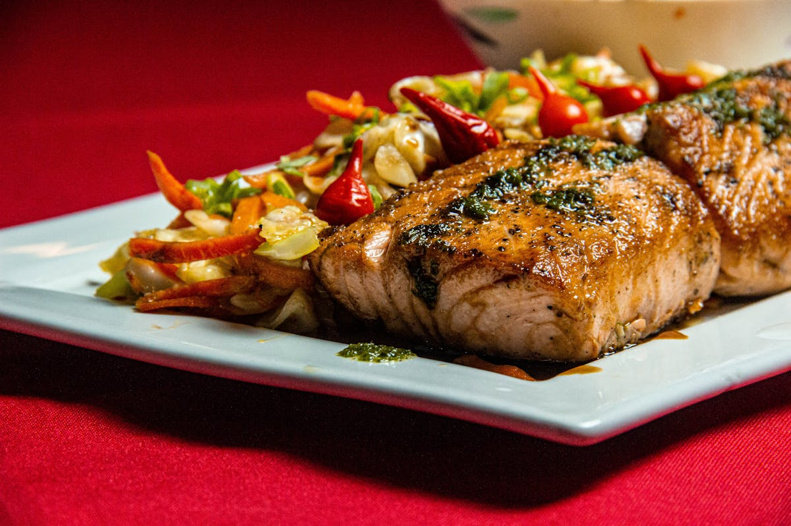

# Pan-Fried Walleye with Tartar Sauce

📍 *Minnesota, Wisconsin, the Dakotas — Lake Country*

> A fresh walleye fillet, dredged in seasoned flour and cornmeal, pan-fried in butter until the crust is golden and crackling and the fish inside flakes into sweet, delicate white layers. This is what Minnesotans dream about during ice fishing season, what lake cabin weekends are built around, and what makes the Upper Midwest's freshwater fishing tradition worth the mosquito bites.

---

## At a Glance

| Detail | Info |
|--------|------|
| **Servings** | 4 |
| **Prep Time** | 15 minutes |
| **Cook Time** | 10 minutes |
| **Total Time** | 25 minutes |
| **Difficulty** | Easy to Moderate |
| **Category** | Mains / Seafood |

---

## 🫕 Midwest Nice Rating: 🫕🫕🫕🫕

Nothing says "welcome to the cabin" like the sound of walleye hitting a hot pan of butter. Minnesotans will make this for anyone — it's the ultimate act of lake hospitality.

---

## Ingredients

### The Walleye
- 1½ pounds walleye fillets (4 fillets), skin removed, pin bones checked
- Salt and freshly ground black pepper
- ½ cup all-purpose flour
- ¼ cup fine yellow cornmeal
- 1 teaspoon garlic powder
- ½ teaspoon paprika
- ½ teaspoon onion powder
- ¼ teaspoon cayenne pepper (optional)
- 2 large eggs, beaten
- 4 tablespoons unsalted butter
- 2 tablespoons vegetable oil
- Lemon wedges, for serving

### Shore Lunch Tartar Sauce
- ¾ cup mayonnaise
- 3 tablespoons dill pickle relish (or finely chopped dill pickles)
- 1 tablespoon fresh lemon juice
- 1 tablespoon capers, chopped (optional but recommended)
- 1 teaspoon dried dill
- ½ teaspoon onion powder
- Hot sauce to taste (a few dashes)
- Salt and pepper to taste

---

## Instructions

1. **Make the tartar sauce.** Stir all tartar sauce ingredients together in a small bowl. Refrigerate for at least 30 minutes to let flavors marry. This step can be done hours or even a day ahead.

2. **Prep the fish.** Pat the walleye fillets completely dry with paper towels — this is crucial for a crispy crust. Season both sides lightly with salt and pepper.

3. **Set up your dredge.** In a shallow dish, combine the flour, cornmeal, garlic powder, paprika, onion powder, and cayenne. In another shallow dish, beat the eggs with a tablespoon of water.

4. **Coat the fillets.** Dip each fillet first in the egg wash, letting excess drip off, then press into the seasoned flour-cornmeal mixture, coating both sides evenly. Set the coated fillets on a plate.

5. **Pan-fry.** Heat the butter and oil together in a large skillet over medium-high heat. When the butter is foaming and fragrant (but not brown), carefully lay the fillets in the pan. Don't crowd — work in batches if needed. Cook for 3–4 minutes per side, until the crust is deeply golden and the fish flakes easily when tested with a fork. The butter will brown slightly during cooking — this is a good thing. Browned butter = flavor.

6. **Drain and serve.** Transfer the fillets to a paper towel-lined plate briefly, then serve immediately with tartar sauce, lemon wedges, and whatever sides speak to you — coleslaw, potato salad, or corn on the cob.

---

## Tips & Variations

- **The Fish:** Walleye is the gold standard for pan-frying in the Upper Midwest — its flesh is mild, sweet, firm enough to hold together, and delicate enough to let the butter and crust shine. If walleye isn't available, perch, crappie, or bluegill are excellent substitutes. Cod works but isn't the same (and Minnesotans will know).
- **Shore Lunch Style:** The classic "shore lunch" preparation — cooking freshly caught walleye on the lakeshore over a campfire — uses a simpler dredge: just seasoned flour, no egg wash. The fish goes straight from the lake to the pan. If you're doing this, add extra butter and don't worry about technique. The setting does half the work.
- **Butter is Non-Negotiable:** The combination of butter and a neutral oil gives you butter flavor with a higher smoke point. Some recipes use all butter, and if you watch it carefully, this is even better. Vegetable oil alone is acceptable but joyless.
- **Don't Overcook:** Walleye is a thin, delicate fillet. 3–4 minutes per side is plenty. When the fish flakes easily and the crust is golden, it's done. Overcooked walleye is dry walleye, and dry walleye is a wasted fish.
- **The Minnesota-Wisconsin Rivalry:** Minnesota claims walleye as its state fish. Wisconsin claims perch as its fish fry king. Both states are right and both states are wrong. (But Minnesota's walleye is better. There. We said it.)

---

> **🤫 Grandma's Secret:** *"Add a splash of Worcestershire sauce to the egg wash. It adds a savory depth that you can't quite identify but you definitely miss when it's not there. And always use a cast iron skillet. Always."*

---

## Pairs Well With

A sunset over a Minnesota lake, a cold beer in a koozie, the sound of loons calling, and the quiet pride of having caught the fish yourself (or the quiet lie of having caught the fish yourself — we don't judge).

---

## 🌾 Did You Know?

> Walleye is the official state fish of Minnesota, and for good reason — the state has more walleye than virtually anywhere else in North America. The name comes from the fish's distinctive large, glassy, almost opaque eyes, which reflect light and help it see in murky or dark water (making it a superb predator and a challenging catch). Walleye fishing is not just a hobby in Minnesota — it's a cultural pillar. The Governor's Fishing Opener is an annual state event covered by local news. Ice fishing for walleye draws hundreds of thousands of anglers onto frozen lakes every winter. And the "shore lunch" — pan-frying walleye in butter on the shore of the lake where you just caught it — is considered by many Minnesotans to be the single best meal you can eat, period. There are no reservations, no dress codes, and no second helpings unless you catch more fish. The Lake of the Woods region in northern Minnesota is known as the "Walleye Capital of the World," and local restaurants serve it every way imaginable: fried, grilled, baked, in tacos, in chowder. But pan-fried in butter, on the shore, with people you love? That's the one that matters.

---

*📸 Photography note: Two golden-crusted walleye fillets on a simple plate, lemon wedges alongside, a small bowl of tartar sauce. Maybe a lakeside picnic table setting — pine trees in the background, a tackle box barely visible. Late afternoon light, golden and warm. The photo should smell like butter and pine needles and summer.*
