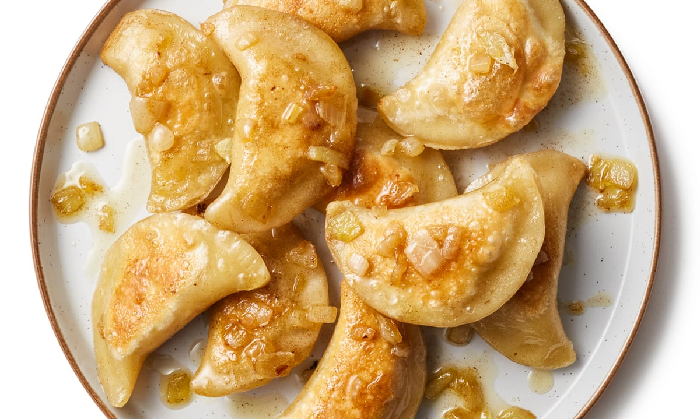

# Pierogi

📍 *Michigan / Ohio (Polish Heritage)*

> These tender, savory dumplings, often filled with potatoes and cheese, are a beloved comfort food, especially in the heavily Polish-influenced communities of the Midwest.

---

## At a Glance

| Detail | Info |
|---|---|
| **Servings** | 6-8 (about 30-40 pierogi) |
| **Prep Time** | 60 minutes |
| **Cook Time** | 20-30 minutes (in batches) |
| **Difficulty** | Medium |
| **Category** | Mains |

---

## Ingredients

**For the Dough:**
- 2 cups (240g) all-purpose flour, plus more for dusting
- 1 large egg
- ½ cup (120ml) sour cream
- ¼ cup (60ml) water
- ½ tsp salt

**For the Potato & Cheese Filling:**
- 2 large russet potatoes (about 1.5 lbs / 680g), peeled and quartered
- 4 oz (113g) cream cheese, softened
- 4 oz (113g) sharp cheddar cheese, shredded
- 2 tbsp (30g) unsalted butter, melted
- ¼ cup (60ml) milk or half-and-half
- Salt and black pepper to taste

**For Serving:**
- 4 tbsp (60g) unsalted butter
- 1 large onion, thinly sliced
- Sour cream, for dolloping
- Fresh chives or parsley, chopped, for garnish

## Instructions

1. **Prepare Filling:** Boil potatoes in salted water until very tender, about 15-20 minutes. Drain well. Return to the hot pot and mash thoroughly. Stir in cream cheese, shredded cheddar, melted butter, and milk. Mix until smooth and creamy. Season with salt and pepper to taste. Set aside to cool completely.
2. **Make Dough:** In a large bowl, combine flour and salt. In a separate bowl, whisk egg, sour cream, and water. Add wet ingredients to dry ingredients and mix until a shaggy dough forms. Turn out onto a lightly floured surface and knead for 5-7 minutes until smooth and elastic. Cover with plastic wrap and let rest for 30 minutes.
3. **Roll & Cut Dough:** Divide dough in half. On a lightly floured surface, roll one half of the dough thinly (about ⅛ inch / 3mm thick). Use a 3-inch (7.5 cm) round cutter or rim of a glass to cut out circles. Re-roll scraps as needed.
4. **Fill Pierogi:** Place a teaspoon of cooled filling in the center of each dough circle. Fold the dough over the filling to create a half-moon shape. Pinch the edges firmly to seal, crimping with a fork if desired to ensure a tight seal.
5. **Boil Pierogi:** Bring a large pot of salted water to a rolling boil. Add pierogi in batches (about 6-8 at a time) and cook for 3-5 minutes, or until they float to the surface and the dough is tender. Remove with a slotted spoon and place on a lightly greased baking sheet or plate.
6. **Sauté Onions:** While pierogi are boiling, melt 4 tbsp butter in a large skillet over medium heat. Add sliced onion and cook until deeply caramelized and tender, about 15-20 minutes.
7. **Sauté Pierogi (Optional):** For a golden-brown finish, add boiled pierogi to the skillet with caramelized onions and sauté for 2-3 minutes per side until lightly browned and crispy.
8. **Serve:** Serve hot, topped with caramelized onions, a dollop of sour cream, and fresh chives or parsley.

---

## Tips & Variations

- Experiment with fillings: add sautéed mushrooms, ground meat, or sweet fruit fillings (like prune or cherry).
- For a richer dough, use melted butter instead of water.
- To freeze: Place uncooked pierogi on a floured baking sheet in a single layer. Freeze until solid, then transfer to a freezer-safe bag. Cook from frozen in boiling water for an extra 2-3 minutes.
- Serve with a side of crispy bacon bits for added texture and flavor.

---

## 🌾 Did You Know?

> Pierogi are a beloved culinary tradition in many Midwestern communities, particularly those with a strong Polish, Ukrainian, or Eastern European heritage. Cities like Detroit, Cleveland, and Chicago have long celebrated pierogi as a staple, deeply woven into holiday meals, church festivals, and family gatherings. These savory dumplings represent the enduring cultural ties and comfort food traditions brought by immigrants to the heart of America.

---

*📸 Photography note: Rustic farmhouse style. A generous plate of golden-brown pierogi, glistening with melted butter and topped with deeply caramelized onions. A dollop of fresh sour cream and a sprinkle of chives provide color. Served on a simple ceramic plate on a wooden table. Soft, natural lighting highlights the tender dough and rich filling.*

## ⭐ Midwest Nice Rating

5/5 🫕🫕🫕🫕🫕
(Will absolutely bring a tray to the church bake sale, and might even offer to help set up the tables.)

## 🥂 Pairs Well With

Pairs well with: A snowy Sunday afternoon, a lively family gathering, and sharing stories about your ancestors while sipping strong coffee.

### 👵 Grandma's Secret: Pierogi

> "Grandma Kaczmarek insisted on using a splash of vodka in the pierogi dough. 'It makes them extra tender, like little pillows!' she'd whisper, 'and it evaporates completely, so don't you worry.'"
