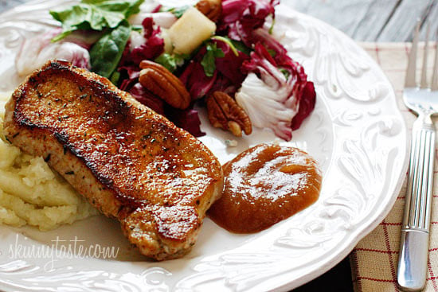

# Pork Chops and Applesauce

📍 *Michigan / Wisconsin (Orchard Belt)*

> Pork and apples. Apples and pork. The pairing is so obvious that it barely qualifies as cooking — unless you grew up in Michigan or Wisconsin, where it's not just dinner, it's a statement about seasonal eating, agricultural pride, and what you do with a bumper crop of Honeycrisps in October. This is what happens when the orchard belt meets the hog farm, and it's been on Midwest tables since your great-grandmother was frying chops in a cast-iron skillet.

---

## At a Glance

| Detail | Info |
|---|---|
| **Servings** | 4 |
| **Prep Time** | 15 minutes |
| **Cook Time** | 25 minutes |
| **Total Time** | 40 minutes |
| **Difficulty** | Easy |
| **Category** | Mains |

---

## Ingredients

**For the Pork Chops:**
- 4 bone-in pork chops, about 1 inch thick (1.5 lbs total)
- 1 tbsp vegetable oil or bacon fat
- 1 tsp salt
- ½ tsp black pepper
- ½ tsp garlic powder
- ½ tsp dried sage or thyme

**For the Applesauce:**
- 4 medium apples (Honeycrisp, Jonathan, or Cortland), peeled, cored, and chopped
- ¼ cup (60ml) water or apple cider
- 2 tbsp butter
- 2 tbsp brown sugar (adjust to taste)
- ½ tsp ground cinnamon
- Pinch of salt
- 1 tsp bourbon or apple brandy (optional, but encouraged)

---

## Instructions

1. **Make the Applesauce:** In a medium saucepan, combine the chopped apples, water (or cider), butter, brown sugar, cinnamon, and a pinch of salt. Bring to a simmer over medium heat. Cover and cook, stirring occasionally, for 12-15 minutes until the apples are soft and breaking down. Mash with a potato masher for chunky applesauce, or blend smooth if you prefer. Stir in the bourbon or brandy if using. Taste and adjust sweetness. Keep warm.

2. **Season the Chops:** Pat the pork chops dry with paper towels. Season both sides generously with salt, pepper, garlic powder, and sage (or thyme).

3. **Sear the Chops:** Heat the oil or bacon fat in a large cast-iron skillet over medium-high heat. When the pan is hot, add the pork chops. Sear without moving them for 4-5 minutes on the first side until a deep golden crust forms. Flip and cook another 4-5 minutes on the second side, until the internal temperature reaches 145°F (63°C). The chops should have a nice crust and be juicy inside.

4. **Rest & Serve:** Remove the chops from the pan and let rest for 5 minutes. Serve each pork chop with a generous spoonful of warm applesauce on the side (or over the top, if you're feeling bold).

---

## Tips & Variations

- **Apple Varieties:** Use a mix of sweet and tart apples for complexity. Honeycrisp, Jonathan, and Northern Spy are all Michigan classics.
- **Stovetop to Oven:** After searing, you can finish the chops in a 375°F oven for 8-10 minutes for extra-thick chops.
- **Quick Applesauce:** In a pinch, use store-bought unsweetened applesauce and doctor it up with butter, cinnamon, and a splash of bourbon.
- **Leftover Applesauce:** Keeps in the fridge for a week. Serve it with pancakes, oatmeal, or straight from the jar.

---

## 🌾 Did You Know?

> Michigan is the third-largest apple producer in the United States, with orchards stretching along the Lake Michigan shoreline and inland toward the Thumb. Wisconsin isn't far behind. Both states have strong hog farming traditions, making pork and apples a natural culinary partnership. The pairing goes back to Colonial times, when European settlers brought both apple trees and pigs to the New World.
> 
> In the Midwest, pork chops and applesauce became a weeknight staple in the mid-20th century, when both pork and apples were abundant and affordable. The dish shows up in community cookbooks from the 1950s onward, often with instructions to use "whatever apples you have" — a testament to Midwestern practicality.
> 
> The phrase "pork chops and applesauce" became a pop culture punchline thanks to *The Brady Bunch*, when Peter Brady impersonated Humphrey Bogart while serving dinner. It's corny. It's dated. But it's also deeply, unapologetically Midwestern — a humble dish elevated by seasonal ingredients and a little bit of care.

---

*📸 Photography note: Autumn farmhouse. A thick, golden-brown pork chop on a white ceramic plate with a generous scoop of chunky applesauce on the side. Fresh apple slices and a sprig of sage as garnish. Shot on a weathered wooden table with a faded plaid napkin. Soft, late-afternoon light from a window. Background: a bowl of fresh apples, slightly out of focus. The vibe should be October on a Michigan farm.*

---

## ⭐ Midwest Nice Rating

4/5 🫕🫕🫕🫕  
(Will serve this to anyone who stops by during apple season, and will send them home with a jar of applesauce.)

---

## 🥂 Pairs Well With

A chilly October evening, a trip to the orchard, a pot of mashed potatoes, and the smell of wood smoke from a neighbor's fire pit.

---

## 👵 Grandma's Secret: Pork Chops and Applesauce

> "Grandma Eleanor always added a teaspoon of good bourbon to the applesauce while it simmered. 'It deepens the apple flavor,' she'd say with a wink, 'and makes it taste like a grown-up made it.' She also insisted on bone-in chops, claiming the bone added flavor and kept the meat from drying out. She was right."
