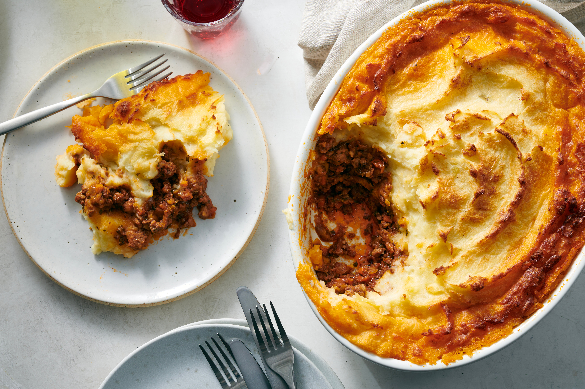

# Shepherd's Pie (Midwest Cottage Pie)

📍 *Michigan / Minnesota (Mining Country Adaptation)*

> This isn't authentic British Shepherd's Pie — it's what happened when Irish and Cornish miners brought the recipe to Michigan's Upper Peninsula and Minnesota's Iron Range in the 1800s, then adapted it with whatever meat was cheap and whatever vegetables were in the root cellar. Real Shepherd's Pie uses lamb. Midwest "Shepherd's Pie" uses ground beef, and no one apologizes for it. It's a casserole of leftovers and economical thinking, topped with a thick blanket of mashed potatoes and baked until the edges are crispy and the middle is bubbling. It's mining-town comfort food, and it fed generations of families who worked underground.

---

## At a Glance

| Detail | Info |
|--------|------|
| **Servings** | 6-8 (or 4 miners) |
| **Prep Time** | 25 minutes |
| **Cook Time** | 35 minutes |
| **Total Time** | 60 minutes |
| **Difficulty** | Medium |
| **Category** | Mains |

---

## Ingredients

**For the Filling:**
- 1 tbsp vegetable oil or bacon fat
- 1.5 lbs (680g) ground beef (80/20 — don't use lean)
- 1 large yellow onion, diced
- 2 medium carrots, peeled and diced
- 2 cloves garlic, minced
- 1 tbsp all-purpose flour
- 1 cup (240ml) beef broth
- 2 tbsp tomato paste
- 1 tbsp Worcestershire sauce
- 1 tsp dried thyme
- ½ tsp dried rosemary, crushed
- 1 cup (150g) frozen peas
- 1 cup (150g) frozen corn (optional, but very Midwest)
- Salt and black pepper to taste

**For the Mashed Potato Topping:**
- 2 lbs (900g) russet or Yukon Gold potatoes, peeled and quartered
- ½ cup (120ml) whole milk, warmed
- 4 tbsp (56g) butter, softened
- Salt and black pepper to taste
- Optional: ½ cup shredded cheddar cheese (very Midwest)

---

## Instructions

1. **Boil the Potatoes:** Place potatoes in a large pot, cover with cold salted water, and bring to a boil. Reduce heat and simmer for 15-18 minutes until fork-tender. Drain well.

2. **Mash the Potatoes:** Return drained potatoes to the hot pot. Add warm milk, butter, salt, and pepper. Mash until smooth and creamy. Taste and adjust seasoning. Set aside.

3. **Brown the Beef:** Heat oil or bacon fat in a large oven-safe skillet (cast iron is ideal) over medium-high heat. Add the ground beef and onion. Cook, breaking up the meat with a wooden spoon, until browned and no pink remains, about 7-8 minutes. Drain excess fat if needed, leaving about 1 tablespoon in the pan.

4. **Add Vegetables:** Stir in the diced carrots and cook for 5 minutes until they start to soften. Add garlic, thyme, and rosemary; cook 1 minute until fragrant.

5. **Thicken the Filling:** Sprinkle the flour over the meat mixture and stir well. Cook for 2 minutes. Add the tomato paste and stir to coat everything.

6. **Build the Sauce:** Pour in the beef broth and Worcestershire sauce. Stir constantly until the mixture thickens and bubbles, about 3-4 minutes. Stir in the peas and corn. Taste and season generously with salt and pepper. The filling should be thick and saucy, not soupy.

7. **Assemble:** Spread the meat filling evenly in the skillet (or transfer to a 9x13-inch baking dish). Spoon the mashed potatoes over the top, spreading to the edges to seal in the filling. Use a fork to create ridges and texture on the surface — this helps it brown. If using cheese, sprinkle it over the potatoes now.

8. **Bake:** Preheat oven to 400°F (200°C). Bake for 25-30 minutes until the filling is bubbling at the edges and the potato topping is golden brown. For extra browning, broil for the last 2-3 minutes, watching carefully.

9. **Rest & Serve:** Let the pie rest for 10 minutes before serving. This keeps it from falling apart when you scoop. Serve in deep bowls or on plates.

---

## Tips & Variations

- **The Lamb Debate:** If you want to be traditional, use ground lamb instead of beef. Most Midwesterners don't bother.
- **Leftover Mashed Potatoes:** This is an excellent use for leftover mashed potatoes. Just warm them slightly before spreading.
- **Vegetable Add-Ins:** Root cellar vegetables like turnips, parsnips, or rutabaga were traditional in mining communities. Use what you have.
- **Cheese or No Cheese:** Adding cheddar to the potatoes or on top is a very American adaptation. It's not traditional, but it's delicious.
- **Leftovers:** Reheats beautifully. In fact, it's better the next day.

---

## 🌾 Did You Know?

> Shepherd's Pie (properly made with lamb) and Cottage Pie (made with beef) are British dishes that arrived in the Midwest with Irish, Scottish, and Cornish immigrants who came to work in the iron mines and copper mines of Michigan's Upper Peninsula and Minnesota's Iron Range in the mid-1800s. The dish was economical, filling, and could be made with whatever meat and vegetables were available.
> 
> In the Midwest, the terms "Shepherd's Pie" and "Cottage Pie" became interchangeable, and beef became the standard because it was cheaper and more available than lamb. Mining families would make it on Sunday and reheat it throughout the week. It was the ultimate make-ahead meal for households where everyone worked long shifts.
> 
> The dish also became popular in farming communities across the Midwest as a way to use up leftover roast beef or ground meat. It's practical, forgiving, and deeply satisfying — which is why it stuck around long after the mines closed.

---

*📸 Photography note: Working-class realism. A cast-iron skillet of shepherd's pie fresh from the oven, the mashed potato topping golden and craggy, with filling bubbling at the edges. A serving spoon has already taken a scoop, showing the layered interior. Shot on a simple kitchen table with a faded potholder nearby. Lighting should be warm and slightly dim, like a kitchen in the evening. No garnish. No frills.*

---

## ⭐ Midwest Nice Rating

5/5 🫕🫕🫕🫕🫕  
(Will bring this to anyone who's going through a hard time, and will leave the dish so they don't have to worry about returning it.)

---

## 🥂 Pairs Well With

A cold November evening, a long day of physical work, a scratched Formica table, and the knowledge that there will be leftovers for lunch tomorrow.

---

## 👵 Grandma's Secret: Shepherd's Pie

> "Grandma Betty, whose father worked the Soudan Mine in Minnesota, always stirred a big spoonful of tomato paste into the meat filling before adding the broth. 'Gives it color and richness,' she'd say, 'and makes it taste like you simmered it for hours.' She also insisted on making deep fork marks in the mashed potatoes so they'd crisp up in the oven. 'If it's not crunchy on top, you didn't do it right.'"
