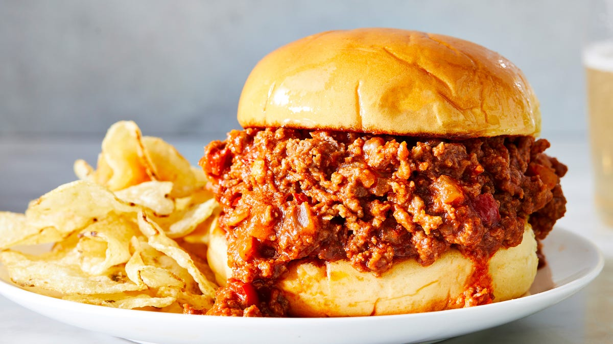

# Sloppy Joes

📍 *Iowa (Sioux City Origin Claim)*

> The Sloppy Joe is a sandwich that embraces chaos. Sweet, tangy, saucy ground beef piled onto a soft bun, guaranteed to drip down your wrists and onto your plate. It's cafeteria food, church basement food, quick-weeknight-dinner food. And while several states claim to have invented it, **Iowa** insists it was born in Sioux City in the 1930s at a diner run by a cook named Joe. We'll never know for sure, but that's never stopped anyone in the Midwest from making them anyway.

---

## At a Glance

| Detail | Info |
|---|---|
| **Servings** | 4-6 sandwiches |
| **Prep Time** | 10 minutes |
| **Cook Time** | 25 minutes |
| **Total Time** | 35 minutes |
| **Difficulty** | Easy |
| **Category** | Mains |

---

## Ingredients

- 1.5 lbs (680g) ground beef (80/20 — you need the fat for flavor)
- 1 medium yellow onion, finely diced
- 1 green bell pepper, finely diced (optional, but adds texture)
- 3 cloves garlic, minced
- 1 (15 oz / 425g) can tomato sauce
- ½ cup (120ml) ketchup
- 3 tbsp brown sugar, packed
- 2 tbsp yellow mustard
- 2 tbsp Worcestershire sauce
- 1 tbsp apple cider vinegar
- 1 tsp smoked paprika (optional, for depth)
- ½ tsp black pepper
- Salt to taste
- 6 soft white hamburger buns
- Optional toppings: dill pickle slices, shredded cheddar cheese

---

## Instructions

1. **Brown the Beef:** Heat a large skillet over medium-high heat. Add the ground beef and cook, breaking it up with a wooden spoon, until browned and no pink remains, about 7-8 minutes. Drain off most of the fat, leaving about 1 tablespoon in the pan.

2. **Cook the Vegetables:** Add the diced onion, bell pepper (if using), and garlic to the skillet. Cook over medium heat, stirring occasionally, until the vegetables are softened, about 5 minutes.

3. **Build the Sauce:** Stir in the tomato sauce, ketchup, brown sugar, mustard, Worcestershire sauce, vinegar, smoked paprika, and black pepper. Mix well until everything is combined.

4. **Simmer:** Reduce heat to low and let the mixture simmer, uncovered, for 15-20 minutes, stirring occasionally. The sauce should thicken and the flavors should meld. Taste and add salt as needed.

5. **Serve:** Toast the buns lightly if you're feeling fancy (most people don't). Pile the Sloppy Joe mixture generously onto the bottom buns. Top with pickles or cheese if desired. Cap with the top bun. Serve immediately with a stack of napkins.

---

## Tips & Variations

- **Sweetness Level:** Adjust the brown sugar to taste. Some folks like it sweeter, others prefer more tang. Start with 2 tbsp and add more if needed.
- **Spice it Up:** Add a pinch of cayenne pepper or a dash of hot sauce for heat.
- **Pickle Juice Secret:** Stir in 1-2 tablespoons of pickle juice at the end for brightness and acidity. This is Grandma Betty's move.
- **Manwich vs. Homemade:** Store-bought Manwich sauce is convenient, but homemade tastes better and lets you control the sweetness and spice.
- **Leftovers:** Sloppy Joe filling freezes well and reheats beautifully. Make a double batch.

---

## 🌾 Did You Know?

> The origin story of the Sloppy Joe is murky, but one popular version claims it was invented in **Sioux City, Iowa, in the 1930s** by a cook named Joe at a small diner. The sandwich was originally called "loose meat" (sound familiar?), but Joe's version had a tomato-based sauce, setting it apart from the Maid-Rite style. Another story credits a bar in Havana, Cuba, also named "Sloppy Joe's."
> 
> Regardless of where it started, the Sloppy Joe became a Midwest staple by the 1950s and '60s, appearing in school cafeterias, church fundraisers, and weeknight dinner rotations. The canned sauce version — **Manwich** — launched in 1969 and turned Sloppy Joes into a convenience food. Hunt's slogan, "A sandwich is a sandwich, but a Manwich is a meal," became iconic.
> 
> The Sloppy Joe is unapologetically messy, cheap, and kid-friendly. It's not fancy. It's not Instagram-worthy. But it's fast, filling, and nostalgic — which is exactly what you want on a Wednesday night when no one feels like cooking.

---

*📸 Photography note: Cafeteria nostalgia. A Sloppy Joe on a soft white bun, overflowing with saucy beef, served on a plain white plate or a school lunch tray. Sauce dripping onto the plate. A stack of dill pickle chips on the side and a small pile of crinkle-cut fries in the background. Shot with overhead fluorescent-style lighting that's slightly cool and flat — this should evoke a 1980s school cafeteria, not a gourmet kitchen.*

---

## ⭐ Midwest Nice Rating

4/5 🫕🫕🫕🫕  
(Will bring this to a potluck in a slow cooker, keep it on "warm," and cheerfully remind everyone to grab extra napkins.)

---

## 🥂 Pairs Well With

A Tuesday night when you don't feel like cooking, a school fundraiser spaghetti dinner, a basement rec room full of kids, and the satisfying knowledge that dinner cost less than $10.

---

## 👵 Grandma's Secret: Sloppy Joes

> "Grandma Betty always stirred in a tablespoon of pickle juice at the very end, just before serving. 'Brightens the whole thing up,' she'd say, 'cuts through all that sweet and makes it taste like *something*.'' She also insisted on toasting the buns in a dry skillet so they wouldn't get soggy. 'Nobody likes a wet bun, honey.'"
