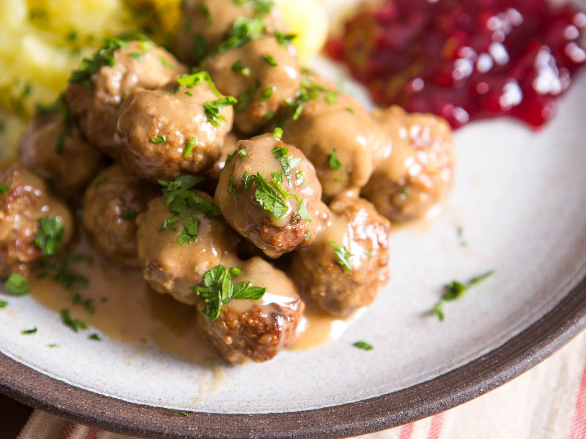

# Swedish Meatballs

📍 *Minnesota*

> A hearty and comforting dish, these tender, perfectly seasoned meatballs bathed in a rich, creamy gravy are a testament to Minnesota's strong Scandinavian roots.

---

## At a Glance

| Detail | Info |
|---|---|
| **Servings** | 6 |
| **Prep Time** | 20 minutes |
| **Cook Time** | 30-35 minutes |
| **Difficulty** | Medium |
| **Category** | Mains |

---

## Ingredients

**For the Meatballs:**
- 1 lb (450g) ground beef (80/20 recommended)
- ½ lb (225g) ground pork
- ½ cup (40g) breadcrumbs (Panko or fresh)
- ¼ cup (60ml) milk or cream
- 1 small onion, finely minced and sautéed until softened
- 1 large egg, lightly beaten
- 1 tsp salt
- ½ tsp black pepper
- ¼ tsp ground allspice
- ⅛ tsp ground nutmeg

**For the Gravy:**
- 2 tbsp (30g) unsalted butter
- 2 tbsp (15g) all-purpose flour
- 2 cups (480ml) beef broth
- ½ cup (120ml) heavy cream or half-and-half
- 1 tbsp (15ml) Worcestershire sauce
- 1 tbsp (15g) Dijon mustard
- Salt and black pepper to taste

**For Serving:**
- Cooked egg noodles or mashed potatoes
- Lingonberry preserves (optional)
- Fresh parsley, chopped (for garnish)

## Instructions

1. **Prepare Meatballs:** In a large bowl, gently combine ground beef, ground pork, breadcrumbs, milk (or cream), sautéed minced onion, egg, salt, pepper, allspice, and nutmeg. Mix until just combined – do not overmix, or meatballs will be tough.
2. **Form Meatballs:** Roll the mixture into small, 1-inch (2.5 cm) meatballs. You should get about 30-35 meatballs.
3. **Cook Meatballs:** Heat a large skillet over medium-high heat. Add a tablespoon of oil if needed. Brown the meatballs in batches until seared on all sides. They don't need to be cooked through. Remove meatballs from skillet and set aside.
4. **Make Roux:** In the same skillet (don't drain the drippings), melt butter over medium heat. Whisk in flour and cook for 1-2 minutes, stirring constantly, until a light roux forms.
5. **Whisk in Liquids:** Slowly whisk in the beef broth, scraping up any browned bits from the bottom of the pan. Bring to a simmer, whisking until the gravy thickens. Reduce heat to low.
6. **Finish Gravy:** Stir in the heavy cream, Worcestershire sauce, and Dijon mustard. Season with salt and pepper to taste. Return the browned meatballs to the gravy. Cover and simmer for 15-20 minutes, or until meatballs are cooked through and flavors have melded.
7. **Serve:** Serve hot over cooked egg noodles or creamy mashed potatoes. Garnish with fresh chopped parsley and a dollop of lingonberry preserves on the side, if desired.

---

## Tips & Variations

- For a richer flavor, use a mix of beef and veal instead of pork.
- If you prefer a less creamy gravy, you can reduce the amount of heavy cream and use more beef broth.
- Make ahead: Meatballs can be cooked and stored in the gravy in the refrigerator for up to 3 days. Reheat gently on the stovetop.
- Serve with pickled cucumbers for an authentic Scandinavian touch.

---

## 🌾 Did You Know?

> Swedish Meatballs are a beloved comfort food in Minnesota, a state with a significant Scandinavian heritage. Many Minnesotans trace their roots to Sweden and Norway, bringing with them culinary traditions that became staples in their new home. Often served at family gatherings, holidays, and community events, these tender meatballs in their creamy gravy are more than just a meal; they are a taste of heritage.

---

*📸 Photography note: Rustic farmhouse style. A generous portion of Swedish meatballs nestled in creamy gravy, served over a bed of fluffy mashed potatoes or egg noodles, in a deep ceramic bowl. A small spoonful of bright red lingonberry preserves on the side. Garnish with fresh green parsley. Soft, overhead natural light highlighting the rich texture of the gravy.*

## ⭐ Midwest Nice Rating

5/5 🫕🫕🫕🫕🫕
(Will definitely bring to a family gathering, and probably offer you the last one even if I really want it.)

## 🥂 Pairs Well With

Pairs well with: A snowy Minnesota evening, a cozy sweater, and a quiet night in with good company (and maybe a little friendly passive-aggressive competition over whose grandma made them best).

### 👵 Grandma's Secret: Swedish Meatballs

> "Grandma Svennson always snuck in a tiny pinch of ground cardamom into her meatballs. 'Just a whisper,' she'd say, 'to make them taste like home.' It added a subtle, warm complexity no one could quite pinpoint but everyone loved."
