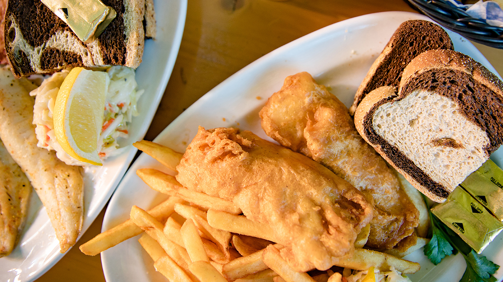

# Wisconsin Friday Fish Fry

📍 *Wisconsin — Every Supper Club, VFW Hall, and Church Basement in the State*

> Beer-battered cod fried to a shattering golden crust, served with a mountain of coleslaw, rye bread with butter, and a pile of french fries or potato pancakes. In Wisconsin, Friday isn't a day of the week. It's a fish fry. It has been this way since before you were born, and it will be this way long after you're gone.

---

## At a Glance

| Detail | Info |
|--------|------|
| **Servings** | 4 |
| **Prep Time** | 20 minutes |
| **Cook Time** | 15–20 minutes |
| **Total Time** | 40 minutes |
| **Difficulty** | Moderate |
| **Category** | Mains / Seafood |

---

## 🫕 Midwest Nice Rating: 🫕🫕🫕🫕🫕

This isn't a potluck dish — this *is* the potluck. Entire communities organize their week around the Friday fish fry.

---

## Ingredients

### The Fish
- 2 pounds cod fillets (or haddock, perch, or walleye), cut into roughly equal portions
- Salt and freshly ground black pepper

### The Beer Batter
- 1½ cups all-purpose flour
- 1 tablespoon cornstarch
- 1 teaspoon baking powder
- 1 teaspoon garlic powder
- 1 teaspoon paprika
- 1 teaspoon salt
- ½ teaspoon freshly ground black pepper
- 1 can (12 ounces) cold beer (a Wisconsin lager — Spotted Cow, Miller High Life, Point Special)
- 1 large egg

### For Frying
- Vegetable or peanut oil, enough for 3 inches in your pot
- Additional ½ cup flour for dredging

### Traditional Accompaniments
- Coleslaw (creamy, not vinegar-based — see our Creamy Coleslaw recipe)
- Tartar sauce (recipe below)
- Lemon wedges
- Dark rye bread with butter
- French fries or potato pancakes

### Quick Tartar Sauce
- ¾ cup mayonnaise
- 3 tablespoons dill pickle relish
- 1 tablespoon fresh lemon juice
- 1 teaspoon dried dill (or 1 tablespoon fresh)
- ½ teaspoon onion powder
- Salt and pepper to taste

---

## Instructions

1. **Make the tartar sauce.** Stir together all tartar sauce ingredients in a small bowl. Refrigerate until ready to serve. (Better if made an hour or more ahead.)

2. **Prep the fish.** Pat the cod fillets completely dry with paper towels. Season both sides with salt and pepper. Dry fish = better batter adhesion. Wet fish = the batter slides right off and you'll be sad.

3. **Make the batter.** In a large bowl, whisk together 1½ cups flour, cornstarch, baking powder, garlic powder, paprika, salt, and pepper. Pour in the cold beer and crack in the egg. Whisk until smooth — a few small lumps are okay. The batter should be the consistency of thick pancake batter. If it's too thick, add a splash more beer. The batter should be cold — cold batter + hot oil = crispier fish. Stick it in the fridge for 10 minutes if your kitchen is warm.

4. **Heat the oil.** Pour oil into a deep heavy pot or Dutch oven to a depth of about 3 inches. Heat to 375°F. Use a thermometer — guessing gets you soggy fish.

5. **Dredge and batter.** Set up your assembly line: fish, dredging flour, batter, oil. Dredge each piece of fish in the plain flour, shake off the excess, then dip it into the beer batter, letting the excess drip off for a couple seconds.

6. **Fry.** Carefully lower the battered fish into the hot oil, 2–3 pieces at a time (don't crowd the pot — it drops the oil temperature). Fry for 4–6 minutes, turning once halfway through, until the batter is deeply golden brown and the fish inside is opaque and flakes easily. Transfer to a wire rack set over a sheet pan. Season with a little extra salt immediately.

7. **Serve the Wisconsin way.** Pile the fish on a plate alongside coleslaw, tartar sauce, lemon wedges, a couple slices of dark rye bread with butter, and fries or potato pancakes. A Brandy Old Fashioned on the side is not optional. (See our Wisconsin Brandy Old Fashioned recipe.)

---

## Tips & Variations

- **The Beer Matters (Sort Of):** A standard American lager works perfectly. The beer provides carbonation (which makes the batter light and crispy) and a subtle malty flavor. Don't use anything too hoppy or dark — save that for drinking alongside the fish.
- **Perch vs. Cod vs. Walleye:** Cod is the most common at fish frys, but yellow perch is the prestige choice in Wisconsin. Walleye is the Minnesota move (and honestly, just as good — but don't tell a Wisconsinite that). Use whatever's freshest.
- **Potato Pancakes:** If you want the full supper club experience, make potato pancakes instead of fries. Grate russet potatoes, squeeze out all the moisture, mix with a little egg and flour, and pan-fry in butter until crispy. Serve with applesauce.
- **Oil Temperature:** Maintain 375°F throughout frying. If the oil gets too cool, the batter absorbs grease instead of crisping. If it's too hot, the outside burns before the fish cooks through.
- **Baked Version?** We don't talk about baked fish at a fish fry. That's like bringing a salad to a tailgate. It technically counts but everyone knows.

---

> **🤫 Grandma's Secret:** *"Add a shot of vodka to the batter instead of some of the beer. Vodka evaporates faster than water, which means a crispier crust. Don't tell the church ladies — they'll have opinions."*

---

## Pairs Well With

A Wisconsin Brandy Old Fashioned (sweet), a Friday evening at a supper club where the wallpaper hasn't changed since 1974, and the comforting knowledge that every single person in this restaurant is eating the exact same thing.

---

## 🌾 Did You Know?

> Wisconsin's Friday fish fry tradition has Catholic roots — the practice of abstaining from meat on Fridays during Lent created a demand for fish dinners, and Wisconsin's large Catholic population (German, Polish, and Irish immigrants) turned Friday fish into an institution. But here's the thing: Lent ends, and the fish fries don't. Wisconsinites eat fish fry year-round, every Friday, Catholic or not. The tradition is so embedded in the culture that it's essentially secular at this point. Supper clubs — those uniquely Wisconsin dining establishments with dim lighting, relish trays, and brandy Old Fashioneds — are the spiritual home of the fish fry, but VFW halls, church basements, fire stations, bowling alleys, and even gas stations get in on the action. The Wisconsin fish fry is estimated to be a $300 million-plus annual industry. Friday night in Wisconsin doesn't ask "where should we eat?" It asks "which fish fry?"

---

*📸 Photography note: A platter of golden beer-battered fish fillets, craggy and crispy, alongside a mound of coleslaw, lemon wedges, rye bread, and a dish of tartar sauce. Maybe a brandy Old Fashioned in the background with its obligatory garnish overload. Red-and-white checkered tablecloth. Supper club vibes — warm, nostalgic, slightly over-lit in that charming way.*
