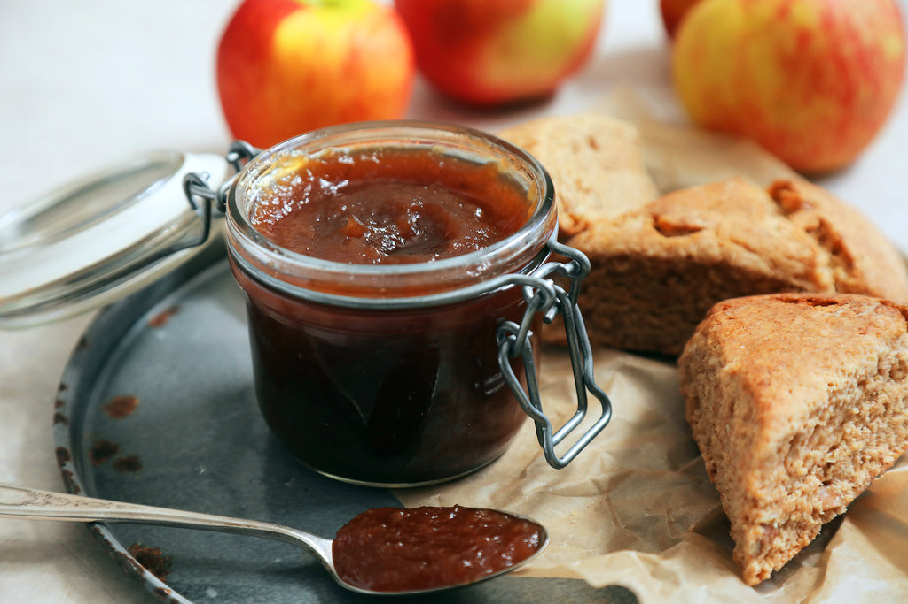

# Apple Butter

📍 *Indiana / Ohio Orchard Country — Where Apples Turn to Gold*

> Apple butter is autumn reduced to its essence — apples cooked down until they surrender completely, turning dark and glossy and concentrated, spiced with cinnamon and cloves until your whole house smells like October. It's not butter, and it's not really jam. It's something older, deeper, slower. It's what happens when you take bushels of apples from the orchard and cook them low and long until the sugars caramelize and the fruit transforms into something almost mystical. A spoonful on toast is breakfast. A jar in the pantry is proof you prepared for winter. A batch made with neighbors in a copper kettle outdoors is a vanishing tradition, but one that some communities still keep alive. This is patient cooking. This is apple alchemy.

---

## At a Glance

| Detail | Info |
|--------|------|
| **Servings** | Yields about 4-5 half-pint jars |
| **Prep Time** | 20 minutes |
| **Cook Time** | 4-6 hours (stovetop) or 8-10 hours (slow cooker) |
| **Total Time** | 4.5-10.5 hours (patience included) |
| **Difficulty** | Medium |
| **Category** | Preserves |

---

## 🫕 Midwest Nice Rating: 🫕🫕🫕🫕🫕

A jar of apple butter says, "I spent the better part of a day making this for you." That's Midwest love language. Expect it wrapped in a cloth napkin with a handwritten tag.

---

## Ingredients

### The Apples
- 4 lbs (about 12 medium) apples — a mix of sweet and tart (Gala + Granny Smith, or Honeycrisp + Jonathan, or whatever the orchard has in abundance)
- 1 cup (240ml) apple cider (not juice — real cider, preferably from the same orchard)

### The Spices & Sweet
- ½ cup (100g) granulated sugar
- ½ cup (100g) packed light brown sugar
- 2 tsp ground cinnamon
- 1 tsp ground cloves
- ½ tsp ground nutmeg
- ¼ tsp ground allspice
- Pinch of salt
- 1 tbsp lemon juice (freshly squeezed)

---

## Instructions

1. **Prepare the apples.** Peel, core, and quarter them. This is the tedious part. Some people use an apple peeler-corer gadget. Those people are smart. Place the apples in a large, heavy-bottomed pot or Dutch oven (or a 6-quart slow cooker if you're going the modern route).

2. **Add everything else.** Pour in the apple cider, both sugars, all the spices, and the salt. Stir to combine. At this point it looks like a lot of apples and not much liquid. Don't worry. Apples release liquid as they cook. Trust the process.

3. **Cook (stovetop method).** Bring the mixture to a simmer over medium heat, stirring occasionally. Once simmering, reduce heat to low, cover, and cook for 3-4 hours, stirring every 30 minutes. The apples will break down, the liquid will reduce, and your kitchen will smell like a spice shop in heaven.

4. **Cook (slow cooker method).** Cover and cook on low for 8-10 hours, or high for 4-5 hours. Stir occasionally. This is the lazy method. It works beautifully. Set it in the morning, let it do its thing all day, come home to apple butter.

5. **Mash and blend.** Once the apples are completely soft and broken down, remove from heat. Use a potato masher or immersion blender to puree the mixture to your desired consistency. For ultra-smooth apple butter, push it through a fine-mesh sieve or food mill. For rustic apple butter, just mash it well. Both are correct.

6. **Reduce and thicken.** Return the mashed apples to the pot (or keep in slow cooker). Add the lemon juice. Cook uncovered over low heat (or high in the slow cooker with the lid slightly ajar) for another 1-2 hours, stirring frequently. The apple butter will darken as it reduces — this is caramelization, which is flavor. It's done when it's thick enough to mound on a spoon and doesn't weep liquid. The color should be deep amber-brown, almost mahogany.

7. **Can or store.** Ladle the hot apple butter into clean, sterilized half-pint jars, leaving ¼ inch headspace. Seal with lids. For shelf-stable storage, process in a boiling water bath for 10 minutes. Otherwise, let cool completely and refrigerate (keeps 3 weeks) or freeze (keeps a year).

---

## Tips & Variations

- **Apple Varieties:** Mix sweet and tart for complexity. Gala, Fuji, and Honeycrisp are sweet. Granny Smith, Jonathan, and Winesap are tart. The best apple butter uses a blend — the tart apples add brightness, the sweet ones add body.
- **Cider vs. Juice:** Real apple cider (unfiltered, unpasteurized if you can get it) adds depth. Apple juice is fine but less interesting. Water works in a pinch but sacrifices flavor.
- **Spice Adjustments:** Traditional apple butter is heavily spiced. If you want a more apple-forward flavor, cut the spices in half. If you want it to taste like Christmas, add an extra teaspoon of cinnamon and a few whole cloves (remove them before jarring).
- **Molasses Depth:** A tablespoon of molasses adds a darker color and a hint of caramel-bitter complexity. Not traditional, but some people swear by it.
- **Sugar Levels:** Adjust based on your apples. Honeycrisp needs less sugar. Granny Smith needs more. Taste as you go. The sugar isn't just for sweetness — it helps with preservation and thickening.
- **Outdoor Copper Kettle Method:** The traditional way. Build a fire, hang a copper kettle, fill it with apples and cider, and stir for 6-8 hours with a long wooden paddle. The kettle conducts heat evenly, the wood smoke adds a faint complexity, and the whole thing becomes a community event. It's labor-intensive, old-fashioned, and produces apple butter that tastes like history. A few Indiana and Ohio communities still do this in autumn — check historical societies and orchard events.

---

> **🤫 Grandma's Secret:** *"Grandma Louise always added a good splash of brandy or applejack — two tablespoons, maybe three if she was feeling generous — during the last hour of simmering. 'It gives it warmth,' she'd say, 'a little extra depth nobody can quite name.' She'd wink when she said it. We all knew. Nobody mentioned it at church. The apple butter always disappeared first at the potluck."*

---

## Pairs Well With

Hot biscuits with butter, toast on a cold morning, stirred into oatmeal, spread on cornbread, dolloped on pork chops, gifted to neighbors who helped bring in the apple harvest, and the satisfaction of a pantry shelf lined with jars of something you made with your own hands from fruit that grew a few miles away.

---

## 🌾 Did You Know?

> Apple butter has roots in medieval Europe, but in the American Midwest — particularly Indiana and Ohio — it became something more than a preserve. It became a social event. In the 19th and early 20th centuries, apple butter making was often a communal affair called an "apple butter boil" or "apple butter bee." Families and neighbors would gather in the fall after the apple harvest, build a fire in an open field or farmyard, hang a massive copper kettle (some held 30-50 gallons), and take turns stirring apples for hours. It was an all-day event, sometimes stretching into the evening. Someone always brought cider (both kinds). Someone always brought food. Kids ran around. Adults gossiped and told stories. And everyone took turns with the long wooden stirring paddle, because if you stopped stirring, the apples would scorch. The copper kettles were prized possessions, often passed down through generations — copper conducts heat evenly and doesn't react with the fruit's acidity. The slow outdoor cooking over wood fire gave the apple butter a faint smokiness and a deep, dark color that modern stovetop versions can't quite replicate. By mid-century, as farms consolidated and communities dispersed, the tradition faded. Copper kettles ended up in antique shops. Apple butter moved indoors, made in small batches on stovetops or slow cookers. But the tradition never completely died. In parts of Indiana and Ohio, historical societies, museums, and a few stubborn orchard communities still hold annual apple butter boils — Roscoe Village in Coshocton, Ohio; various Amish and Mennonite communities; a handful of historical farms and living history sites. If you've never tasted apple butter made outdoors in a copper kettle over wood fire, stirred by a dozen hands over six hours, you've never tasted *real* apple butter. It's darker, richer, more complex — the slow caramelization and the wood smoke and the patient stirring all contribute something electric stoves can't replicate. But even the stovetop version carries the echo of those traditions. When you make apple butter, you're making something slow, patient, generous — something meant to be shared, stored, and savored through winter. That's the Midwest way. Apples don't keep forever. But apple butter does.

---

*📸 Photography note: Mason jars of dark, glossy apple butter on a weathered wooden table, one jar open with a spoon resting in it, a smear of apple butter on the spoon catching the light. Fresh apples scattered around — a mix of red and green varieties, some with stems and leaves. Cinnamon sticks. Autumn light, golden and slanting. The photo should feel like late afternoon in October, harvest season, wood smoke in the air, the smell of apples and spices. Not too styled. This is real food, made in a real kitchen, from real apples.*
