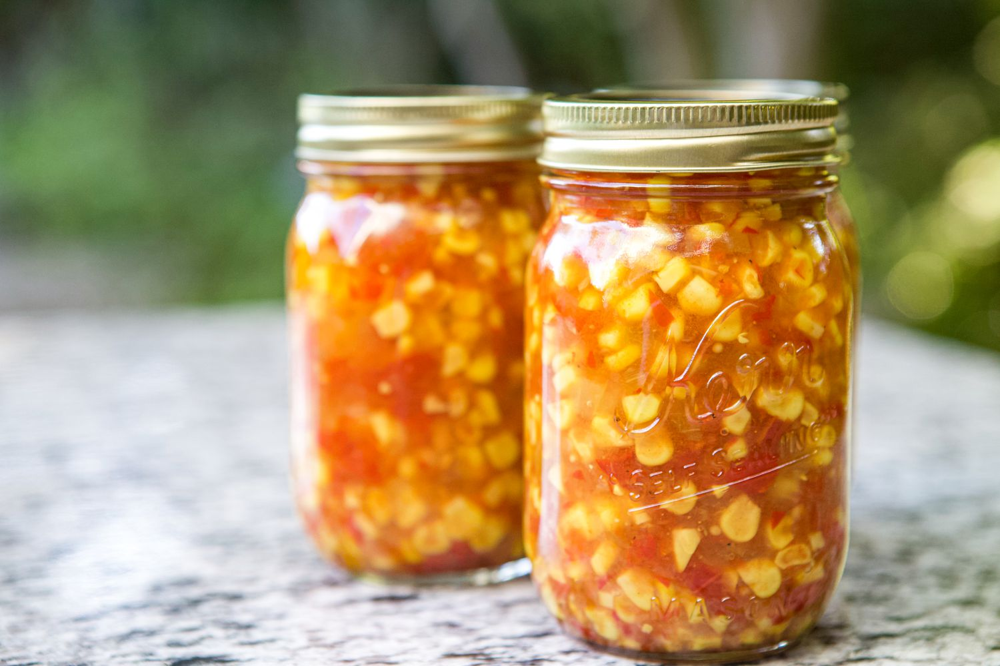

# Corn Relish

📍 *Midwest — The Sunshine in a Jar*

> Summer captured at its peak. Sweet corn kernels, crisp peppers, and onion preserved in a tangy, slightly sweet brine that brightens any meal. This colorful relish transforms humble hot dogs, elevates grilled meats, and makes sandwiches sing. It tastes like August even in the dead of February.

---

## At a Glance

| Detail | Info |
|--------|------|
| **Servings** | 6 pint jars |
| **Prep Time** | 30 minutes |
| **Cook Time** | 25 minutes |
| **Total Time** | 55 minutes + cooling |
| **Difficulty** | Medium |
| **Category** | Preserves |

---

## Ingredients

### The Vegetables
- 8 cups fresh corn kernels (about 12 ears, or 4 lbs frozen corn, thawed)
- 1 cup red bell pepper, finely diced
- 1 cup green bell pepper, finely diced
- 1 cup yellow onion, finely diced
- 1 cup celery, finely diced
- 1 jalapeño, seeded and minced (optional)

### The Brine
- 2 cups apple cider vinegar
- 1 cup water
- 1 cup granulated sugar
- 2 tablespoons fine sea salt
- 1 tablespoon yellow mustard seeds
- 1 teaspoon celery seeds
- ½ teaspoon ground turmeric
- ½ teaspoon dry mustard powder
- ¼ teaspoon freshly ground black pepper

---

## Instructions

1. **Prep the corn.** If using fresh corn, shuck ears and remove silk. Stand each ear upright in a large bowl and slice kernels off the cob with a sharp knife. Measure 8 cups.

2. **Make the brine.** In a large pot or Dutch oven, combine vinegar, water, sugar, and salt. Add mustard seeds, celery seeds, turmeric, dry mustard, and black pepper. Bring to a boil over high heat, stirring to dissolve sugar and salt.

3. **Add the vegetables.** Add corn, red and green peppers, onion, celery, and jalapeño (if using) to the brine. Return to a boil, stirring occasionally.

4. **Simmer.** Reduce heat to medium and simmer for 15–20 minutes, stirring occasionally, until vegetables are tender but still have some crunch. The mixture will thicken slightly.

5. **Pack the jars.** Sterilize six pint jars. Using a slotted spoon, pack the vegetable mixture into hot jars, leaving ½ inch headspace. Ladle hot brine over the vegetables to fill any gaps, maintaining ½ inch headspace.

6. **Remove air bubbles.** Run a clean knife around the inside of each jar to release trapped air. Wipe rims clean with a damp cloth.

7. **Seal.** Place lids on jars and screw on bands until fingertip-tight.

8. **Refrigerator method.** Let cool to room temperature, then refrigerate. Allow at least 24 hours for flavors to meld. Refrigerator corn relish keeps for up to 2 months.

9. **For canning (shelf-stable).** Process filled jars in a boiling water bath for 15 minutes. Remove and let cool undisturbed for 12–24 hours. Check seals before storing.

---

## Tips & Variations

- **Fresh vs. Frozen:** Fresh corn at peak season is unbeatable, but frozen corn works well in winter. Thaw and drain thoroughly.
- **Color Variety:** Use a mix of red, orange, and yellow peppers for maximum visual appeal.
- **Spicier Version:** Keep the jalapeño seeds, or add a habanero for serious heat.
- **Tangy-Sweet Balance:** Taste the brine before adding vegetables. Adjust sugar and vinegar to your preference.
- **Serving Ideas:** Top hot dogs and burgers, serve with grilled chicken, mix into potato salad, or spoon over cream cheese with crackers.
- **Southwestern Corn Relish:** Add 1 can black beans (drained), 1 teaspoon cumin, and fresh cilantro for a Tex-Mex version.
- **Smaller Batch:** Cut the recipe in half for 3 pint jars.

---

## 🌾 Did You Know?

> Corn relish is quintessentially Midwestern — born from the region's endless corn fields and the need to preserve summer's bounty. Before home refrigeration, farm families relied on pickling and canning to get through winter, and corn relish was a prized way to capture the flavor of August corn. The Pennsylvania Dutch brought similar relishes to the Midwest, where they merged with German and Scandinavian pickling traditions. County fair canning competitions still award blue ribbons for the best corn relish, and winning recipes are guarded family secrets. A jar of homemade corn relish remains the perfect hostess gift — a little jar of sunshine to brighten someone's day.

---

*📸 Photography note: Wide-mouth mason jar filled with golden corn relish, red and green pepper pieces visible throughout. Jar is open with a small wooden spoon inside. Hot dog dressed with corn relish on a plate beside the jar. Checkered cloth napkin. Bright, cheerful summer lighting.*
