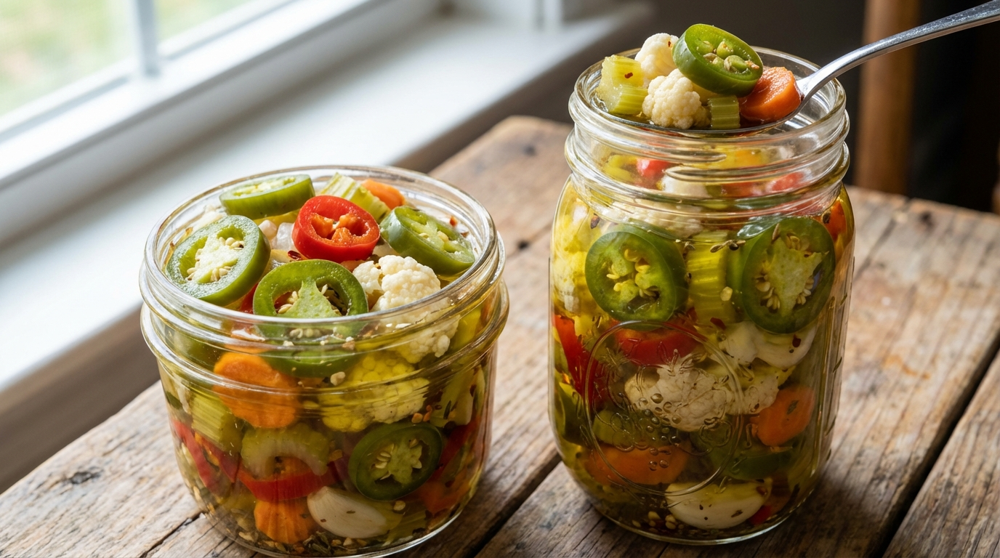

# Fresh Giardiniera (Chicago-Style Hot)

📍 *Chicago, Illinois — Taylor Street to Every Italian Beef Stand in the City*

> A riotous jar of fire-pickled vegetables — serrano peppers, celery, cauliflower, carrots, olives — swimming in a spiced oil brine that burns just right. This is the condiment that turns a good Italian beef into a religious experience. Chicagoans don't ask *if* you want giardiniera. They ask *how much.*

---

## At a Glance

| Detail | Info |
|--------|------|
| **Yield** | About 6 pint jars |
| **Prep Time** | 45 minutes |
| **Brine Time** | Overnight + 2–3 days marinating |
| **Total Time** | 3–4 days (mostly waiting) |
| **Difficulty** | Moderate |
| **Category** | Preserves / Condiments |

---

## 🫕 Midwest Nice Rating: 🫕🫕🫕🫕🫕

Bring a jar of homemade giardiniera to any gathering and you'll be invited back for life. This is top-tier potluck currency.

---

## Ingredients

### The Vegetables
- 4 stalks celery, diced (¼-inch pieces)
- 2 medium carrots, peeled and diced
- 1 red bell pepper, diced
- 1 small head cauliflower, cut into small florets then roughly chopped
- 10–12 serrano peppers, stems removed, finely chopped (leave seeds in for heat)
- 4 jalapeño peppers, finely chopped
- 1 cup green olives with pimentos, roughly chopped
- 4 cloves garlic, minced
- 1 small white onion, diced

### The Brine (Day 1)
- ¼ cup kosher salt
- 4 cups cold water

### The Oil Mixture (Day 2)
- 2 cups extra-virgin olive oil
- 1 cup canola or vegetable oil
- 2 tablespoons dried oregano
- 1 teaspoon red pepper flakes
- 1 teaspoon freshly ground black pepper
- ½ teaspoon celery seed

---

## Instructions

1. **Chop everything.** Dice all the vegetables into pieces roughly the size of your pinky fingernail — uniform enough that they'll pack into jars, rough enough that they've got character. This is Chicago, not a French kitchen. Combine all the vegetables in a very large bowl.

2. **Salt brine.** Dissolve the kosher salt in the cold water. Pour the brine over the vegetable mixture. The vegetables should be mostly submerged — add a bit more salted water if needed. Cover with plastic wrap and refrigerate overnight (at least 8 hours, up to 16).

3. **Drain thoroughly.** The next day, drain the vegetables in a large colander. Let them sit for 15–20 minutes, tossing occasionally. You want them well-drained — excess water will make your giardiniera soggy, and soggy giardiniera is a sin on Taylor Street.

4. **Mix the oil.** In a large bowl, whisk together the olive oil, canola oil, oregano, red pepper flakes, black pepper, and celery seed.

5. **Combine.** Add the drained vegetables to the seasoned oil mixture. Stir thoroughly, making sure every piece is coated and the spices are distributed.

6. **Jar it up.** Pack the giardiniera into clean pint jars (or one big jar), making sure the oil covers the vegetables completely. If you're short on oil, top off with more olive oil.

7. **Wait.** Refrigerate for at least 2 days before eating. Three days is better. A week is phenomenal. The flavors need time to meld — the heat softens slightly, the oregano blooms, the garlic permeates everything.

---

## Tips & Variations

- **Heat Control:** For milder giardiniera, seed the serrano peppers before chopping. For "my eyes are watering and I love it" heat, add a couple of habaneros. For authentic Chicago heat, leave the serranos seeded and don't be a coward.
- **Sport Peppers:** Some old-school recipes include Chicago sport peppers. If you can find them, throw in a dozen, chopped.
- **Fine vs. Chunky:** Classic Chicago Italian beef joints use finely chopped ("hot mix"). For a more relish-tray style, leave the pieces slightly larger. Both are correct.
- **Shelf Life:** Stored in the fridge with oil covering the vegetables, giardiniera keeps for 3–4 weeks easily. It gets better every day.
- **The Italian Beef Connection:** Pile this on a proper Italian beef sandwich with sweet peppers, dip the whole thing in jus, and you've just unlocked Chicago's greatest contribution to American cuisine. (Sorry, deep dish — you're number two.)
- **Other Uses:** Giardiniera on scrambled eggs. On pizza. On a grilled bratwurst. Stirred into pasta salad. Mixed into cream cheese for a dip. There is almost nothing it doesn't improve.

---

> **🤫 Grandma's Secret:** *"Add a few tablespoons of the brine from a jar of sport peppers to the oil mixture. Nobody will know why yours tastes more authentic. Also, let the jar sit upside-down for a few hours, then right-side up — it keeps the oil distributed."*

---

## Pairs Well With

A dripping Italian beef sandwich from a stand with no seats, the L train rattling overhead, and a complete inability to keep this off your shirt.

---

## 🌾 Did You Know?

> Giardiniera (jar-din-AIR-ah) comes from the Italian word *giardino* — garden — and refers to the garden vegetables in the mix. But what Chicagoans did to this Italian pickled vegetable tradition would make a Neapolitan grandmother weep with confusion. Italian giardiniera is a vinegar-brined, mild, almost salad-like preparation. Chicago giardiniera is an oil-packed, blisteringly hot, oregano-punched condiment that has more in common with a dare than a salad. It was born in the Italian-American neighborhoods of Chicago's Near West Side, where immigrant families adapted Old World preserving techniques to New World peppers. By the mid-20th century, giardiniera was inseparable from the Chicago Italian beef sandwich — together they form one of America's most underrated regional food pairings. Every Italian deli, beef stand, and corner store in Chicago carries their own version. Families guard their recipes. Arguments about whose is best have ended friendships. This recipe won't end any friendships, but it might start a few.

---

*📸 Photography note: A wide-mouth mason jar packed with colorful chopped giardiniera — the greens of celery and peppers, orange carrots, white cauliflower, all glistening in golden-green oil. Some spilled onto a wooden cutting board next to an Italian beef sandwich with the giardiniera piled high. Harsh, honest deli lighting. Maybe a red-checked paper liner. Chicago, baby.*
