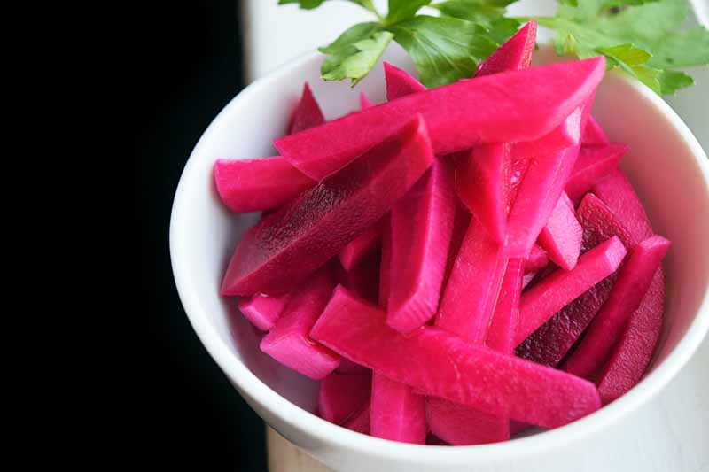

# Pickled Beets

📍 *German, Polish, Scandinavian Midwest — Root Cellars and Holiday Tables*

> Deep ruby red, sweet-tart, spice-scented, and jewel-bright in their jars — pickled beets are what happens when you take one of the earth's most stubbornly red vegetables and transform it into something that belongs on a holiday table. They stain everything they touch (your hands, your cutting board, your conscience if you skip making them). They're earthy and sweet and vinegary all at once. They're the vegetable equivalent of a Midwest grandma who wears lipstick to church and speaks her mind at town council meetings: unignorable, unapologetic, and entirely themselves. A jar of pickled beets in the pantry means winter is handled. A jar of pickled beets at Easter dinner means someone knows what they're doing. And a forkful of pickled beets next to ham and mashed potatoes means you understand that sometimes the best things are the things that have been waiting in the dark, getting better with time.

---

## At a Glance

| Detail | Info |
|--------|------|
| **Servings** | 4 pint jars |
| **Prep Time** | 30 minutes (and possibly stained hands) |
| **Cook Time** | 45 minutes |
| **Total Time** | 1 hour 15 minutes + cooling + 2 weeks patience |
| **Difficulty** | Medium |
| **Category** | Preserves |

---

## 🫕 Midwest Nice Rating: 🫕🫕🫕🫕🫕

Pickled beets at a church potluck or holiday meal are a sign of serious cooking credentials. Bringing store-bought is noticed. Bringing homemade is respected. Bringing homemade with the right spice balance is remembered.

---

## Ingredients

### The Beets
- 3 pounds fresh beets (about 8 medium), greens trimmed to 1 inch
- Water for boiling

### The Pickling Liquid
- 2 cups apple cider vinegar (the good stuff — it matters)
- 1 cup water
- ¾ cup granulated sugar
- 1 teaspoon fine sea salt
- 1 teaspoon whole black peppercorns
- 1 teaspoon whole cloves
- 1 teaspoon whole allspice berries
- 2 cinnamon sticks
- 2 bay leaves
- 1 medium onion, thinly sliced (optional, but adds complexity)

---

## Instructions

1. **Cook the beets.** Place whole, unpeeled beets in a large pot. Cover with cold water by 2 inches. Bring to a boil, then reduce to a simmer. Cook for 35-45 minutes, until a knife slides easily into the center. The cooking time depends on size — small beets cook faster, baseball-sized beets take longer. Drain and let cool until you can handle them without swearing.

2. **Peel and slice.** Under cool running water, slip the skins off the beets. They should slide right off like magic. If they don't slide easily, the beets aren't cooked enough. Trim the tops and bottoms. Slice into ¼-inch rounds, or cut into wedges or cubes — whatever shape makes you happy. Wear gloves or embrace the pink hands. Your call.

3. **Make the brine.** While the beets cook, combine vinegar, water, sugar, and salt in a medium saucepan. Add the peppercorns, cloves, allspice, cinnamon sticks, and bay leaves. Bring to a boil, stirring to dissolve the sugar. Reduce heat and simmer for 5 minutes to let the spices bloom. Your kitchen will smell like Christmas and autumn had a baby.

4. **Pack the jars.** Sterilize four pint jars (boil them, run them through the dishwasher, or keep them in a 200°F oven until ready). Pack the sliced beets tightly into the jars, layering in the sliced onion if you're using it. Leave ½ inch headspace at the top.

5. **Fill with brine.** Ladle the hot brine over the beets, distributing the whole spices evenly among the jars. Make sure the beets are fully submerged — any exposed beet will darken and dry out. Leave ½ inch headspace.

6. **Remove air bubbles.** Run a clean knife or chopstick around the inside edge of each jar to release trapped air bubbles. They hide in there. Find them. Wipe the jar rims clean with a damp cloth — any beet residue will prevent a good seal.

7. **Seal.** Place lids on jars and screw on bands until fingertip-tight. Don't overtighten — air needs to escape during processing.

8. **Refrigerator method (easier).** Let the jars cool to room temperature, then refrigerate. Allow at least 48 hours for the flavors to develop — the longer they sit, the better they get. Refrigerator pickled beets keep for up to 3 months.

9. **Canning method (shelf-stable).** Process the filled jars in a boiling water bath for 30 minutes (start timing when the water returns to a full boil). Remove carefully and let cool undisturbed for 12-24 hours. Check seals — the lids should be concave and shouldn't flex when pressed. Store in a cool, dark place for up to a year. Wait at least 2 weeks before opening to let the flavors marry.

---

## Tips & Variations

- **Choosing Beets:** Select firm, smooth beets of similar size for even cooking. Small to medium beets (2-3 inches diameter) are more tender than the massive ones. Look for beets with fresh greens still attached — that's a sign of freshness. Save the greens and sauté them. Waste not.
- **Wear Gloves:** Beet juice stains everything. Your hands, your cutting board, your countertop, your dish towel, your soul. Rubber gloves are your friend. Or embrace the pink hands for a few days. It'll fade. Eventually.
- **Color Varieties:** Golden beets and Chioggia (candy-stripe) beets make beautiful pickles with a milder flavor and zero staining. But they're not *pickled beets* in the traditional sense. Red is the standard. Red is the expectation. Red is what grandma made.
- **Don't Mix Colors:** If you pickle golden and red beets together, the red will bleed into the golden and you'll end up with a jar of sad pink beets. Keep them separate.
- **Honey Sweetened:** Replace half the sugar with honey for a rounder, more complex sweetness. Some families swear by it. It's not traditional, but it's good.
- **Horseradish Kick:** Add 2 tablespoons prepared horseradish to the brine for a German-style pickled beet with bite. Excellent with pot roast.
- **Quick Pickle Method:** In a hurry? Slice raw beets paper-thin on a mandoline, pack into jars, pour hot brine over, and refrigerate. They'll be ready to eat in 2 hours. They won't have the same tender texture as cooked beets, but they'll be crunchy, bright, and good.
- **Pickled Beet Eggs:** After you've eaten the beets, add peeled hard-boiled eggs to the jar. They'll turn a shocking magenta in 2-3 days and taste like a diner in 1965. It's a Pennsylvania Dutch tradition that traveled west. Bar food in certain parts of Ohio. Don't knock it until you've tried it.

---

> **🤫 Grandma's Secret:** *"Grandma Elsa always added a whole star anise to each jar — 'for depth,' she'd say. And she'd save the beet-pickling brine after the beets were gone. 'Liquid gold,' she called it. She'd use it in potato salad dressing, drizzle it on roasted vegetables, mix it into vinaigrettes. Nothing wasted. And she always made sure the beets sat for at least three weeks before opening the first jar. 'Patience makes perfect pickles,' she'd say. She was right. She usually was."*

---

## Pairs Well With

Easter ham, Christmas ham, any ham really, mashed potatoes and gravy, pot roast, Swedish meatballs, winter salads, rye bread and butter, and the pride of opening a pantry and seeing jars lined up like rubies, proof that summer's harvest is still feeding you in February.

---

## 🌾 Did You Know?

> Pickled beets are one of those foods that reveal the deep immigrant roots of Midwestern foodways. German settlers brought their *Rote Bete* (red beets) traditions. Polish families made *ćwikła* (beet relish). Scandinavian immigrants knew pickled beets as *inlagda rödbetor*, a standard accompaniment to herring and potatoes. These traditions collided and merged in the Midwest, creating a hybrid pickled beet culture that's distinctly American but deeply European in its DNA. Before refrigeration, root cellars were the only way to keep food through harsh Midwestern winters, and beets — hardy, nutritious, and able to store for months — were a root cellar staple. Pickling them extended their life even further and added the vinegar tang that brightened heavy winter meals. By the mid-20th century, pickled beets had become a permanent fixture at Midwest holiday tables, particularly Easter and Christmas. The deep red color added visual drama to the spread, the sweet-sour-spice flavor balanced rich meats, and the cultural association with "real cooking" made them a point of pride. Canned pickled beets (the Harvard Beets style) became grocery store standards, but homemade remained the gold standard. There's a reason: homemade pickled beets have complexity and balance that mass-produced versions can't replicate. The spices are whole, not ground. The sugar level is adjustable. The texture is tender but not mushy. And the deep, dark, glossy red that comes from slow cooking and proper brining is something you can't get from a can. In German and Polish communities across the Midwest, pickled beet recipes are still passed down on stained index cards, written in grandma's handwriting, with notes like "not too much clove" or "Ma always used honey" in the margins. These aren't just recipes. They're heirlooms. They're proof that your people knew how to turn a root vegetable into something beautiful, something that lasts, something worth keeping in the dark and bringing out when it matters.

---

*📸 Photography note: Pint jars of deep ruby pickled beets, one jar open with beet slices visible, the brine catching the light like garnet. Cinnamon sticks and whole spices scattered around. A small plate with a few beet slices and a fork — maybe a smear of beet juice on the plate. Rustic wooden table, worn and real. Late afternoon light, warm and golden. The photo should feel like a farmhouse pantry, a holiday table, a kitchen where someone's grandmother actually cooked. Not magazine-perfect. Real.*
