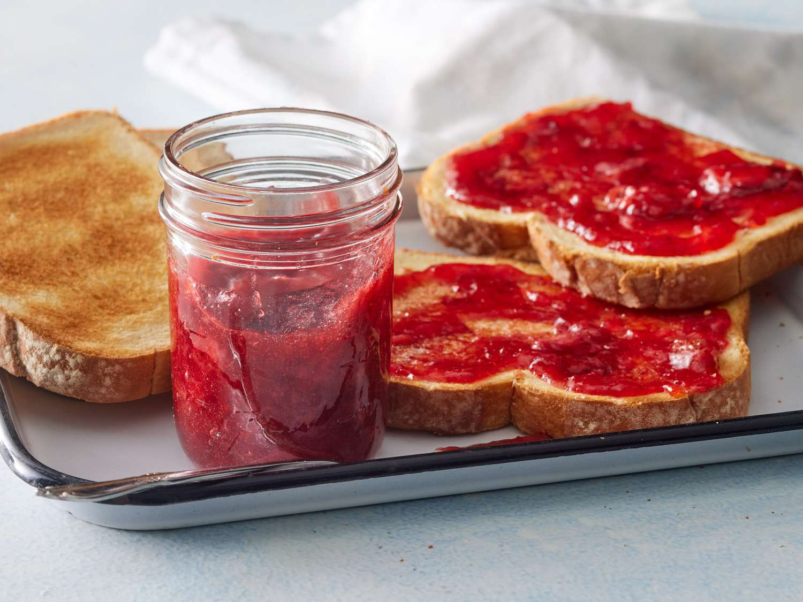

# Strawberry Freezer Jam

📍 *Michigan, Wisconsin, Illinois Berry Country — U-Pick Farms, June Mornings, Summer in a Jar*

> June in the Midwest means one thing: strawberry season. And strawberry season means waking up early, driving out to a U-pick farm with empty flats and high hopes, kneeling in the rows until your knees are stained and your fingers are red, and coming home with more berries than any reasonable person needs. Freezer jam is what happens next — bright, fresh, almost obscenely red, tasting more like actual strawberries than any cooked jam ever could. It's summer captured without heat, berries preserved at their peak, the kind of jam that makes store-bought taste like a polite suggestion of fruit. You make it in twenty minutes, you freeze it, and six months later you open a jar in the dead of January and it tastes like hope.

---

## At a Glance

| Detail | Info |
|--------|------|
| **Servings** | Yields about 6-8 half-pint jars |
| **Prep Time** | 20 minutes |
| **Cook Time** | 0 minutes (that's the point) |
| **Total Time** | 20 minutes (plus 24 hours to set) |
| **Difficulty** | Easy (perfect for first-time preservers) |
| **Category** | Preserves |

---

## 🫕 Midwest Nice Rating: 🫕🫕🫕🫕🫕

Making extra batches of freezer jam is the Midwestern equivalent of minting your own social currency. Hostess gifts, teacher gifts, neighbor gifts, church bazaar contributions — a jar of homemade freezer jam says "I woke up at dawn, picked berries with dirt under my nails, and thought of you."

---

## Ingredients

### The Berries
- 2 lbs (about 6 cups) fresh ripe strawberries, hulled and crushed
- 4 cups (800g) granulated sugar
- 1 (1.75 oz / 49g) package powdered fruit pectin (Sure-Jell for Less Sugar, or regular pectin for sweeter jam)
- ¾ cup (180ml) water

---

## Instructions

1. **Prepare the strawberries.** Wash and hull the berries. Crush them thoroughly with a potato masher — you want crushed, not pureed. Leave some texture. Some people use a food processor. Those people are wrong. A potato masher gives you the perfect consistency: broken-down but still recognizable as actual fruit. Measure exactly 4 cups of crushed strawberries into a large bowl.

2. **Combine with sugar.** Add all the sugar to the crushed berries. Stir for 3 minutes — set a timer, because your arm will get tired and you'll want to stop early. Keep stirring. The sugar needs to dissolve. Let the mixture stand for 10 minutes, stirring occasionally. This is called maceration. The sugar pulls out the berry juice and the whole thing becomes glossy and gorgeous.

3. **Prepare the pectin solution.** In a small saucepan, combine the powdered pectin and ¾ cup water. Bring to a full rolling boil over high heat, stirring constantly. Boil for exactly 1 minute. This activates the pectin, which is what makes jam set without cooking the fruit.

4. **Combine pectin with strawberries.** Pour the hot pectin solution into the strawberry-sugar mixture immediately. Stir constantly for 3 minutes. Your kitchen will smell like a strawberry field at noon. A few undissolved sugar crystals are fine — they'll dissolve as the jam sits.

5. **Fill the jars.** Ladle the jam into clean freezer-safe jars or plastic containers, leaving ½ inch headspace at the top (the jam will expand slightly when frozen). Half-pint jars are ideal — that's a breakfast's worth of jam.

6. **Set and store.** Cover the jars tightly. Let them stand at room temperature for 24 hours to set — the pectin needs time to work its magic. After 24 hours, refrigerate any jars you'll use within 3 weeks. Freeze the rest for up to a year. When you need one, thaw it in the fridge overnight. The color stays brilliant, the flavor stays fresh, and the texture stays just right.

---

## Tips & Variations

- **Strawberry Selection:** For freezer jam, peak ripeness is everything. Underripe berries lack flavor. Overripe berries get mushy. You want berries that are deep red all the way through, fragrant, and just firm enough to hold their shape. Local U-pick farms (Michigan's strawberry belt, Wisconsin's berry farms, Illinois fruit country) harvest at peak ripeness because they don't ship — that's why they make the best jam.
- **Variety Matters:** Honeoye, Jewel, and Allstar are classic Midwestern strawberry varieties — intensely flavored, sweet-tart balanced, perfect for preserving. Chandler and Seascape (California varieties) are bigger and prettier but less flavorful. Ask the farm which varieties they're growing.
- **Texture Control:** Crush lightly for chunky jam, crush thoroughly for spreadable jam. Don't puree — you want pieces of berry, not strawberry soup.
- **Low-Sugar Option:** Use pectin specifically labeled "for less or no sugar" and reduce sugar to 2 cups. The jam will be less sweet, more intensely berry-flavored, and slightly softer-set. Some people prefer it. Some people are also wrong, but that's their choice.
- **Lemon Juice:** A teaspoon of fresh lemon juice brightens the berry flavor and adds a tiny bit of acidity. Grandma Peggy used balsamic vinegar instead (see below). Both work.
- **Gift-Giving Tip:** Freezer jam makes excellent gifts, but tell recipients to keep it in the freezer. A jar left out on a counter will mold. Write "KEEP FROZEN" on the lid in Sharpie. People will still forget. That's humanity.
- **Peak Season:** Late May through mid-June is prime strawberry season in the northern Midwest (Michigan, Wisconsin). Illinois and southern regions harvest slightly earlier. If you miss it, you miss it — strawberries don't wait.

---

> **🤫 Grandma's Secret:** *"Grandma Peggy always added a quarter teaspoon of balsamic vinegar to her crushed strawberries. 'It brightens the berry flavor,' she'd say, 'makes it taste extra special.' Nobody ever guessed the secret. They'd just say, 'Peggy, this tastes like* real *strawberries,' and she'd smile and say, 'That's because it is.' She wasn't wrong, but she wasn't telling the whole truth either."*

---

## Pairs Well With

Buttermilk biscuits still warm from the oven, toast with good butter, vanilla ice cream on a summer evening, and the memory of kneeling in a strawberry row at dawn with the dew soaking through your jeans and the sun just coming up over the field.

---

## 🌾 Did You Know?

> Freezer jam is a relatively modern invention — it became popular in the 1950s and 1960s when home freezers became common appliances and commercial pectin manufacturers (like Ball and Sure-Jell) started marketing "freezer pectin" specifically designed to set jam without cooking. For Midwestern home preservers, it was a revelation. Traditional cooked jam requires careful temperature monitoring, boiling water baths, sterilized equipment, and the risk of burnt batches or failed seals. Freezer jam requires a bowl, a masher, and twenty minutes. It democratized jam-making. Suddenly, anyone could preserve strawberries without canning expertise or equipment. It became particularly popular for strawberries because strawberries lose their fresh flavor when cooked — the bright, floral notes that make a perfectly ripe berry so incredible evaporate in heat. Freezer jam preserves those notes almost perfectly. By the 1970s and 1980s, freezer jam had become the standard strawberry preserving method across the Midwest, particularly in rural and small-town communities where U-pick farms were abundant and strawberry season was a major social event. Families would spend a June Saturday picking berries together, then spend the afternoon making jam together — kids crushing berries, parents managing the pectin, grandparents supervising and quality-testing (i.e., eating spoonfuls directly from the bowl). The jars would go into chest freezers in basements and garages, a stockpile of summer. Freezer jam also became the default gift for church bazaars, craft fairs, teacher appreciation, and hostess gifts — it was homemade, it was special, and it was achievable. You didn't need to be an expert canner. You just needed berries, sugar, pectin, and a little bit of effort. In recent years, as farmers' markets and U-pick farms have experienced a resurgence, so has freezer jam. The Instagram generation has discovered what Midwestern grandmothers knew all along: homemade jam made from fresh-picked berries tastes infinitely better than anything you can buy. And unlike the complicated, equipment-intensive canning methods that can intimidate beginners, freezer jam is approachable. It's the gateway drug to home preserving. First you make freezer jam. Then you're planting a garden, buying a pressure canner, and comparing pickle recipes with strangers at the farmers' market. It's a slippery slope, and it starts with strawberries.

---

*📸 Photography note: Half-pint mason jars of brilliant red freezer jam, lids off, some with spoons resting in them. Fresh strawberries scattered around — some whole, some halved to show the red interior, a few with stems and leaves still attached. Morning light through a kitchen window, the kind of light that makes red things glow. One jar is open with jam on a piece of toast on a plate beside it. The photo should feel like June — bright, fresh, optimistic, the promise of summer mornings. Not styled to death. A little bit of mess is good. This is a kitchen where people actually cook, not a magazine set.*
