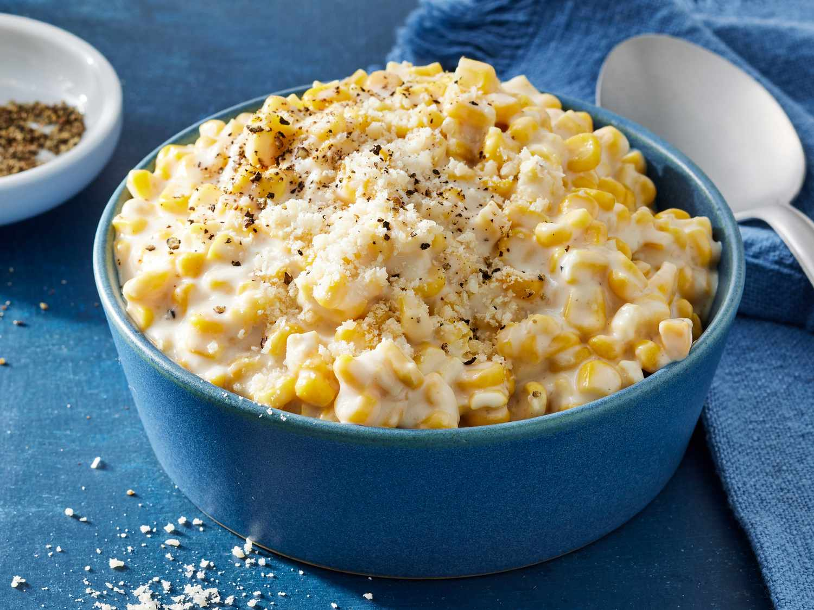

# Creamed Corn

📍 *Iowa / Nebraska (Midwest Harvest)*

> A simple yet incredibly satisfying side dish, Creamed Corn celebrates the sweet bounty of the Midwest cornfields, featuring tender kernels bathed in a rich, creamy sauce.

---

## At a Glance

| Detail | Info |
|--------|------|
| **Servings** | 6-8 |
| **Prep Time** | 10 minutes |
| **Cook Time** | 15-20 minutes |
| **Total Time** | 25-30 minutes |
| **Difficulty** | Easy |
| **Category** | Sides |

---

## Ingredients

- 2 tbsp (30g) unsalted butter
- 1 small yellow onion, finely minced (optional)
- 4 cups (about 6-8 ears) fresh or frozen corn kernels
- ½ cup (120ml) heavy cream or half-and-half
- ¼ cup (60ml) milk (whole or 2%)
- 2 tbsp (15g) all-purpose flour (optional, for thickening)
- 1 tbsp granulated sugar (optional, to enhance sweetness)
- ½ tsp salt
- ¼ tsp black pepper
- Pinch of cayenne pepper (optional, for a subtle kick)
- Fresh chives or parsley, chopped, for garnish (optional)

---

## Instructions

1. **Melt Butter & Sauté Onion:** In a large skillet or Dutch oven, melt butter over medium heat. If using, add the finely minced onion and cook until softened and translucent, about 3-5 minutes.
2. **Add Corn:** Add the fresh or frozen corn kernels to the skillet. Cook, stirring occasionally, for 5-7 minutes, until the corn is tender and slightly bright in color.
3. **Thicken (Optional):** If you prefer a thicker creamed corn, sprinkle the flour over the corn and onion. Cook, stirring constantly, for 1 minute to cook out the raw flour taste.
4. **Add Dairy & Seasonings:** Pour in the heavy cream (or half-and-half) and milk. Stir in the granulated sugar (if using), salt, black pepper, and cayenne pepper (if using).
5. **Simmer & Thicken:** Bring the mixture to a gentle simmer, then reduce heat to low and cook for 5-10 minutes, stirring occasionally, until the sauce has thickened to your desired consistency and the flavors have melded.
6. **Serve:** Taste and adjust seasonings as needed. Ladle the hot creamed corn into a serving bowl. Garnish with fresh chopped chives or parsley, if desired. Serve immediately.

---

## Tips & Variations

- For an even creamier texture, you can use an immersion blender to blend about a quarter of the corn mixture directly in the pot, then stir it back in.
- Add a tablespoon of cream cheese or mascarpone at the end for extra richness and a tangy note.
- For a smoky flavor, cook a slice or two of diced bacon until crispy, remove, then use the bacon fat to sauté the onion and corn. Crumble the bacon over the top as a garnish.
- If using fresh corn, scrape the "milk" from the cobs after removing the kernels and add it to the pan with the dairy for an intensified corn flavor.

---

## 🌾 Did You Know?

> Creamed Corn is a classic side dish that embodies the agricultural heartland of the Midwest, especially in corn-rich states like Iowa and Nebraska. It's a testament to the region's ability to transform simple, abundant ingredients into comforting, crowd-pleasing fare. Often found at holiday dinners, Sunday suppers, and community gatherings, creamed corn is a sweet and savory staple that brings a taste of the harvest to any table.

---

*📸 Photography note: Rustic farmhouse style. A generous serving of creamy, golden creamed corn in a sturdy ceramic bowl, garnished with fresh green chives. The bowl sits on a distressed wooden table or a classic checkered tablecloth. Soft, warm overhead lighting emphasizes the creamy texture and vibrant color of the corn. A vintage spoon rests alongside.*

---

## ⭐ Midwest Nice Rating

5/5 🫕🫕🫕🫕🫕 (Will bring a hot dish to your potluck, and quietly make sure everyone gets a second scoop.)

---

## 🥂 Pairs Well With

Pairs well with: A festive holiday dinner, a cozy Sunday lunch with family, and the satisfying feeling of a bountiful harvest.

---

## 👵 Grandma's Secret: Creamed Corn

> "Grandma Martha always said the trick was to add a tiny pat of butter and a splash of milk *right at the very end* before serving. 'It makes it extra glossy and creamy,' she'd insist, 'and gives it that fresh-from-the-farm taste everyone loves!'"
