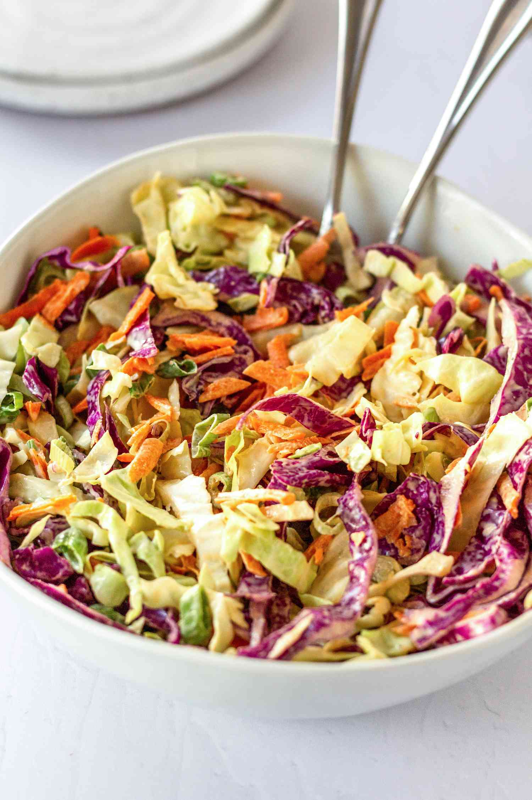

# Creamy Coleslaw

📍 *Midwest — Every Backyard Barbecue*

> Cool, crisp, and creamy with just enough tang to cut through any rich main dish — this is the coleslaw that appears at every Midwestern cookout, fish fry, and potluck, the faithful sidekick that never steals the spotlight but always gets finished first.

---

## At a Glance

| Detail | Info |
|--------|------|
| **Servings** | 8–10 |
| **Prep Time** | 15 minutes |
| **Chill Time** | 1 hour (minimum) |
| **Total Time** | 1 hour 15 minutes |
| **Difficulty** | Easy |
| **Category** | Sides |

---

## Ingredients

### The Slaw
- 1 medium head green cabbage (about 2 pounds), cored and finely shredded
- 2 large carrots, peeled and grated
- ½ small red onion, very thinly sliced

### The Dressing
- ¾ cup mayonnaise
- ¼ cup sour cream
- 2 tablespoons apple cider vinegar
- 1 tablespoon granulated sugar
- 1 teaspoon Dijon mustard
- ½ teaspoon celery seed
- ½ teaspoon fine sea salt
- ¼ teaspoon freshly ground black pepper
- Pinch of cayenne (optional)

---

## Instructions

1. **Prepare the vegetables.** In a large bowl, combine the shredded cabbage, grated carrots, and sliced red onion. Toss to mix.

2. **Make the dressing.** In a medium bowl, whisk together the mayonnaise, sour cream, apple cider vinegar, sugar, Dijon mustard, celery seed, salt, pepper, and cayenne (if using) until smooth and well combined.

3. **Dress the slaw.** Pour the dressing over the cabbage mixture and toss thoroughly until everything is evenly coated.

4. **Chill.** Cover and refrigerate for at least 1 hour before serving. This resting time allows the cabbage to soften slightly and the flavors to meld. The slaw will also release some liquid — give it a good stir before serving.

5. **Taste and adjust.** Before serving, taste and add more salt, vinegar, or sugar as needed. The slaw should be creamy, tangy, and just barely sweet.

---

## Tips & Variations

- **Make Ahead:** Coleslaw is best made 2–4 hours ahead. It continues to improve as it chills. Beyond 24 hours, the cabbage starts to get too soft.
- **Vinegar Slaw:** For a tangier, lighter version, skip the mayo and dress with apple cider vinegar, oil, sugar, salt, and celery seed.
- **Add Crunch:** Toss in ½ cup of sunflower seeds, sliced almonds, or crumbled bacon just before serving.
- **Apple Slaw:** Add 1 thinly sliced Granny Smith apple for a sweet-tart autumn variation.
- **Spicy Version:** Add 1 minced jalapeño and extra cayenne for a slaw with kick.

---

## 🌾 Did You Know?

> Coleslaw arrived in America with Dutch immigrants (the name comes from the Dutch *koolsla*, meaning "cabbage salad"), but the Midwest made it an institution. In a region where cabbage grows abundantly and backyard barbecues are a way of life from May through October, coleslaw became the indispensable side dish — paired with pulled pork, fried fish, grilled brats, and everything in between. In Wisconsin, coleslaw is served alongside the Friday night fish fry, a tradition so deeply embedded in the culture that restaurants keep their coleslaw recipes under lock and key.

---

*📸 Photography note: A white ceramic bowl filled with creamy coleslaw, the purple and green of the cabbage and orange of the carrot peeking through the creamy dressing. Set on a picnic table with red-checked cloth. Grilled items blurred in the background. Bright outdoor summer light.*

---

## ⭐ Midwest Nice Rating

4/5 🫕🫕🫕🫕 (Will make a huge bowl for the neighborhood cookout and quietly refill it twice without mentioning you brought extra — because running out would be embarrassing for everyone.)

---

## 🥂 Pairs Well With

Pairs well with: Pulled pork sandwiches, Friday fish fry, backyard barbecues, and the sound of kids playing in sprinklers on a hot summer day.

---

## 👵 Grandma's Secret: Coleslaw

> "Grandma Mae always made her coleslaw the night before. 'It needs to marry,' she'd say, tucking it in the back of the fridge. 'The cabbage softens just enough, the flavors get friendly. Day-of coleslaw is like meeting a stranger. Next-day coleslaw is family.'"
