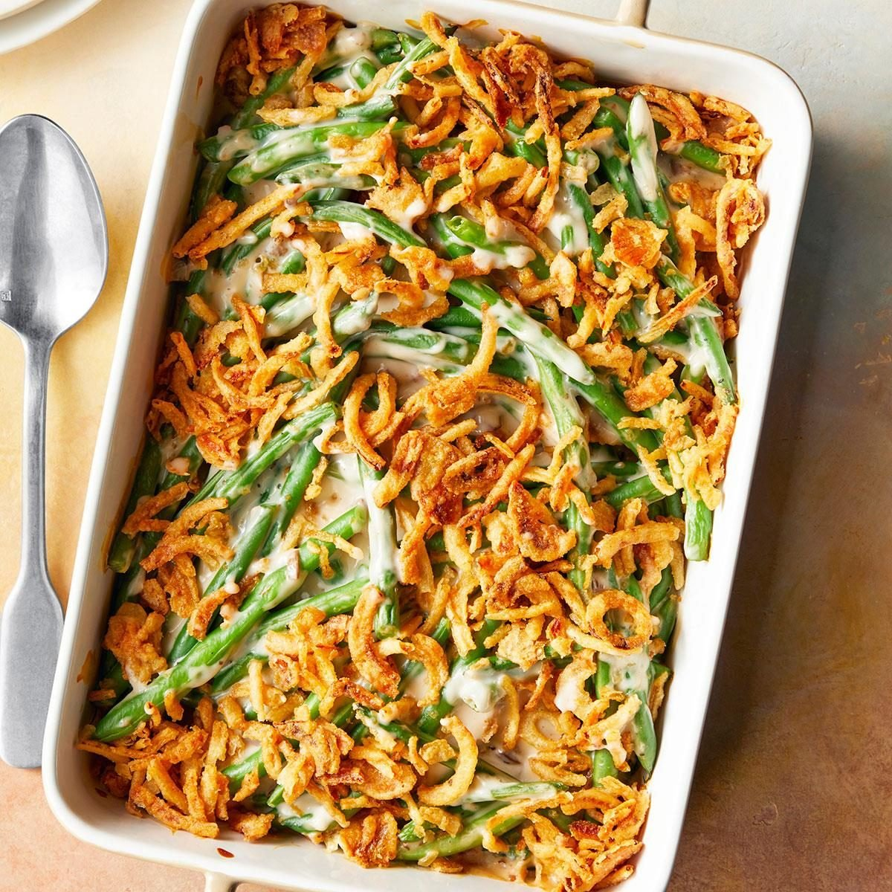

# Green Bean Casserole

📍 *Midwest — The Thanksgiving Table*

> The dish that launched a thousand potlucks. Tender green beans in a velvety mushroom cream sauce, topped with a shattering layer of crispy fried onions — this is the Midwest's most beloved side dish, and no holiday table is complete without it.

---

## At a Glance

| Detail | Info |
|--------|------|
| **Servings** | 8–10 |
| **Prep Time** | 15 minutes |
| **Cook Time** | 35 minutes |
| **Total Time** | 50 minutes |
| **Difficulty** | Easy |
| **Category** | Sides |

---

## Ingredients

### The Casserole
- 2 pounds fresh green beans, trimmed and cut into 2-inch pieces (or 2 cans [14.5 oz each] green beans, drained, or 2 bags [12 oz each] frozen cut green beans, thawed)
- 2 tablespoons unsalted butter
- 8 ounces cremini mushrooms, thinly sliced
- 3 cloves garlic, minced
- 1 medium shallot, finely diced
- 3 tablespoons all-purpose flour
- 1 cup chicken broth
- 1 cup whole milk or half-and-half
- 1 tablespoon soy sauce
- ½ teaspoon freshly ground black pepper
- ½ teaspoon fine sea salt (adjust to taste)
- Pinch of ground nutmeg

### The Topping
- 1½ cups French's crispy fried onions (or homemade — see tips)
- ¼ cup freshly grated Parmesan cheese (optional, but great)

---

## Instructions

1. **Prep the green beans.** If using fresh: bring a large pot of salted water to a boil. Blanch the green beans for 5 minutes until crisp-tender and bright green. Drain and immediately plunge into ice water to stop cooking. Drain well and set aside. (If using canned or frozen, simply drain/thaw well.)

2. **Cook the mushrooms.** Preheat oven to 375°F. In a large oven-safe skillet or saucepan, melt the butter over medium-high heat. Add the mushrooms and cook, stirring occasionally, until golden and most of the moisture has evaporated, about 5–6 minutes.

3. **Build the sauce.** Add the shallot and garlic to the mushrooms and cook 1 minute until fragrant. Sprinkle the flour over the vegetables and stir constantly for 1 minute to cook out the raw flour taste. Gradually pour in the chicken broth and milk, whisking steadily to prevent lumps. Add the soy sauce, pepper, salt, and nutmeg.

4. **Simmer until thick.** Bring the sauce to a gentle boil, then reduce heat and simmer for 3–4 minutes, stirring frequently, until the sauce thickens enough to coat the back of a spoon.

5. **Combine.** Fold the green beans into the sauce until evenly coated. Transfer to a 9x13-inch baking dish (or leave in the oven-safe skillet).

6. **Bake.** Place in the oven and bake uncovered for 20 minutes until the edges are bubbling.

7. **Add the topping.** Remove from the oven. Scatter the fried onions (and Parmesan, if using) evenly over the top. Return to the oven for 5–8 minutes more, until the onions are deeply golden and the casserole is bubbling throughout.

8. **Rest and serve.** Let the casserole rest for 5 minutes before serving. The sauce will thicken slightly as it cools.

---

## Tips & Variations

- **Fresh vs. Canned:** Fresh green beans make a noticeably better casserole — crisper texture, brighter flavor. But we won't judge the canned version. It's how grandma made it, and grandma was right about a lot of things.
- **Homemade Fried Onions:** Thinly slice 2 large onions into rings, toss with ½ cup flour and a pinch of salt, then shallow-fry in ½ inch of oil at 375°F until golden and crispy. Drain on paper towels. Worth the effort for holidays.
- **Make Ahead:** Assemble the casserole (without the fried onion topping) up to a day ahead. Refrigerate covered. Add 10 minutes to the baking time and put the onions on in the last 5 minutes.
- **Extra Luxurious:** Stir ½ cup sour cream into the sauce for an even richer, tangier version.
- **Bacon Addition:** Fold ½ cup crumbled, crispy bacon into the filling for a smoky upgrade.

---

## 🌾 Did You Know?

> Green bean casserole was invented in 1955 by Dorcas Reilly in the Campbell's Soup Company test kitchen in Camden, New Jersey. Tasked with creating a quick, easy recipe using ingredients most Americans already had in their pantry, she combined cream of mushroom soup, canned green beans, and Durkee (now French's) fried onions. The recipe was published on the back of the soup can, and the rest is Thanksgiving history. Today, Americans buy approximately 40 million cans of Campbell's Cream of Mushroom Soup each year during the holiday season, and Reilly's recipe card is preserved in the Smithsonian's National Museum of American History. She called it "a beloved American classic" — and the Midwest, which adopted it most fervently, would agree.

---

*📸 Photography note: Oval ceramic baking dish with golden, bubbling green bean casserole — crispy fried onions piled on top. A large serving spoon scoops out a portion, showing the creamy interior. Set on a wooden trivet with a linen napkin. Thanksgiving table setting hints in the background. Warm, golden overhead lighting.*

---

## ⭐ Midwest Nice Rating

5/5 🫕🫕🫕🫕🫕 (Will bring this to Thanksgiving even when the host says 'don't bring anything' — because some traditions are non-negotiable.)

---

## 🥂 Pairs Well With

Pairs well with: Turkey, cranberry sauce, the entire Thanksgiving table, and approximately 40 million cans of Campbell's Cream of Mushroom Soup sold annually.

---

## 👵 Grandma's Secret: Green Bean Casserole

> "Grandma Helen always used fresh green beans from her garden and made her own cream of mushroom soup from scratch. 'The canned stuff works fine,' she'd say with a wink, 'but fresh makes it special. That's how you get people asking for the recipe.'"
