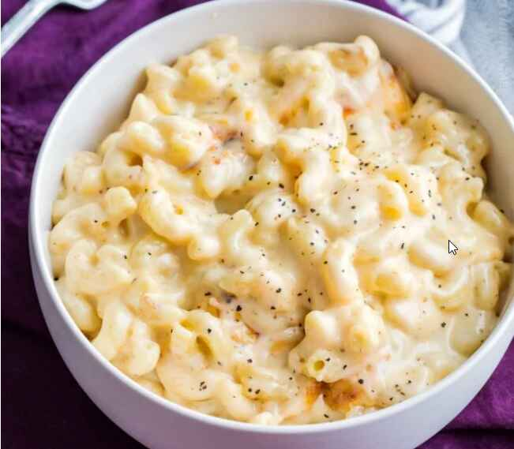

# Mac and Cheese

📍 *Midwest — Every Table, Every Occasion*

> Forget the blue box — this is the real thing. Elbow macaroni swimming in a velvety, three-cheese sauce, topped with a buttery breadcrumb crust that shatters with each bite. It's the dish that turns adults into children and children into believers.

---

## At a Glance

| Detail | Info |
|--------|------|
| **Servings** | 8–10 |
| **Prep Time** | 20 minutes |
| **Cook Time** | 35 minutes |
| **Total Time** | 55 minutes |
| **Difficulty** | Easy |
| **Category** | Sides |

---

## Ingredients

### The Pasta
- 1 pound elbow macaroni
- 1 tablespoon fine sea salt (for pasta water)
- 1 tablespoon unsalted butter

### The Cheese Sauce
- 5 tablespoons unsalted butter
- ⅓ cup all-purpose flour
- 3 cups whole milk, warmed
- 1 cup heavy cream
- 1 teaspoon Dijon mustard
- ½ teaspoon garlic powder
- ½ teaspoon onion powder
- ¼ teaspoon cayenne pepper
- ¼ teaspoon ground nutmeg
- 1½ teaspoons fine sea salt
- ½ teaspoon freshly ground black pepper
- 2 cups sharp cheddar cheese, shredded
- 1 cup mild cheddar cheese, shredded
- 1 cup Gruyère cheese, shredded
- 4 ounces cream cheese, cubed

### The Topping
- 1½ cups panko breadcrumbs
- 4 tablespoons unsalted butter, melted
- ½ cup sharp cheddar cheese, shredded
- ¼ teaspoon paprika
- Pinch of fine sea salt

---

## Instructions

1. **Cook the pasta.** Bring a large pot of water to a rolling boil. Add salt and pasta. Cook until just barely al dente — about 1 minute less than package directions. Drain and toss with 1 tablespoon butter to prevent sticking. Set aside.

2. **Make the roux.** In a large Dutch oven or heavy-bottomed pot, melt 5 tablespoons butter over medium heat. Whisk in flour and cook for 2 minutes, stirring constantly, until it turns light golden and smells nutty.

3. **Build the sauce.** Gradually pour in warm milk and cream, whisking continuously to prevent lumps. Add mustard, garlic powder, onion powder, cayenne, nutmeg, salt, and pepper. Bring to a gentle simmer and cook for 5–7 minutes, whisking often, until sauce thickens and coats the back of a spoon.

4. **Add the cheese.** Remove pot from heat. Add the cheddar cheeses, Gruyère, and cream cheese. Stir until completely melted and silky smooth. Taste and adjust seasoning.

5. **Combine.** Fold the cooked pasta into the cheese sauce until every piece is coated. Transfer to a buttered 9x13-inch baking dish.

6. **Prepare the topping.** In a small bowl, combine panko, melted butter, shredded cheddar, paprika, and salt. Toss until breadcrumbs are evenly coated.

7. **Top and bake.** Preheat oven to 375°F. Spread the breadcrumb mixture evenly over the mac and cheese. Bake for 25–30 minutes until the top is golden brown and the edges are bubbling.

8. **Rest and serve.** Let cool for 5 minutes before serving. The sauce will thicken slightly as it rests.

---

## Tips & Variations

- **Cheese Quality Matters:** Use block cheese and shred it yourself. Pre-shredded cheese contains anti-caking agents that can make your sauce grainy.
- **Low and Slow:** Don't rush the sauce. High heat can cause the cheese to break and become oily.
- **Pasta Shape:** Cavatappi, shells, or rotini work beautifully — the curves and ridges catch more sauce.
- **Bacon Lover's:** Fold in 1 cup crispy bacon pieces and top with more before baking.
- **Buffalo Mac:** Add ½ cup buffalo sauce to the cheese sauce and top with crumbled blue cheese.
- **Lobster Mac:** Fold in 1 pound of cooked lobster meat for special occasions.
- **Smoky Version:** Swap half the cheddar for smoked Gouda.
- **Stovetop Only:** Skip the baking — it's delicious straight from the pot.

---

## 🌾 Did You Know?

> While Thomas Jefferson is often credited with popularizing macaroni and cheese in America after encountering it in Italy and France, the Midwest made it a religion. During the Great Depression, Kraft introduced its boxed macaroni and cheese dinner in 1937, selling for 19 cents and feeding a family of four. It became a lifeline for struggling families and never left American tables. The from-scratch version remained the church potluck and holiday standard across the Heartland, with every family claiming their grandmother's recipe was best. In Wisconsin alone, per capita cheese consumption is 25% higher than the national average — and much of it ends up in mac and cheese.

---

*📸 Photography note: Cast iron skillet overflowing with golden-topped mac and cheese, breadcrumbs perfectly toasted. A wooden spoon pulls up a stretchy, cheesy scoop. Steam rising. Set on a wooden board with a checkered napkin. Warm, homestyle kitchen lighting.*

---

## ⭐ Midwest Nice Rating

5/5 🫕🫕🫕🫕🫕 (Will make a double batch — one for dinner and one to drop off at the neighbor's who just had a baby, because that's what you do.)

---

## 🥂 Pairs Well With

Pairs well with: A cozy winter evening, a good book, and the knowledge that tomorrow's lunch is already sorted.

---

## 👵 Grandma's Secret: Mac and Cheese

> "Grandma Ruth never used just one cheese — she'd say 'variety makes it sing!' Her secret was adding a tablespoon of cream cheese to the sauce. 'Makes it silkier than silk,' she'd whisper, 'and nobody can ever quite figure out why theirs doesn't taste the same.'"
