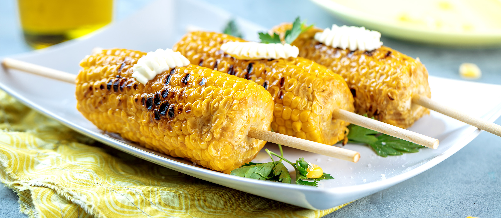

# Butter & Salt Corn on the Cob

📍 *Midwest — The Corn Belt*

> August in the Midwest means one thing above all else: sweet corn season. Picked that morning, boiled just until tender, slathered in butter, and showered in salt — it's the simplest recipe in this book and possibly the most perfect.

---

## At a Glance

| Detail | Info |
|--------|------|
| **Servings** | 6 |
| **Prep Time** | 5 minutes |
| **Cook Time** | 5–7 minutes |
| **Total Time** | 12 minutes |
| **Difficulty** | Easy |
| **Category** | Sides |

---

## Ingredients

- 6 ears fresh sweet corn, husked and silk removed
- 4 tablespoons unsalted butter, softened (plus more at the table)
- Flaky sea salt or kosher salt
- Freshly ground black pepper (optional)

---

## Instructions

1. **Boil the water.** Bring a large pot of water to a rolling boil. Do NOT add salt to the water — salt toughens the corn kernels during cooking.

2. **Cook the corn.** Gently add the ears of corn to the boiling water. Return to a boil and cook for 4–7 minutes. Fresh-picked corn needs only 4 minutes; corn that's a day or two old benefits from 6–7. The kernels should be tender and bright yellow when done.

3. **Butter and salt.** Remove ears with tongs and place on a platter. Immediately rub with softened butter while the corn is still steaming hot — the butter will melt and pool in the kernels. Season generously with salt and pepper if desired.

4. **Serve instantly.** Corn on the cob waits for no one. Provide corn holders, extra butter, and a salt shaker at the table.

---

## Tips & Variations

- **The Freshness Rule:** The sugars in corn start converting to starch the moment it's picked. The fresher the corn, the sweeter it is. If you can get it from a roadside stand or farmers' market that morning, you'll taste the difference.
- **Grilled Corn:** Pull back the husks (leaving them attached), remove silk, re-wrap in husks, and soak in water for 30 minutes. Grill over medium heat for 15–20 minutes, turning occasionally. The slight char is magnificent.
- **Mexican Street Style (Elote):** Slather grilled corn with mayo, sprinkle with cotija cheese, chili powder, and lime juice for a Midwestern-meets-Mexican crossover.
- **Herb Butter:** Mix softened butter with chopped fresh chives, dill, and a squeeze of lemon for an herb compound butter.
- **Oven Roasted:** Wrap individual ears in foil with butter and roast at 425°F for 20–25 minutes.

---

## 🌾 Did You Know?

> The Midwest is the beating heart of American corn country. Iowa, Illinois, Nebraska, and Indiana produce billions of bushels of corn annually, and while most of that is field corn destined for livestock feed and ethanol, the sweet corn varieties grown for eating are a source of intense regional pride. In the late summer, roadside stands dot every highway, hand-painted signs advertising "SWEET CORN" are as common as traffic signals, and the question "Is it Silver Queen or Peaches and Cream?" is a serious conversation starter. Many Midwesterners can tell you the exact farm their favorite corn comes from, and the local sweet corn festival — found in nearly every small town — is a social event rivaling the county fair.

---

*📸 Photography note: Three ears of buttered corn on a rustic wooden cutting board, glistening with melted butter. Salt crystals visible. One ear with a bite taken out. A small ramekin of butter. Outdoor summer evening light, a grill blurred in the far background. Bright, fresh, summery.*

---

## ⭐ Midwest Nice Rating

5/5 🫕🫕🫕🫕🫕 (Will drive 20 miles out of the way to stop at that one farm stand with the best corn, then bring home extra ears for the elderly couple next door who can't drive that far anymore.)

---

## 🥂 Pairs Well With

Pairs well with: Grilled anything, August sunsets, and competitive debates about whose local farm grows the sweetest corn.

---

## 👵 Grandma's Secret: Corn on the Cob

> "Grandma Betty always added a tablespoon of sugar and a splash of milk to the boiling water. 'Makes it even sweeter,' she'd say with a wink. 'Course, if you get it fresh enough, you don't need any help — but a little insurance never hurt anybody.'"
