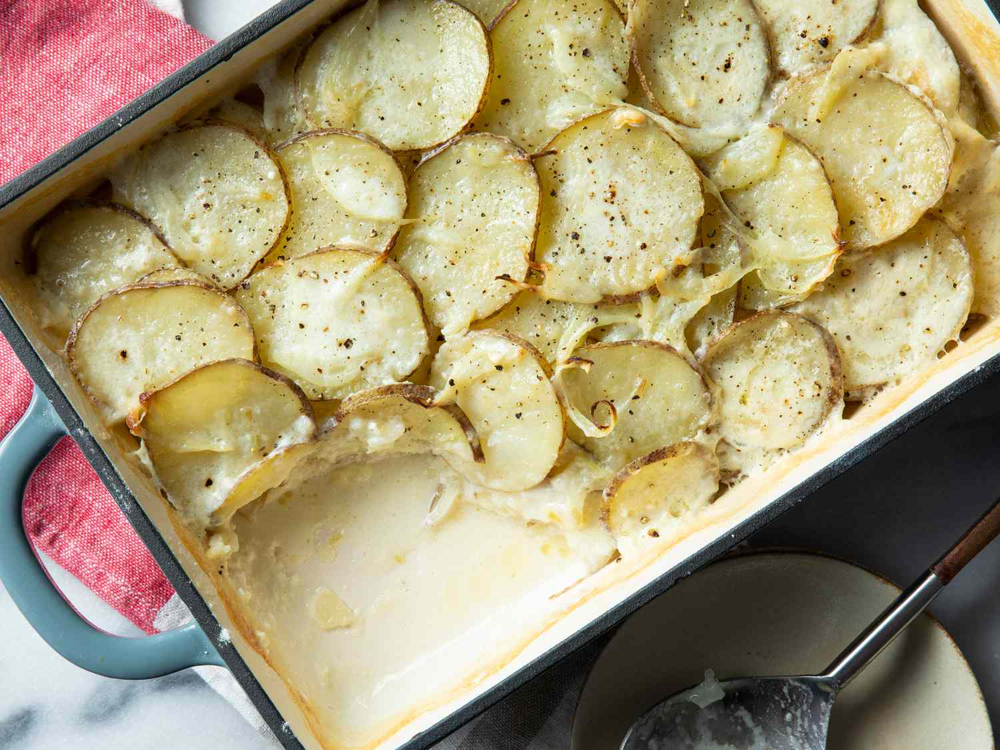

# Scalloped Potatoes

📍 *Midwest — The Sunday Supper Table*

> Layers of thinly sliced potatoes bathed in a silky, garlicky cream sauce, baked until the top turns golden and the edges bubble with crispy, cheesy goodness. This is comfort food at its most elemental — simple ingredients transformed into something transcendent.

---

## At a Glance

| Detail | Info |
|--------|------|
| **Servings** | 8–10 |
| **Prep Time** | 25 minutes |
| **Cook Time** | 1 hour 15 minutes |
| **Total Time** | 1 hour 40 minutes |
| **Difficulty** | Easy |
| **Category** | Sides |

---

## Ingredients

### The Potatoes
- 4 pounds Yukon Gold potatoes, peeled and sliced ⅛-inch thick
- 1 teaspoon fine sea salt
- ½ teaspoon freshly ground black pepper

### The Cream Sauce
- 4 tablespoons unsalted butter
- 4 cloves garlic, minced
- ¼ cup all-purpose flour
- 2 cups whole milk
- 1 cup heavy cream
- 1 teaspoon Dijon mustard
- ½ teaspoon ground nutmeg
- 1 teaspoon fine sea salt
- ½ teaspoon white pepper
- 2 cups sharp cheddar cheese, shredded (divided)
- ½ cup Gruyère cheese, shredded

### For the Dish
- 2 tablespoons unsalted butter, softened (for greasing)
- Fresh chives, chopped (for garnish)

---

## Instructions

1. **Prep the potatoes.** Slice the potatoes uniformly thin — a mandoline works wonders here. Place sliced potatoes in a large bowl of cold water to prevent browning while you make the sauce.

2. **Make the cream sauce.** Melt butter in a large saucepan over medium heat. Add garlic and cook for 1 minute until fragrant. Whisk in flour and cook for 2 minutes, stirring constantly. Gradually pour in milk and cream, whisking continuously to prevent lumps.

3. **Season and thicken.** Add mustard, nutmeg, salt, and white pepper. Bring to a gentle simmer and cook for 5–7 minutes until the sauce thickens and coats the back of a spoon. Remove from heat and stir in 1 cup of cheddar and all the Gruyère until melted and smooth.

4. **Prepare the dish.** Preheat oven to 375°F. Generously butter a 9x13-inch baking dish. Drain the potatoes thoroughly and pat dry with paper towels.

5. **Layer.** Arrange one-third of the potato slices in overlapping rows in the prepared dish. Season lightly with salt and pepper. Pour one-third of the cream sauce evenly over the potatoes. Repeat layers twice more, ending with sauce.

6. **Top and cover.** Sprinkle remaining 1 cup cheddar over the top. Cover tightly with aluminum foil.

7. **Bake covered.** Place on a rimmed baking sheet (to catch drips) and bake for 45 minutes.

8. **Finish uncovered.** Remove foil and continue baking for 25–30 minutes until the top is deeply golden and bubbling, and a knife slides easily into the center.

9. **Rest and serve.** Let stand for 10 minutes before serving — this allows the sauce to set. Garnish with fresh chives.

---

## Tips & Variations

- **Even Slicing:** A mandoline is your best friend here. Uneven slices lead to some potatoes being mushy while others stay crunchy. Aim for ⅛-inch thickness.
- **Potato Choice:** Yukon Golds hold their shape beautifully while becoming creamy. Russets work but may break down more. Avoid waxy red potatoes.
- **Ham Addition:** Layer thin slices of ham between the potato layers for a hearty main-dish version.
- **Make Ahead:** Assemble completely, cover, and refrigerate up to 24 hours. Add 15–20 minutes to the covered baking time.
- **Cheese Variations:** Swap in fontina, white cheddar, or smoked Gouda for different flavor profiles.
- **Crispy Top:** For extra crunch, mix ½ cup panko with 2 tablespoons melted butter and sprinkle over the cheese topping before the final uncovered bake.

---

## 🌾 Did You Know?

> The term "scalloped" doesn't refer to the shellfish at all — it comes from the French "escalope," meaning a thin slice of meat or, in this case, vegetables. Scalloped potatoes became a Midwestern staple in the early 1900s as dairy farming flourished across Wisconsin, Minnesota, and Iowa. The dish was economical, filling, and showcased the region's abundant cream and cheese. Church cookbooks from the era often listed multiple variations, each claiming to be "the best." The debate between scalloped potatoes (cream sauce) and au gratin (cheese and breadcrumbs) continues to this day, though most Midwesterners sensibly add cheese to both.

---

*📸 Photography note: Oval ceramic baking dish with golden-brown scalloped potatoes, cheese bubbling at the edges. A portion has been scooped out, revealing the layered creamy interior. Fresh chives scattered on top. Rustic wooden table with a blue linen napkin. Warm, inviting overhead lighting.*

---

## ⭐ Midwest Nice Rating

5/5 🫕🫕🫕🫕🫕 (Will make this for Sunday dinner even though it takes an hour and a half, because family deserves the effort — and leftovers make Monday better.)

---

## 🥂 Pairs Well With

Pairs well with: Roasted ham, Easter Sunday, and the satisfied silence that falls over the dinner table when everyone's too busy eating to talk.

---

## 👵 Grandma's Secret: Scalloped Potatoes

> "Grandma Dorothy always rubbed the baking dish with a cut clove of garlic before buttering it. 'Just a whisper of garlic,' she'd say, 'not enough to taste, but enough to make people wonder what makes yours so special.' She'd smile and never tell."
